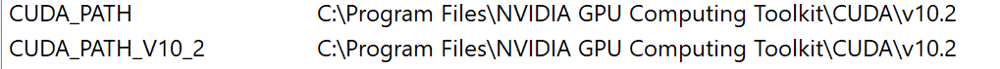

CUDA和cuDNN的安装
---
1. 本教程是安装Windows操作系统下的CUDA和cuDNN

# 1. 前期准备
1. 查看CUDA版本号的步骤:
   1. 打开NVIDIA的控制面板
   2. 选择帮助->系统信息
   3. 选择组件之后查看组件中的NVCUDA.DLL项
   4. 查看到产品名称中的CUDA后面的版本号
2. 下载CUDA的相应包
   1. <a href = "https://developer.nvidia.com/cuda-downloads">下载地址</a>
   2. 根据自己的具体情况选择下载的方式
   3. 如果没有找到合适的CUDA的版本，则去<a href = "https://developer.nvidia.com/cuda-toolkit-archive">位置</a>去下载
3. 查找cuDNN的对应版本号:<a href = "https://blog.csdn.net/LEE18254290736/article/details/89319142">cuDNN的版本对应关系</a>
   1. <a href = "https://developer.nvidia.com/cuda-downloads">下载cuDNN的安装包</a>
   2. 可能注册一下NVIDIA的账号，然后勾选一些同意，最后就可以选择自己机子适合cuDNN进行安装了。

# 2. 安装CUDA
1. 第一次安装CUDA的时候会需要你选择临时解压目录，第二次会让你设置安装目录。
   1. 临时解压目录在安装结束之后，则会自动删除
   2. 安装目录最好使用默认，但是这两个目录千万不要一样。
2. 这个过程根据自己的需求进行安装即可
   1. 自定义安装选项中的Nsight Systems和Nsight Compute不必安装
3. 添加CUDA的系统变量，具体如下图

# 3. 测试CUDA安装情况
1. 使用cmd进入命令界面
2. 输入命令:`nvcc -V`，查看到版本信息即为安装成功
3. 更加深入的检查，我们可以回到安装目录，找到extras\demo_suite这个文件夹，然后在本文件夹中启动cmd命令行，使用命令`.\`运行bandwidthTest.exe和deviceQuery.exe查看Result是否结果为PASS

# 4. 安装cuDNN
1. 将下载的得到的压缩包解压缩，得到bin文件夹、include文件夹和lib文件夹。
2. 将上面文件夹中的对应内容拷贝到CUDA的安装目录(CUDA/vx.xx)下的重名文件夹中即可。

# 5. 参考
1. <a href = "https://blog.csdn.net/qq_39797713/article/details/103947951">查看电脑合适的CUDA和cuDNN版本</a>
2. <a href = "https://blog.csdn.net/sinat_23619409/article/details/84202651">cuda安装教程+cudnn安装教程</a>
3. <a href = "https://blog.csdn.net/u011473714/article/details/95042856">win10下CUDA和CUDNN的安装（超详细）！亲测有效！</a>