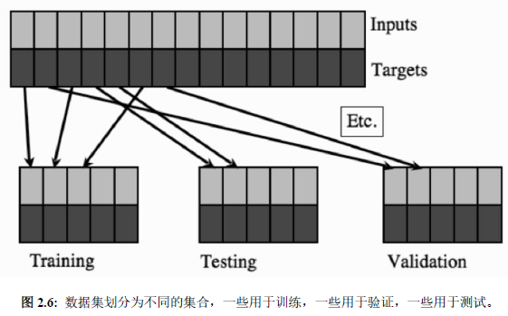
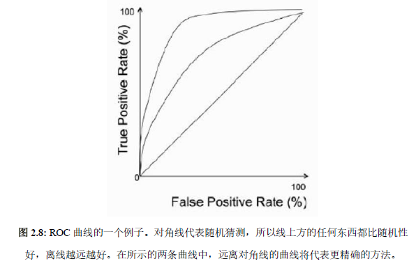

Procedure3-效果评估
---

# 1. 效果评估
> 评估机器学习的结果

1. 评估机器学习结果在多大程度上能够帮助实现业务目标。
2. 此阶段的要素包括评估学习结果，以便为机器学习的过程提供反馈。

## 1.1. 欠拟合和过拟合
1. 欠拟合和过拟合就是两个极端

### 1.1.1. 欠拟合
1. 欠拟合是并没有学习到数据本身对应的通用规律

### 1.1.2. 过拟合
1. 过拟合是过分地学习得到了样本集中的特征(但是不通用)，比如数据中的噪声、不确定性以及实际功能。
2. 我们希望算法过拟合之前停止学习过程，也就意味着我们需要确定其每个时间步长的泛化程度。
3. 因此我们需要验证集，来完成交叉验证，为模型选择正确的参数，使其尽可能的泛化。

## 1.2. 测试集、训练集和验证集
1. 训练集：实际训练算法
2. 验证集：用于跟踪其学习效果
3. 测试集：产生最终结果
4. 这在数据上显得很昂贵
   1. 对于监督学习则必须附加目标值，并且它并不总是很容易获得准确的标签
   2. 半监督学习领域视图满足对大量标记数据的这种需求
5. 一般比例为50:25:25或者60:20:20

## 1.3. 评估方法
1. 留出法
2. 多折交叉检验(将数据集随机分为K个子集，一个子集用作验证集，而算法则在其他所有子集上进行训练，然后对所有子集重复操作，最后测试并使用最低验证误差的模型)
3. 留一法交叉检验(极端情况才使用)

## 1.4. 混淆矩阵
1. 制作方法：制作一个方阵，其中包含水平和垂直方向上的所有可能的类，并将表格顶部的类列为预测输出，然后沿左侧列为目标。
2. (i, j)处的矩阵元素告诉我们在目标中有多少输入模式放入类i中，但是算法归入到类j中。
3. 主对角线上的任何东西都是正确的答案。

## 1.5. 精度指标
| True Positives  | False Positives |
| --------------- | --------------- |
| False Negatives | True Negatives  |

| 度量值    | 公式                                                                                           |
| --------- | ---------------------------------------------------------------------------------------------- |
| 精度      | $Accuracy = \frac{TP + FP}{TP + FP + TN + FN}$                                                 |
| 敏感率    | $Sensitivity = \frac{TP}{TP + FN}$                                                             |
| 特异率    | $Specificity = \frac{TN}{TN + FP}$                                                             |
| 查准率    | $Precision = \frac{TP}{TP + FP}$                                                               |
| 查全率    | $Recall = \frac{TP}{TP + FN}$                                                                  |
| $F_1$度量 | $F_1 = 2 * \frac{precision * recall}{ precision + recall} = \frac{TP}{TP + \frac{FN + FP}{2}}$ |

## 1.6. ROC(受试者工作特征)曲线
1. 在使用上述度量来比较不同学习参数的相同分类器或完全不同的分类器时，受试者工作特征(Receiver Operator Characteristic)曲线是有用的
   1. x轴是假正率
   2. y轴是真正率
2. 分类器越接近左上角，分类器性能越好。
   1. 完美的分类器是(0, 1)处
   2. 反分类器是(1, 0)处
3. 我们计算曲线下面积(Area Under The Curve, AUC)是正常的：如果只有一个点，那么这个曲线是(0, 0)到这个点 + 这个点到(1, 1)。

4. 怎么获取曲线而不是ROC曲线上的点的关键是使用交叉检验：10折交叉就有10个分类器和10个测试集以及真值标签(用于生成不同交叉验证训练结果的排序列表，用于指定ROC曲线下雨改分类器相对应的10个数据点的曲线，**为每个分类器生成ROC曲线然后比较结果**)

## 1.7. 不平衡数据集
1. 对于精度，我们隐含地假设了数据集中存在相同数量的正、负示例，这称为平衡数据集
2. 而在不是的时候我们可以将平衡精度计算为敏感率和特异率之和除以2，这是Matthew相关系数(Matthew’s Correlation Coefficient)

$MCC = \frac{TP * TN - FP * FN}{\sqrt{(TP + FP)(TP + FN)(TN + FP)(TN + FN)}}$

3. 如果分母中的任何括号为0，则整个分母设置为1，这提供了平衡的精度计算。

## 1.8. 度量精度
1. 精度：算法的可变性的度量
2. 真实度
   1. 算法预测与现实匹配程度的一个衡量标准，可以被定义为正确输出和预测之间的平均距离。
   2. 除非某些类的某些概念彼此类似，否则真实度通常对分类问题没有多大意义。

## 1.9. 注意
1. 如果有两个以上的类并且区分不同类型的误差是有意义的，那么计算将会变得复杂，因为不是一组假正例和一组假反例，而是每一个类都有一些，这种情况下特异率和查全率是不一样的，但是可以创建一组为结果，其中使用一个类作为正例，其他作为反例，并且对不同的类重复此操作。

# 2. 常见的错误

## 2.1. 错误的比较对象
1. 机器学习中的结果或效果进行比较时，容易将不同样本集进行结果比较，比较对象不合 理，其结果自然无效，结论便不能成立

## 2.2. 适当处理数据极值
1. 单纯的忽略数据极值可能失去某种样本或丢失某项重要特征
2. 过度的重视极值可能会对结果造成偏差，影响结论

## 2.3. 过分关心统计指标
1. 机器学习规律只能作为参考。
2. 过分关心统计指标可能会忽视某些方法或结论成立的前提。

## 2.4. 避免分析出一个常识性规律