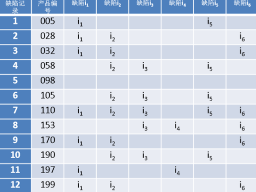
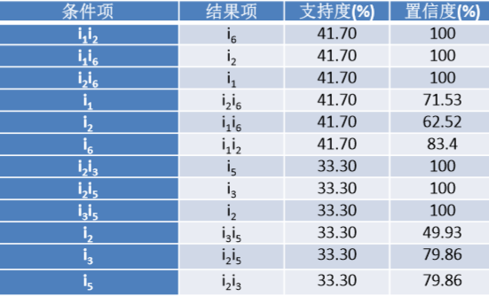

**关联规则应用**

# 1. 基于关联分析的服装缺陷管理
1. **服装制造**通常采取流水线的方式生产，这是一个复杂的过程，其中牵涉多个部门。因而很难确定每个**缺陷**的责任部门，缺陷的根源无从查询.
2. 一件产品身上的缺陷可能多达到上百处，这么大规模的缺陷信息缺少一套有效的机制管理和分析。低效率的缺陷识别导致服装行业的不良后果，例如客户满意度降低、返工成本高、生产周期长。

# 2. 服装缺陷数据提取与预处理
1. 把不同部门存储的有关制造流程和产品质量数据从不 同的数据库中提取。因为不同部门使用的数据结构不一致，需要把这些数据预处理统一格式后存储到数据仓库中。i1，i2，i3，i4，i5和i6分 别表示Broken stitches、 Unraveling seams、Twisted  leg、Poor colorfastness after  being laundered、Sagging  pockets和Re‐stitched seams

2. 根据产品编号来确定不同编号之间的区别

# 3. 服装缺陷的部分关联规则

1. 设置支持度40%和置信度80%

# 4. 质量改善计划
1. 质量管理小组就可以在一种缺陷存在的情况下，有效预测潜在的 其他缺陷。
2. 找出关联规则中缺陷同时存在的原因。例如缺陷i1、i2发生时，i6也可能会同时发生，经过追查，根本原因为缝纫工人做工差。
3. 质量管理人员应把更多的人力、设备等资源投入到解决这些问题的根源。
