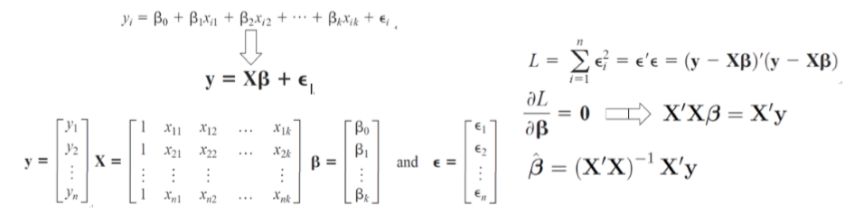

多元线性回归模型
---

1. 和y呈现多元化线性关系。
2. β是我们要求的目标项，通过变换，求出来目标结果。
    + 我们只需要求(X'X)-1和X'
3. 对于矩阵来说，取逆操作运算量巨大。
4. 我们将数据进行分块来完成。

1. 将X和Y进行分块，进行分块计算
2. Eg.我们将数据切成m块，然后每一块对应的取出来。
    + map主要是计算每一块矩阵的运算，reduce主要是负责之后的β的累加即可。

3. 分布式大数据特点
    + 在计算过程中必须保证是分组后结果和之前结果是等价的
    + 使用mapReduce或者Spark来改造算法完成机器学习