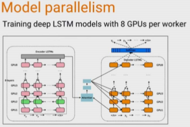
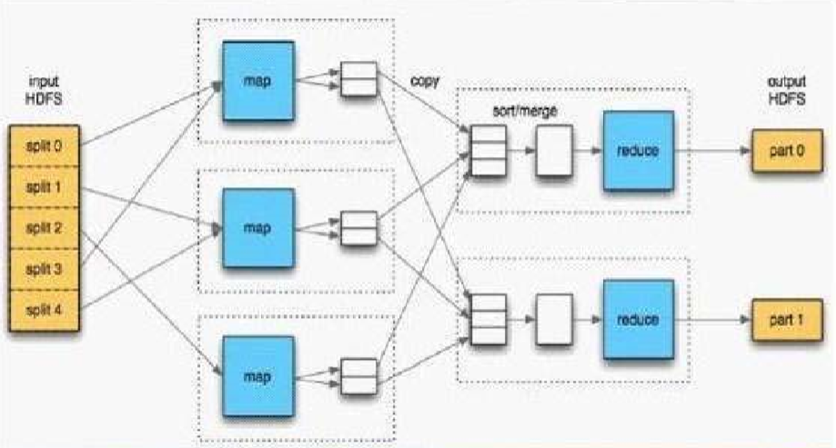
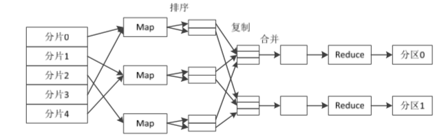
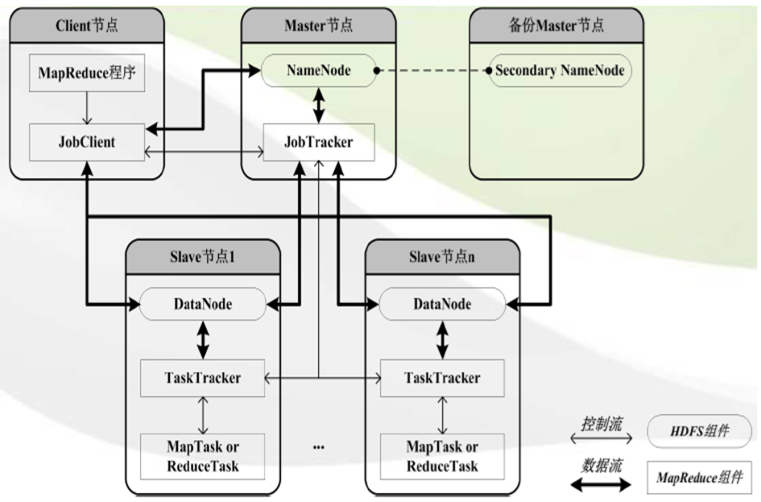
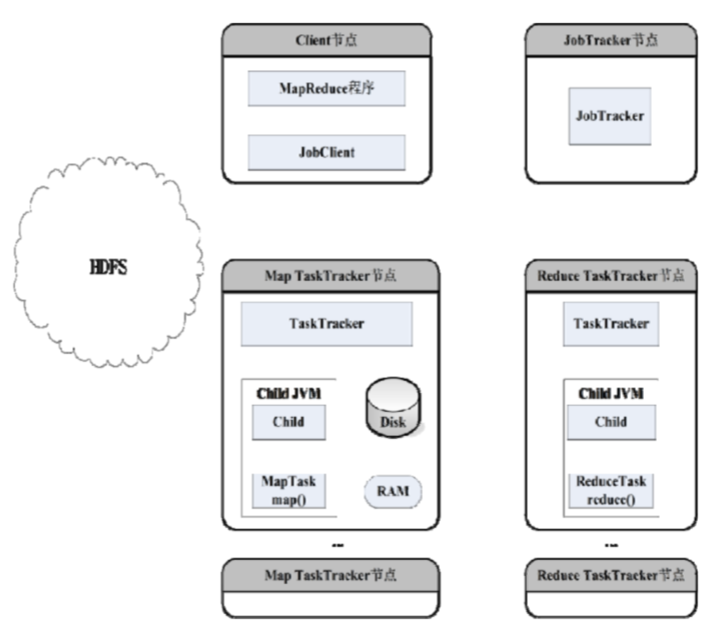
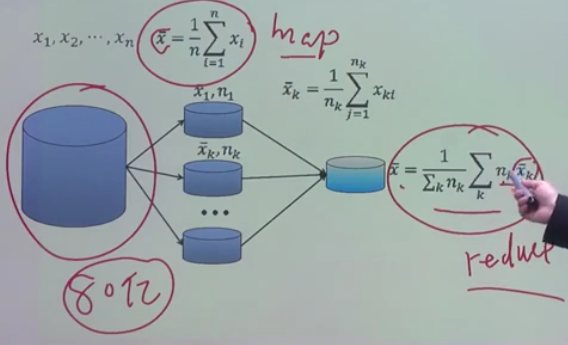
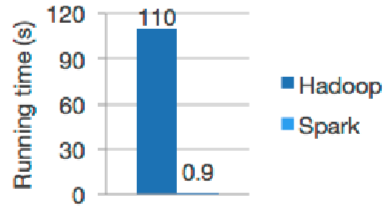
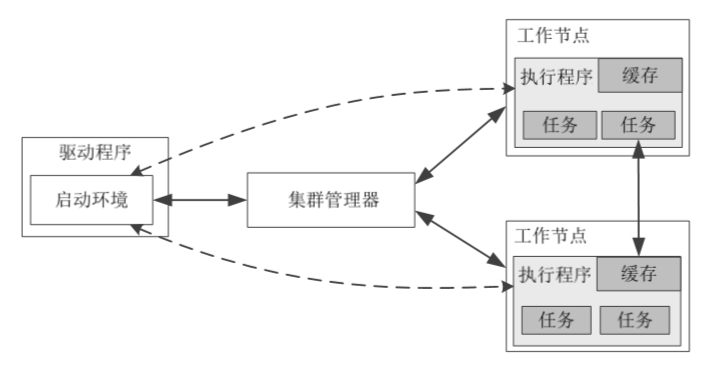
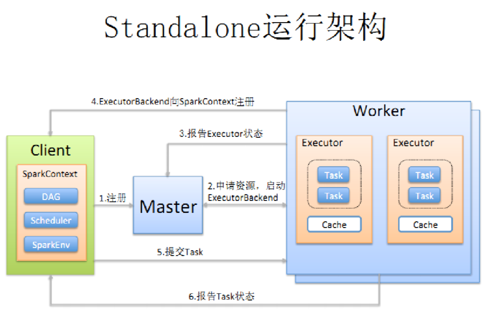
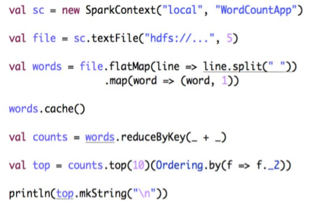

分布式机器学习
---

# 1. 分布式机器学习基础

## 1.1. 分布式机器学习中的一些核心问题
1. 如何提高各分布式任务节点之间的**网络传输效率**；
2. 如何解决参数**同步问题**，传统训练模型是采用同步方法，如果机器性能不统一，必然会产生 训练任务之间的协作；
3. 分布式环境下如何提高容错能力，需要避免单点故障，并能合理处理异常，训练子节点出错 不影响全局任务。

## 1.2. 参数服务器
1. 应用传统的大数据处理框架训练大型的机器学习模型时，由于数据量比较大并且训练方法多样，存在着一致性、扩展性、稳定性的问题。较大的模型也意味着**参数较多**，因而需要实现分布式并行训练，参数服务器是分布式并行训练框架之一，存储着模型的参数和状态。参数服务器具有如下特点：
    + 高效通信
    + 宽松一致性
    + 灵活可扩展：训练过程中支持动态扩展节点，不需要重启训练任务就可以动态插入新节点到集合中，这一特性无疑有利于那些训练周期较长(长达数天或数周)的机器学习项目，可节省大量训练时间。
    + 容错能力强:在**大型服务器集群**中，由于节点较多，小概率故障往往常态化，所以需要节点的恢复(状态清理、任务重启)时间要短，而且不能中断训练过程，这就要求并行化系统具有较强的容错能力。 
    + 易用:目前机器学习项目开发者数量较少，为了**减少学习难度**，需要尽可能的使用常用语言或将参数表示成通用的形式，如向量、矩阵等，并与现有机器学习框架无缝拼接。

## 1.3. 分布式并行计算框架
1. 模型并行
2. 数据并行
3. 混合并行

### 1.3.1. 模型并行
1. 模型并行是指将模型按照其结构放在不同的分布式机器上进行训练，一般用在那些内存要求较高的机器学习项目，例如，单机训练一个1000层的DNN网络，内存容易溢出，而使用模型并行，用不同的机器负责不同的层进行训练，通过维护各层间参数同步实现整个DNN网络的并行训练。

1. 深度学习

### 1.3.2. 数据并行
1. 数据并行是指各机器上的模型相同，对训练数据进行分割，并分配到各机器上，最后将计算结果按照某种方式合并。该方法主要应用在海量训练数据的情况，数据以并行化方式训练，训练过程中组合各工作节点的结果，实现模型参数的更新。参数并行常用的方法有参数平均和异步梯度下降的方法。

1. 现将数据分块传入数据结点

### 1.3.3. 参数平均
1. 参数平均是在每次训练迭代完成后计算各节点各模型参数平均值，这一方法操作简单，主要依赖网络同步更新，如果更新频率较慢会导致参数差别较大，平均之后的模型参数的局部差异化被抵消，效果较差，影响模型的精确性。反之，如果更新较快，对网络压力较大，通信和同步的成本较高，所以在应用中需要结合模型复杂度和优化方法进行平衡。
2. 结合两者特点，进行混合计算。

### 1.3.4. 异步梯度下降
1. 异步梯度下降是一种基于更新的数据并行化，它传递的是模型训练过程中的梯度、动量等信息，而没有直接传递参数值，这样一方面可以减少传输数据量，提高网络传输效率；另一方面不同计算节点通过共享梯度，可以提高模型收敛速度。该方法的不足之处在于会随着引入参数数量的增多出现梯度值过时的问题。
2. 对于数据更新，如何更新模型，如何同步更新参数和权重。

### 1.3.5. 混合并行
1. 混合并行的方式是指综合应用模型并行和数据并行，在训练集群的设计中，将上述两种方式进行合并，各取所长，形成互补。例如，可以在同一台机器上采用模型并行化，在GPU和CPU之间使用模型并行。然后在机器之间采用数据并行化，将数据分配在不同的机器上，既实现了计算资源利用的最大化，也减少了数据分发的压力。

# 2. 分布式机器学习框架
1. 分布式机器学习是机器学习领域的一大主要研究方向，其中MapReduce适合做**离线**计算，Storm适合做**流式**计算，Spark是**内存计算**框架，能快速得到计算结果。分布式机器学习平台归类为三种基本设计方法：基本数据流、参数服务器模型以及高级数据流。基于这三种方法来介绍分布式机器学习框架。

## 2.1. MapReduce编程模型
1. MapReduce是一个能处理和生成超大数据集的算法模型，该架构能够在大量硬件配置不高的计算机上实现并行化处理，这一编程模型结合用户自定义的Map和Reduce函数。Map函数处理一个输入的基于<Key,value>对的集合， 输出中间基于<Key,value>对的集合，Reduce函数是将所有具有相同key值的 value值进行合并，将数据集合进行压缩。
2. 一个主节点Master控制其他的分节点，存储相应的元数据。
3. 将查询日志进行分块来进行分布。Reduce把分布式的数据进行合成。
4. MapReduce的运行需要基础的分布式存储系统HDFS支持。MapReduce**不可以**对分布式的大数据分片进行并行的实时分析。

流程
---

## 2.2. Hadoop MapReduce框架
1. HadoopMapReduce是Hadoop三大组件之一，包括JobTracker和一定数量的TaskTracker。JobTracker负责任务分配和调度，一个MapReduce作业通常会把输入的数据集切分为若干独立的数据块，由Map任务以并行方式处理它们，框架会对Map的输出先进行排序，然后把结果输入到Reduce任务中。通常作业的输入和输出都会被存储在文件系统HDFS中，由JobTracker负责任务的调度和监控，以及重新执行已经失败的任务。
    + Master主节点，client客户端节点
    + 可以尝试动态的增加数据结点
    + 同一个数据块有一到两个备份,通过和主机的信号，来确定是否启用备份数据。

2. HadoopMapReduce框架由一个单独的主JobTracker和每个集群节点对应一个备TaskTracker组成。JobTracker负责调度作业的所有任务，并监控它们的执行，这些任务分布在不同的备TaskTracker上。如果TaskTracker上的任务执行失败，还会调度其重新执行。而TaskTracker仅负责执行指派的任务。

框架数学模型
---

1. 最后使用reduce，证明是成立的。

## 2.3. spark框架
1. 与HadoopMapReduce相比，Spark的优势在于处理迭代计算的机器学习任务，尤其是**内存要求小**的应用，性能提升很大，Spark还可以进行批处理、实时数据处理、机器学习以及图算法等计算模块。使用Spark平台无需关心分布式并行计算的细节，可以智能地进行数据切分、算法复制、分布执行、结果合并，以支持数据分析人员快速开发分布式应用。

基本框架
---

应用核心
---
1. Spark应用核心由启动环境和执行程序两部分组成，其中执行程序负责执行任务，运行执行程序的机器是工作节点，而启动环境由用户程序启动，通过集群管理器与各个执行程序进行通信。集群管理器主要负责集群的资源管理和调度，目前支持Standalone、ApacheMesos和YARN三种类型的管理器。

弹性分布式数据集
---
1. Spark使用弹性分布式数据集(RDD)抽象分布式计算，RDD是Spark并行数据处理的基础，它是一种只读的分区记录的集合，用户可以通过RDD对数据显示地控制存储位置和选择数据的分区。RDD主要通过转换和动作操作来进行分布式计算，转换是根据现有数据集创建新数据 集，动作是在数据集上进行计算后返回值给Driver程序。使用RDD可以用基本一致的方式应对不同的大数 据处理场景，还能够提高分布式计算的容错性。
    + 所有的处理放置在内存中。

总结
---
Spark是一种粗粒度、基于数据集的并行计算框架。其计算范式是数据集上的计算，在使用Spark的时候，要按照这一范式编写算法。所谓的数据集操作，就是成堆的数据，如果源数据集是按行存储的话，就需要对其进行适配，将若干记录组成一个集合。因此在提交给Spark任务时，需要先构建数据集，然后通过数据集的操作，实现目标任务。

## 2.4. TensorFlow
1. TensorFlow为用户封装了底层的分布式操作，使其可以专注于编写机器学习代码。使用数据流图进行数值计算，用有向图中的节点表示，节点的状态是可变的，边是张量，对应为多维数组。TensorFlow中数据并行化的方式由In‐graph、Between‐graph、异步训练、同步训练几种方式，通过将模型训练分配给不同的工作节点，并使用参数服务器共享参数。