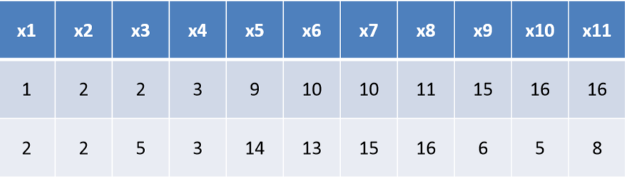
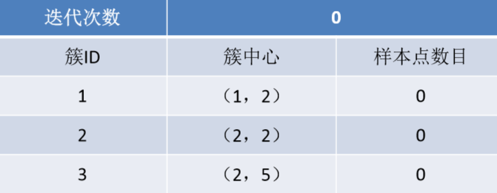
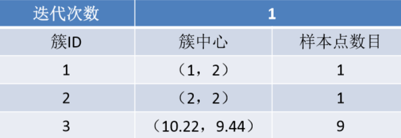
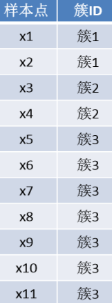

并行K-均值算法
---

# 1. 为什么开发并行K-均值算法
1. k‐均值算法是应用最广泛的聚类算法之一，随着大数据的发展，在实际使用过程中如何提升该算法的性能成为了一个有挑战性的任务。可以基于Map Reduce实现k‐均值算法，在Hadoop环境中并行运行，能够高效且廉价的处理大型数据集。

# 2. 并行K-均值算法实现
1. 在具体实现该算法时，将输入数据集存储在分布式文件系统HDFS中，作为<key,value>的序列文件，每个键值对代表数据集的一条记录，其中key记录的是**数据文件距离起始位置的偏移量**，value是该条**记录的内容**。将迭代后或初始化后的k个聚类中心放到Configuration中，然后在**Mapper**的setUp计算读取这k个聚类中心。Mapper会将同一类的数据发送至同一个Reducer。在Reducer中，只需要根据数据重新计算聚类中心即可。
2. 使用MapReduce框架实现k‐均值聚类算法时，需要将每一次迭代作为一个MapReduceJob进行计算，通过多次运行该Job达到迭代的效果，最终得到k个聚类中心。基于MapReduce的并行k‐均值算法，可以在廉价机器上有效处理大型数据集。

# 3. K-Means算法实例
1. 核心:共享聚类中心

## 3.1. 聚类数据

1. 两个属性来描述一个数据

## 3.2. 开始阶段
1. 将x1—x6分配给node1，将x7‐x11分配给node2，选择k=3，在开始阶段，创建一个如下表的全局文件。
    + 完成了分块

2. 假设的聚类中心要传递到node1,和node2上去，根据就近原则进行分簇，决定是在三个簇的哪一个簇中去。

## 3.3. Map阶段
1. Map阶段对于数据集中的每一个节点，读取全局文件，获得上一轮迭代生成的簇中心信息，计算样本点到簇中心的距离。
2. Map程序将分布式样本通过簇中心共享，将两块样本划分到相应的簇中，给样本簇号，对数据进行分类，然后重新计算几何中心，将几何中心传输到node1和node2上。

## 3.4. Reduce阶段
1. 在Reduce阶段每个reduce收到关于某一个簇的信息。包括该簇的ID和簇的中心以及包含的样本个数。具体如下表。

2. 找出来之后，重新确定新的簇中心。
    + 之后进行迭代。
3. 一直迭代到簇中心稳定不变，收敛的时候。

## 3.5. 结果
1. 一次迭代完成后，进入下一次迭代，直到聚类结果不再发生变化，输出最终得到的聚类结果如右表。

