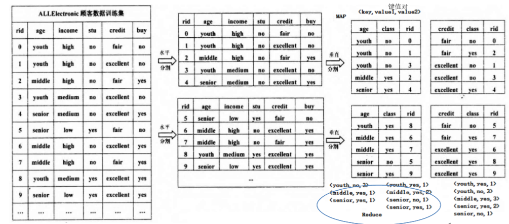
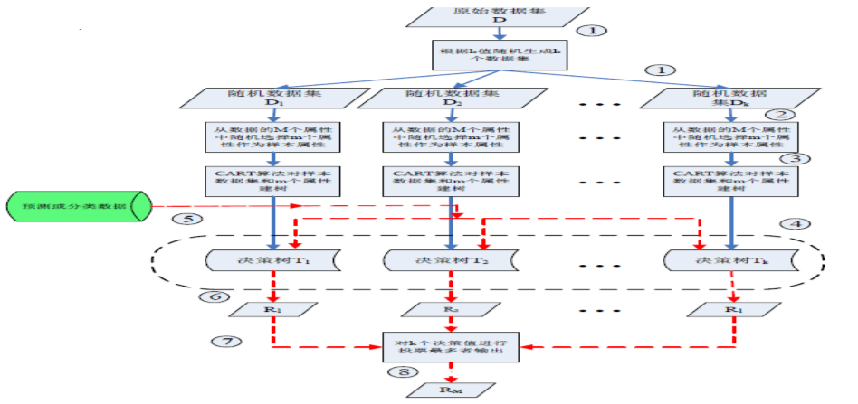

并行决策树
---

# 1. 为什么使用决策树
1. 随着大数据时代的到来，算法需要处理的数据量急剧增加，仅依靠原始的决策树算法进行分类无论在效率上还是准确性上都不足以满足需求。高效出色的在大数据量下使用决策树算法，需要将决策树算法并行化。

# 2. 并行决策树实现
1. 并行决策树算法基于MapReduce框架，**核心思想**是分而治之的策略。
2. MapReduce通过将海量数据集**分割**成多个小数据集交给多台不同计算机进行处理，实现并行化数据处理。
3. 应用到决策树算法上，通过MapReduce将决策树算法并行处理，将耗时的属性相似度计算的步骤并行执行。

## 2.1. Map阶段
1. 以单元组形式分解数据，计算属性相似度，以<属性名，相似度>形式输出。

1. 考虑年龄，我们怎么计算年龄的商集呢？
    + 分类进行计算
2. 考虑数据总体，所以要分别考虑每一个样本的数据。

## 2.2. Reduce阶段
1. 汇总所有局部结果，找到最大相似度属性名，以这个属性作为测试节点，若是叶子节点，则返回，否则执行分裂，将其录入待计算数据库中进行存储。不断重复上述过程完成决策树的构建。
2. 将在Map阶段得到的结果进行合成，根据键值进行合成。

# 3. 并行随机森林 —— 并行CART决策树算法

1. 首先从数据库中抽取出来n个(每次都是随机的)
    + 描述数据的属性也是随机抽取出来的。
2. 根据所有的决策树的结果可以"少数服从多数"得到结果。