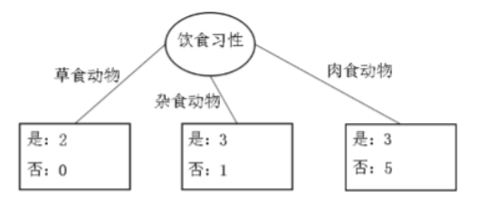
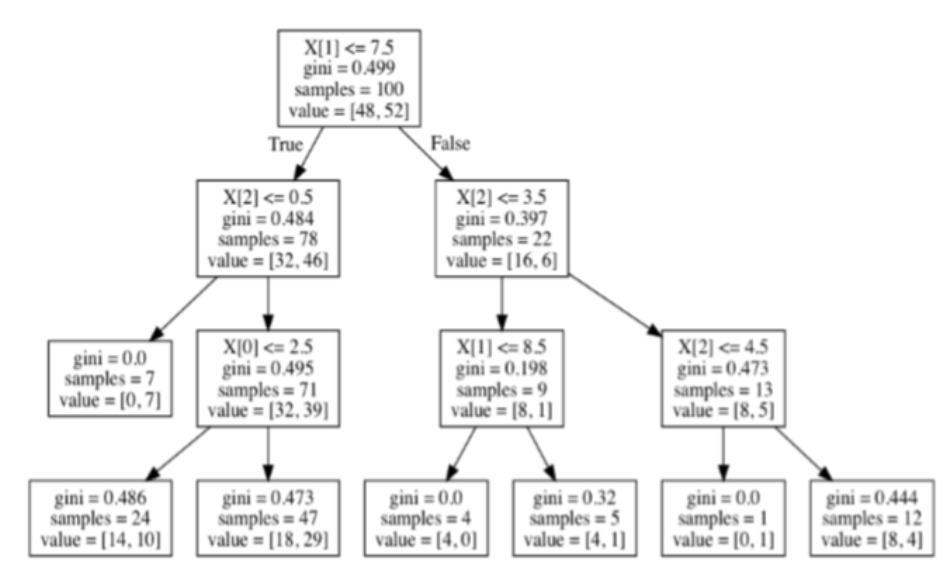
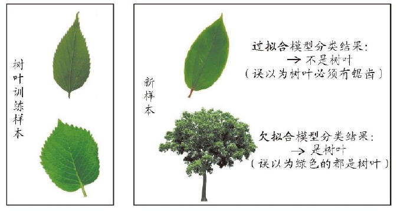
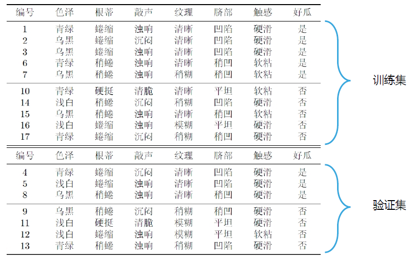
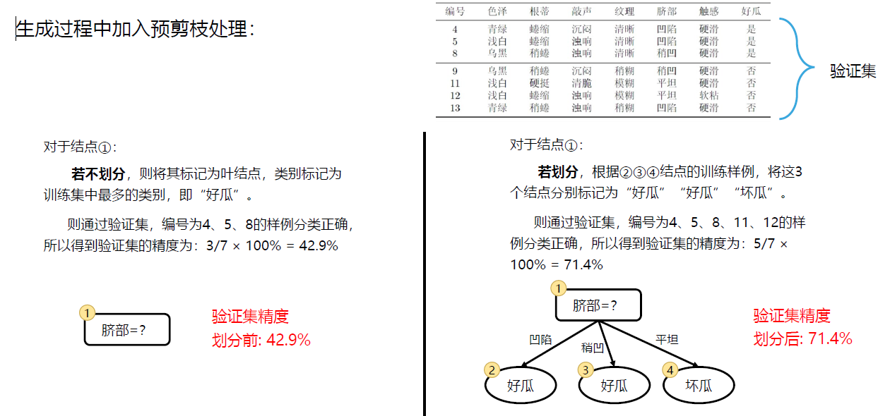
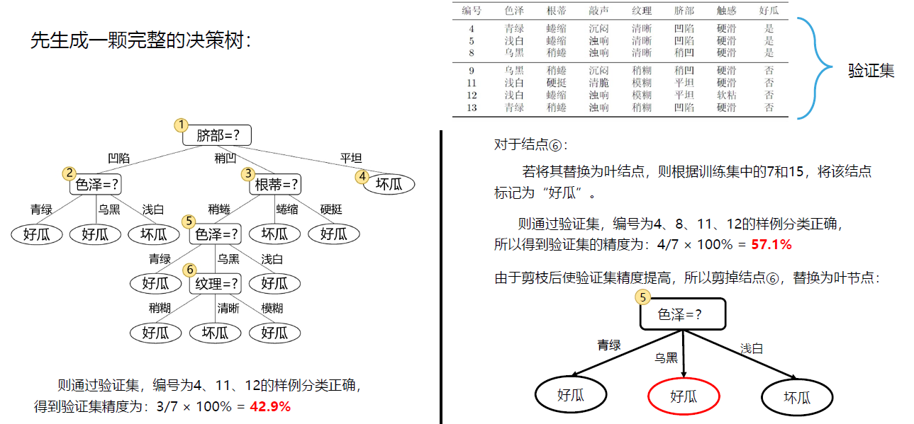

Algorithm-决策树算法
---

# 1. 决策树示例
|  |  |
| --------------------------- | --------------------------- |

# 2. 决策树算法
1. 分类算法是利用训练样本集获得分类函数即分类模型(分类器)，从而实现将数据集中的样本划分到各个类中。
2. 分类模型通过学习训练样本中属性集与类别之间的潜在关系，并以此为依据对新样本属于哪一类进行预测。
3. 决策树算法模拟的是人的识别能力。

## 2.1. 决策树算法思想
1. 决策树通过把数据样本分配到某个叶子结点来确定数据集中样本所属的分类 
2. 决策树的组成:根节点、决策结点、分支和叶子结点
    1. 根节点代表未进行划分前的样本全集
    2. 决策结点表示在样本的一个属性上进行的划分 
    3. 分支表示对于决策结点进行划分的输出,用椭圆表示 
    4. 叶结点代表经过分支到达的类，用长方形表示
3. 从决策树根结点出发，自顶向下移动，在每个决策结点都会进行次划分，通过划分的结果将样本进行分类，导致不同的分支，最后到达个叶子结点，这个过程就是利用决策树进行分类的过程.
4. 抽离出事物的最本质特征，作为特征点来进行分类。
5. 学习算法的核心思想：分治、贪心。

## 2.2. ID3算法
1. 最简单的机器学习算法，使用了启发式算法来进行决策树的构造。例如，使用贪婪算法对每个结点构造部分最优决策树。
2. 算法内容:每次使用一个最有区分性的属性来看是否能把各个数据分类分开。
3. 算法精髓:在于分支处理，即确定在每个决策结点出的分支属性。分支属性的选取即对决策节点上选择哪一个属性来对数据集进行划分，要求每个分支中样本的类别纯度尽可能高，而且不要产生样本数量太少的分支。

### 2.2.1. 定义：信息熵
1. 衡量样本集合纯度的指标则是熵(信息熵)
2. 对于有m个类别的分类问题，假设样本集合中第i类样本所占的比例是$p_i$，则信息熵如下所定义

$$
\begin{array}{l}
    p_i = \frac{|C_i|}{n}\\
    Entropy(S) = -\sum\limits_{i=1}\limits^{m}p_ilog_2{p_i}\\
    约定 p_i = 0,则log_2{p_i} = 0\\
\end{array}
$$

3. 信息熵刻画了系统整体的混乱程度的量，信息熵越大，系统越混乱。
4. 举例来说，如果有一个大小为10的布尔值样本集$S_b$，其中有6个真值、4个假值，那么该布尔型样本分类的熵为:

$$
Entropy(S_b) = -(\frac{6}{10})log_2\frac{6}{10} - (\frac{4}{10})log_2\frac{4}{10} = 0.9710
$$

### 2.2.2. 信息增益
1. 在决策树的分类问题中，信息增益是针对一个特征T，计算原有数据的信息熵与引用特征后的信息熵之差
2. 信息增益定义为：

$$
Gain(S, T) = Ent(S) - \sum\limits^m\limits_{i=1}\frac{S_i}{S}Entropy(S^i)
$$

### 2.2.3. 信息熵和信息增益的计算示例
> 根节点的信息熵


> 部分特征的信息增益

|  |  |
| ---------------------------- | ---------------------------- |
|  |  |
|  |  |

> 最终计算结果:使用信息增益最大的特征作为本节点的划分依据，其取值作为其他几个子节点

|  |  |
| ---------------------------- | ---------------------------- |

### 2.2.4. 具体算法实现：使用信息熵
1. 计算给定样本分类所需的**信息熵**
2. 计算每个特征的**信息熵、信息增益**
3. 从所有特征列中选出信息**增益最大**的特征作为根节点或者内部结点或划分结点(提高决策树的纯度)，其子节点分别为该特征的可能取值
4. 根据划分结点的不同取值来查分数据集为对应子节点，然后删去当前的特征列，在计算剩余列的信息熵，如果有信息增益就重复第二步直到划分结束
5. 划分结束的标志
   1. 子集只有一个类别标签，停止划分
   2. 决策树达到设定最大的深度。

### 2.2.5. ID3算法示例


#### 2.2.5.1. 饮食习性为分类
1. 此样本集有"饮食习性"、"胎生动物"、"水生动物"、"会飞"四个属性可作为分支属性，而"哺乳动物"作为样本的分类属性，有"是"与"否"两种分类，也即正例与负例。共有14个样本，其中8个正例，6个反例，设此样本集为S，则分裂前的熵值为

$$
Entropy(S) = -(\frac{8}{14})log_2(\frac{8}{14}) - (\frac{6}{14})log_2(\frac{6}{14}) = 0.9852
$$

2. 脊椎动物训练样本集以"饮食习性"作为分支属性的分裂情况

3. "饮食习性"为"肉食动物"的分支中有3个正例、5个反例，其熵值为:



$$
Entropy(肉食动物) = -(\frac{3}{8})log_2(\frac{3}{8}) - (\frac{5}{8})log_2(\frac{5}{8}) = 0.9544
$$

4. 同理，计算出"饮食习性"分类为"草食动物"的分支与分类为"杂食动物"的分支中的熵值分别为

$$
\begin{array}{l}
   Entropy(草食动物) = -(\frac{2}{2})log_2(\frac{2}{2}) = 0 \\
   Entropy(杂食动物) = -(\frac{3}{4})log_2(\frac{3}{4}) -(\frac{1}{4})log_2(\frac{1}{4}) = 0.8113 \\
\end{array}
$$

5. 设"饮食习性"属性为Y，由此可以计算得出,作为分支属性进行分裂之后的信息增益为

$$
Gain(Y) = Entropy(S) - Entropy(S|Y) = 0.9852 - \frac{8}{14} * 0.9554 - \frac{2}{14} * 0 - \frac{4}{14} * 0.8113 = 0.2080
$$

#### 2.2.5.2. 全部结果
1. 同理，可以算出针对其他属性作为分支属性时的信息增益
2. 计算可得，以"胎生动物""水生动物""会飞"作为分支属性时的信息增益分别为0.6893、0.0454、 0.0454
3. 由此可知"胎生动物"作为分支属性时能获得最大的信息增益，即具有最强的区分样本的能力，所以在此处选择使用" 胎生动物"作为分支属性对根结点进行划分
4. 将胎生动物作为根节点，然后按照情况画分支，分开样本集，然后相应分支再继续向下分(递归)。
5. 当分支下到全是同一类的就不用再进行分支了。

### 2.2.6. ID3算法的不足
1. 未考虑连续特征，比如长度、密度都是连续值，无法在ID3运用。
2. 用信息增益作为标准容易偏向**取值较多**的特征。然而在相同条件下，取值比较多的特征比取值少的特征信息增益大。比如一个变量有2个值，各为1/2，另一个变量为3个值，各为1/3，其实他们都是完全不确定的变量，但是取3个值比取2个值的信息增益大。如何校正这个问题？参考C4.5算法
3. 未考虑**缺失值**问题
4. 未考虑**过拟合**问题

### 2.2.7. ID3算法实现
1. CSDN上的python实现ID3<a href = "https://blog.csdn.net/weixin_38273255/article/details/88981748">详见</a>

## 2.3. C4.5算法(ID3算法变种)
1. C4.5算法总体思路与ID3类似，都是通过构造决策树进行分类，
2. 其区别在于分支的处理，在分支属性的选取上，ID3算法使用信息增益作为度量，而C4.5算法引入了信息增益率作为度量
3. 解决了ID3的以下问题
   1. 无法处理连续特征的问题。
   2. 使用信息增益选择属性时偏向于选择分支比较多的特征：信息增益率
   3. 解决了缺失值问题

### 2.3.1. 将连续的特征离散化
1. 将n个连续的样本按值从小到大排列，得到数据$a_1, a_2, ..., a_n$
2. 取相邻两样本值的平均数，会得到$n-1$个划分点，其中第i个划分点$T_i = \frac{a_i + a_{i+1}}{2}$
3. 对这n-1个点，分别计算每一个点作为二元分类点时的信息增益，选择信息增益最大的点作为该连续特征的二元离散分类点
4. 用**信息增益比**选择最佳划分
5. 注意这里还不使用**信息增益率**

|  |  |
| ---------------------------- | ---------------------------- |

### 2.3.2. 信息增益率
1. 在决策树的分类问题中，信息增益是针对一个特征T，计算原有的数据的信息熵与引用特征后的信息熵之差，信息增益的定义为：

$$
Gain_{ratio}(D,a) = \frac{Gain(D,a)}{-\sum\limits^V\limits_{v=1}\frac{|D^v|}{|D|}\log_2\frac{|D^v|}{|D|}}
$$

1. 由信息增益率公式中可见，当v比较大时，信息增益率会明显降低，从而在一定程度上能够解决ID3算法存在的往往选择取值较多的分支属性的问题
2. 在前面例子中，假设选择"饮食习性"作为分支属性，其信息增益率为

$$
Gain_{ratio}(饮食习性) = \frac{Gain(饮食习性)}{-\sum\limits_{i=1}^{v}\frac{|S_i|}{|S|}log_2\frac{|S_i|}{|S|}} \\
= -\frac{0.2080}{-(\frac{8}{14}*log_2\frac{8}{14} + \frac{2}{14}log_2\frac{2}{14} + \frac{4}{14}log_2\frac{4}{14})} = 0.1509
$$

3. 使用信息增益率，会偏好可取值数目较少的属性

### 2.3.3. C4.5算法流程思路
1. 整体思路相似，但是将信息增益除以分母。
    1. v代表每种取值。
    2. 选择的并不是信息增益最大的一部分，而是选择信息增益率最大的一部分
2. 每选择一个特点，就空间划分出来一个空间出来
3. C4.5使用了启发式原则：先从候选划分属性中找出信息增益率高于平均水平的属性，再从中选择增益率最高的。

### 2.3.4. C4.5处理缺失值的部分
1. 主要解决两个问题
   1. 样本某些**特征缺失**的情况下选择划分的属性
   2. 选定了划分属性，对于在该属性上缺失特征的样本的处理

### 2.3.5. 处理特征缺失的情况下选择划分属性的问题
1. C4.5的想法是将数据分为两部分，每一个部分都设置权重(初始为1)，然后划分数据
   1. 一部分有特征A的D1
   2. 一部分没有特征A的数据D2
2. 然后对于没有确实特征A的数据集D1来和对应A特征的各个特征值一起计算加权重后的信息增益比，最后乘以一个系数(系数=无特征A缺失的样本加权后所占加权总样本的比例)

### 2.3.6. 对划分属性上缺失特征的样本的处理
1. 可以将缺失特征的样本同时划分入所有的子节点，不过该样本的权重按照各个子样本的数量比例来分类
2. 比如缺失特征A的样本a之前权重为1，特征有3个特征值A1，A2，A3，分别对应的无A特征的样本个数为2，3，4，则a同时划入A1，A2，A3，对应权重调节为$\frac{2}{9}$、$\frac{3}{9}$、$\frac{4}{9}$

### 2.3.7. C4.5算法的不足与改进
1. 决策树算法很容易过拟合，所以决策树需要**剪枝**，而C4.5的剪枝方法有优化空间
   1. **预剪枝**:生成决策树的时候决定是否剪枝
   2. **后剪枝**:生成决策树，再通过交叉检验进行剪枝
2. 生成多叉树，不如二叉树计算快
3. 只能用于**分类**
4. 使用了**熵模型**，对于连续属性还有大量排序，如果为了检查模型并不希望牺牲太多准确性，使用基尼系数代替熵模型。

### 2.3.8. C4.5算法实例
1. <a href = "https://blog.csdn.net/zjsghww/article/details/51638126">C4.5算法实例</a>

## 2.4. C5.0算法
1. C5.0算法是Quinlan在C4.5算法的基础上提出的商用改进版本，目的是对含有大量数据的数据集进行分析
2. C5.0算法与C4.5算法相比有以下优势:
   1. 决策树构建时间要比C4.5算法快上数倍，同时生成的决策树规模也更小，拥有更少的叶子结点数
   2. 使用了提升法(boosting)，组合多个决策树来做出分类，使准确率大大提高
   3. 提供可选项由使用者视情况决定，例如是否考虑样本的权重、样本错误分类成本等

## 2.5. CART算法
1. Classification And Regression Tree，即分类回归树算法，简称CART算法，使用基尼系数代替信息增益比
2. 基尼系数代表了模型的不纯度，基尼系数越小，不纯度越低，特征越好，和信息增益率相反
3. 步骤:
   1. 用样本递归划分进行建树过程
   2. 用验证数据进行剪枝
4. 找出信息增益大于平均水平的，然后再找信息增益率最大的。

### 2.5.1. 基尼指数
1. 假设有n个类别，第k个类别的概率为$p_k$，概率分布的基尼系数表达式:

$$
\begin{array}{l}
   Gini(p) = \sum\limits^{n}\limits_{k=1}p_k(1-p_k) \\
   = 1 - \sum\limits^{n}\limits_{k=1}p_k^2 \\
\end{array}
$$

2. 如果是二分类问题，第一个样本输出概率为p，概率分布的基尼系数表达式特化为$Gini(p) = 2p(1-p)$
3. 对于样本D，个数为|D|，假设有n个类别，第k个类别的数量为$|C_k|$，则样本D的基尼系数表达式

$$
Gini(D) = 1 - \sum\limits_{k=1}\limits^{K}(\frac{|C_k|}{|D|})^2
$$

4. 对于样本D，个数为|D|，根据特征A的某个值a，把D分为$|D_1|$和$|D_2|$，在特征A的条件下，样本D的基尼系数表达式为

$$
Gini_{Index}(D, A) = \frac{|D_1|}{|D|}Gini(D_1) + \frac{|D2|}{|D|}Gini(D_2)
$$

### 2.5.2. 步骤
1. 输入:训练集D，基尼系数的阈值，样本个数阈值
2. 输出:决策树T
3. 算法步骤
   1. 对当前节点的数据集D，如果样本容量小于阈值或没有特征，则返回决策子树，当前节点停止递归
   2. 计算样本集D的基尼系数，如果基尼系数小于阈值，则返回决策子树，当前节点停止递归
   3. 计算当前节点现有的各个特征的各个特征值对数据集D的基尼系数。
   4. 计算出来的各个特征的各个特征值对数据集D的基尼系数中，选择基尼系数最小的特征A和对应的特征值a，根据这个最优特征和最优特征值，把数据集划分为两部分$D_1$和$D_2$，同时建立当前节点的左右节点，左节点的数据集为$D_1$，右节点的数据集为$D_2$
   5. 对左右的字节点递归调用1-4步骤

### 2.5.3. 连续特征的处理
1. 思想和C4.5完全一致的，都是将连续的特征离散化，只是将信息增益率替换成了Gini指数
2. 和ID3、C4.5的不同的是，如果当前节点为连续属性，则该属性在后面还可以参与节点的产生选择过程。

### 2.5.4. 离散数据的处理
1. 大致思路是不断二分类
2. 比如

$$
\begin{array}{l}
   A \to \{A1\},\{A2,A3\} \\
   A \to \{A2\},\{A1,A3\} \\
   A \to \{A3\},\{A1,A2\} \\
\end{array}
$$

3. 然后找到上面的基尼系数最小的组合，建立二叉树节点，然后继续划分剩下的特征

### 2.5.5. CART例子：CART处理离散数据


> 注意上面公式的最后一个

### 2.5.6. CRAT例子二


|  |  |
| ---------------------------- | ---------------------------- |
|  |  |

### 2.5.7. 样例
1. 以下是基于sklearn库的CART算法示例代码。通过构建决策树(采用Gini指标)对随机生成(通过np.random.randint方法)的数字进行分类，自变量X为100x4的矩阵，随机生成的数字大于10，因变量Y为大于2的100x1矩阵。树的最大深度限制为3层，训练完成之后将树可视化显示。

```py
# -*- coding: utf-8 -*-
import numpy as np
from sklearn import tree
from graphviz import Source

# 设置随机数因子
np.random.seed(42)
# 随机生成矩阵
X = np.random.randint(10, size=(100, 4))
Y = np.random.randint(2, size=100)
a = np.column_stack((Y,X) )
clf = tree.DecisionTreeClassifier(criterion='gini',max_depth=3)
clf = clf.fit(X, Y)
graph = Source(tree. export_graphviz(clf, out_file=None))
graph.format = 'png'
graph.render('cart_ tree', view=True)
```

1. graphviz是可视化库
2. 可视化结果



### 2.5.8. C5.0和CART算法的比较
<a href = "https://mp.weixin.qq.com/s?__biz=MzA3OTAxMDQzNQ==&mid=2650624953&idx=1&sn=51ba7c9e8e49ef060d2e1bf01f378b1b&source=41#wechat_redirect">C5.0与CART算法比较</a>

## 2.6. GBDT
1. 决策树一般分为回归树与分类树:
    1. 分类树的结果不能进行加减运算。
    2. 回归树的结果是数值，可以进行加减运算，如年龄、身高等。
    3. GBDT中的决策树是回归树。
    4. 通过损失函数:最大熵VS均方差来评估模型的准确率。
2. 如果在不改变原有模型的结构的基础上提升模型的拟合能力?
    + 可以优化模型。
    + 也可以增加一个新的模型，拟合其残差。比如(170+10=180)

$$
J(y, F(x)) = \frac{1}{2}(y - F(X))^2 \\
y_i - F(x_i) = -\frac{\partial J}{\partial F(x_i)}
$$

3. 第一个F(x)是均方差，第二个是差等于负梯度方向，作为残差的估计值。对于负梯度直接求导是一个比较快速的方法。

### 2.6.1. 思路分析
1. 利用梯度下降，用损失函数的负梯度在当前模型的值，作为提升树中**残差**的近似值来**拟合回归决策树**，算法过程如下:
    1. 初识化决策树，估计一个使损失函数最小化的常数构建一个只有根节点的树。
    2. 不断提升迭代:
        1. 计算当前模型中损失函数的负梯度值，作为残差的估计值。
        2. 估计回归树中叶子节点的区域，拟合残差的近似值。
        3. 利用线性搜索估计叶节点区域的值，使损失函数极小化。
        4. 更新决策树。
    3. 经过若干论的提升法迭代过程之后，输出最终的模型.
2. 加法模型

$$
\hat{y_i} = \sum\limits_{k=1}^Kf_k(x_i)，f_k \in F
$$

3. K个基模型，F为所有树组成的函数

$$
\hat{y_i}^{t} = \hat{y_i}^{t-1} + f_t(x_i) \\
Obj^{(t)} = \sum\limits_{i=1}^{\infty}(y_i * \hat{y_i}^(t-1) +f_i(x_i)) + \Omega(f_i) + constant
$$

1. 多个基模型作为基础，来进行一步一步拟合决策树
2. 最后一个公式是每个的固定值的损失+正则部分(最终的损失函数)

### 2.6.2. XGBoost树提升系统
1. 对于GBDT算法的具体实现，最为出色的是XGBoost树提升系统。
2. 下面是在Python环境下使用XGBoost模块进行回归的调用示例，首先用 pandas构造一个最简单的数据集df，其中x的值为[1,2,3]，y的值为[10,20,30] ，并构建训练集矩阵T_train_xbg。
3. 代码如下:
```python
import pandas as pd
import xgboost as xgb
df = pd.DataFrame({'x':[1,2,3], 'y':[10,20,30]})
X_train = df.drop('y',axis=1)
Y_train = df['y']
T_train_xgb = xgb.DMatrix(X_train, Y_train)
params = {"objective": "reg:linear", "booster":"gblinear"}# reg线性回归，booster使用gb线性回归
gbm = xgb.train(dtrain=T_train_xgb,params=params)# 进行训练
Y_pred = gbm.predict(xgb.DMatrix(pd.DataFrame({'x':[4,5]}))) print(Y_pred)#输入一个x的一个值，就可以输出一个y的值。
```

### 2.6.3. GBDT特点
1. 特点:
   1. 超参比较多，可用交叉验证的方法选择最佳参数: 
   2. 非线性变换比较多，表达能力强，不需要做复杂的特征工程和特征变换:
   3. Boost是串行过程，难以并行化，计算复杂度高，不适合高维稀疏特征;
   4. 样本中异常值较多时，可将平方损失用绝对损失或Huber损失代替

$$
L(y, F) = |y - F|\ L(y,F) = \begin{cases}
    \frac{1}{2}|y-F|^2\ |y-F| \leq \delta \\
    \delta(|y-F| - \frac{\delta}{2}) \ |y-F| > \delta \\
\end{cases}
$$

2. 应用场景：
   1. 线性/非线性回归问题
   2. 推荐系统
3. 超参比较多:交叉验证、grad_search进行自动化调参。
4. 不用正则化、归一化等问题的处理。
5. Boost是串行过程，按照线性序列顺序做，很难进行并行处理。
    + 可以通过PC降维处理来完成使用
6. 平方损失:用绝对损失，我的预测值和之前的模型的差不进行平方，减少异常值造成的损失，而Huber损失是均衡进行，根据阈值进行比较。
    + 减去阈值/2->调整因子
7. 其他可以看官网手册。

# 3. 剪枝

## 3.1. 过拟合与欠拟合
1. 过拟合：算法在学习时，学习能力过强，将某训练样本的特征当作所有数据都具有的一般特征。（决策树学习算法的主要问题）
2. 欠拟合：算法在学习时，学习能力过弱，没有学习到样本数据集中的一般规律。



## 3.2. 剪枝
1. 通过主动去掉决策树中的一些分支来降低过拟合的风险；并且在决策树对训练数据的**预测误差**和**树复杂度**之间寻求一个平衡。
2. 决策树的剪枝策略主要有两种
   1. 预剪枝：
      1. 在决策树生成过程中，对每个结点在划分前先进行估计，若当前节点的划分不能提升决策树的泛化性能，则停止划分并将当前结点标记为叶结点。
      2. 即：**提前终止了某些分支的生长**。
   2. 后剪枝：
      1. 先根据算法生成一个完整的决策树，然后自底向上地对非叶节点进行考察（REP，错误率降低剪枝），若将该结点对应的子树替换为叶结点能提升决策树的泛化性能，则执行剪枝。
      2. 即：**生成后，再回头进行剪枝**。

### 3.2.1. 预剪枝实例




### 3.2.2. 后剪枝实例


### 3.2.3. 预剪枝和后剪枝比较
1. 时间开销：
   1. 预剪枝：训练时间开销**降低**，测试时间开销**降低**
   2. 后剪枝：训练时间开销**增加**，测试时间开销**降低**
2. 过/欠拟合风险：
   1. 预剪枝：过拟合风险**降低**，欠拟合风险**增加**
   2. 后剪枝：过拟合风险**降低**，欠拟合风险**基本不变**
3. 泛化性能：后剪枝通常优于预剪枝

## 3.3. CART树的剪枝
1. CART树的剪枝:用验证数据集对生成的树进行剪枝并选择最优子树，损失函数最小作为剪枝的标准
2. CART分类树的剪枝策略是在度量损失的时候用基尼系数
3. (了解)CART回归树的剪枝策略是在度量损失的时候使用均方差
4. 剪枝后的CART树，通过交叉检验验证剪枝的效果，选择泛化能力最好的剪枝策略。

### 3.3.1. 剪枝损失函数
$C_a(T_i)=C(T_t) +\alpha|T_t|$

- $\alpha$是正则化参数，$C(T_t)$是训练数据的预测误差，$|T_t|$是树T的子节点个数
  - 当$\alpha = 0$时，生成的CART树记为最优子树
  - 当$\alpha \to \infty$时，正则化强度最大
- $\alpha$固定，最后的子树固定

### 3.3.2. 剪枝思路
1. 对于位于节点t的任意一棵子树
   1. 如果没有剪枝，损失函数为$C_a(T_i)=C(T_t) +\alpha|T_t|$
   2. 如果剪枝后，仅保留根节点，则损失函数为$C_a(T_i)=C(T_t) +\alpha$
2. 当$\alpha=0$或者很小的时候，$C_a(T_i) < C_a(T)$
3. 当$\alpha$增大一定程度时，$C_a(T_i) = C_a(T)$
4. 当$\alpha$继续增大时，则满足$\alpha = \frac{C(T) -C(T_i)}{|T_i|-1}$
5. $T_i$和T有相同的损失函数，但T节点更少，因此可以对子树T_t进行剪枝，也就是将它的子节点全部剪掉，变成叶子节点T

### 3.3.3. 交叉验证策略
如果我们将所有节点是否剪枝的值$\alpha$计算出来，然后针对不同$\alpha$剪枝后的最优子树做交叉验证，得到最好的$\alpha$，用对应的最优子树作为最终结果

### 3.3.4. 剪枝算法过程
1. 输入:原始决策树T
2. 输出:最优决策树$T_{\alpha}$
3. 算法过程
   1. 初始化$\alpha_{min} = \infty$，最优子树集合$w = {T}$
   2. 从叶节点开始自上而下计算内部结点t的训练误差损失函数$C_a(T_t)$(回归树为均方差，分类树为基尼系数)，叶节点树$|T_t|$，以及正则化阈值$\alpha = \min\{\frac{C(T) -C(T_i)}{|T_i|-1}, \alpha_{\min}\}$
   3. 得到所有节点的$\alpha$值为集合M
   4. 从M中选择最大的值$\alpha_k$，自上而下的访问子树t的内部节点，如果$\frac{C(T) -C(T_i)}{|T_i|-1} \leq a_k$时，进行剪枝，并决定叶节点的t的值，对于分类树，这就是概率最高的类别
   5. 最优子树集合$w=w \cup T_k，M = M - {a_k}$
   6. 如果M不为空，则回到步骤4，否则就已经得到了所有的可选最优子树集合w
   7. 采用交叉验证在w选择最优子树$T_a$

# 4. 决策树的优缺点
1. 优点：
   1. 简单直观，在逻辑上可以得到很好的解释
   2. 训练需要的数据少，基本不需要预处理
   3. 既可以处理离散值也可以处理连续值
   4. 可以处理多维度输出的分类问题
   5. 对于异常点的容错能力好，健壮性高
2. 缺点：
   1. 决策树算法非常容易过拟合，导致泛化能力不强。这个问题可以通过剪枝、设置节点最少样本数量和限制决策树深度来改进
   2. 决策树可能是不稳定的，因为数据中的微小变化可能会导致完全不同的树生成。
   3. 决策树学习算法每个节点进行局部最优决策的贪心算法。这样的算法不能保证返回全局最优决策。

# 5. 参考
1. <a href = "https://www.cnblogs.com/keye/p/10267473.html">决策树算法原理(ID3，C4.5)</a>
2. <a href = "https://www.cnblogs.com/lovephysics/p/7231294.html">决策树(ID3 )原理及实现</a>
3. <a href = "https://www.cnblogs.com/keye/p/10564914.html">决策树算法原理(CART分类树)</a>