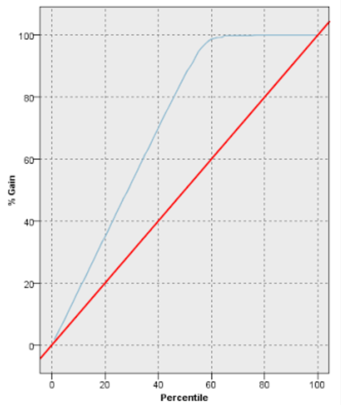

Standard-分类评价标准
---

# 1. 分类准确率
1. 分类准确率是指模型正确地预测新的或先前未见过的数据的类标号的能力，通常分类算法寻找的是分类准确率高的分类模型
2. 分类准确率在一般情况下可以满足分类器模型的比较

# 2. 计算复杂度
1. 计算复杂度决定着算法执行的速度和占用的资源，它依赖于具体的实现细节和软硬件环境。
2. 由于数据挖掘中的操作对象是海量的数据库，因而空间和时间的复杂度是非常重要的问题

# 3. 可解释性
分类结果只有可解释性好，容易理解，才能更好地用于决策支持，结果的可解释性越好，算法受欢迎的程度越高

# 4. 可伸缩性
一个模型是可伸缩的，是指在给定内存和磁盘空间等可用的系统资源的前提下，算法的运行时间应当随数据库大小线性增加

# 5. 强壮性或鲁棒性
指在数据集中含有噪声和缺失值的情况下，分类器正确分类数据的能力

# 6. 累积增益图
1. 累积增益图会在给定的类别中显示通过把个案总数的百分比作为目标而增益的个案总数的百分比。对角线是“基线”曲线，曲线离基线的上方越远，增益越大。
2. 累积增益图通过选择对应于大量收益的百分比选择分类标准值，然后将百分比与适当分界值映射。

# 7. 不平衡数据分类
1. 不平衡数据是指训练样本数量在类间分布不平衡，具体地说就是在同一数据集中某些类的样本数远大于其他类的样本数
   1. 样本数少的类为少数类(正类)
   2. 样本数多的类为多数类(负类)
2. 具有不平衡类分布的数据集出现在很多的实际应用中，很多重要信息隐藏在**少数类**中
3. 在这种类中。少数类的正确分类比多数类的正确分类更有价值，比如1%的的信用卡交易是欺诈。

# 8. 使用混淆系数矩阵
|          | 预测正确       | 预测错误       |
| -------- | -------------- | -------------- |
| 实际正确 | 正确的正例(TP) | 错误的负例(FN) |
| 实际错误 | 错误的正例(FP) | 正确的负例(TN) |

1. 不平衡数据分类问题中，我们不关注正确分类的负例
   1. 实际正例数$P = TP + FN$
   2. 实际负例数$N = FP + TN$
   3. 实例总数$C = P + N$
2. 分类准确率，对测试集分类时，分类正确样本的百分比

$$
Accuracy = \frac{正确预测数}{样本总数} = \frac{TP + TN}{C}
$$

2. 错误率，对测试集分类时，错误分类的样本占样本总数的百分比

$$
\begin{array}{l}
  Errorrate = 1- Accuracy \\
  = 1 - \frac{TP + TN}{C} \\
  = \frac{FN + FP}{C}\\
\end{array}
$$

3. 精度(真负率)，为正确分类的正例占分类结果为正例的样本个数的比例

$$
p = \frac{TP}{TP + FP}
$$

4. 召回率(真正率)，为正确分类的正例个数占实际正例个数的比例

$$
r = \frac{被正确分类的正例样本个数}{实际正例样本个数} = \frac{TP}{TP+FN}
$$

5. $F_1$度量，表示精度或召回率的调和平均值:$F_1 = \frac{2rp}{r+p}$，$F_1$度量趋向于接近精度或召回率中的较小者。
6. 精度和召回率是评价不平衡数据分类模型的两个常用度量，可以构造一个为基线模型，最大化其中一个度量，发现精度高，容易导致召回率低，召回率高容易导致精度低，而$F_1$度量平衡了这两个部分的效果。