**贝叶斯网络**
1. 在机器学习的过程中比较常用

<!-- TOC -->

- [1. 什么是贝叶斯网络(信念网络)](#1-什么是贝叶斯网络信念网络)
- [2. 贝叶斯理论概述](#2-贝叶斯理论概述)
    - [2.1. 垃圾邮件问题的实例](#21-垃圾邮件问题的实例)
    - [2.2. 贝叶斯概率基础](#22-贝叶斯概率基础)
- [3. 朴素贝叶斯分类模型](#3-朴素贝叶斯分类模型)
    - [3.1. 模型内容](#31-模型内容)
    - [3.2. 模型流程](#32-模型流程)
    - [3.3. 朴素贝叶斯分类器的提升](#33-朴素贝叶斯分类器的提升)
    - [3.4. 朴素贝叶斯的python实现](#34-朴素贝叶斯的python实现)
    - [3.5. 例子实现:朴素贝叶斯分类模型](#35-例子实现朴素贝叶斯分类模型)
- [4. 贝叶斯网络推理](#4-贝叶斯网络推理)
    - [4.1. 例子:警铃模型](#41-例子警铃模型)
        - [4.1.1. 各种概率的情况](#411-各种概率的情况)
        - [4.1.2. 问题分解](#412-问题分解)
        - [4.1.3. 不确定性分析的问题](#413-不确定性分析的问题)
        - [4.1.4. 问题解决](#414-问题解决)
    - [4.2. 优化的贝叶斯网络](#42-优化的贝叶斯网络)
        - [4.2.1. 警铃问题的一种链式图](#421-警铃问题的一种链式图)
        - [4.2.2. 如何定量表示图中节点间的依赖关系呢？](#422-如何定量表示图中节点间的依赖关系呢)
    - [4.3. 贝叶斯网络的Python实现](#43-贝叶斯网络的python实现)
- [5. 贝叶斯网络的表示](#5-贝叶斯网络的表示)
- [6. 贝叶斯网络的构建](#6-贝叶斯网络的构建)
    - [6.1. 构建的通常流程](#61-构建的通常流程)
- [7. 贝叶斯网络的学习](#7-贝叶斯网络的学习)
- [8. 贝叶斯网络推理](#8-贝叶斯网络推理)
    - [8.1. 精准推理](#81-精准推理)
    - [8.2. 近似推理](#82-近似推理)
- [9. 贝叶斯网络的应用](#9-贝叶斯网络的应用)
    - [9.1. 中文分词](#91-中文分词)
        - [9.1.1. 使用贝叶斯网络](#911-使用贝叶斯网络)
    - [9.2. 机器翻译](#92-机器翻译)
    - [9.3. 故障诊断](#93-故障诊断)
        - [9.3.1. 故障诊断的网络](#931-故障诊断的网络)
    - [9.4. 疾病诊断](#94-疾病诊断)
        - [9.4.1. 疾病诊断过程](#941-疾病诊断过程)

<!-- /TOC -->

# 1. 什么是贝叶斯网络(信念网络)
1. 贝叶斯网络(Bayesian network)，又称为信念网络(Belief network)，是一种通过有向无环图(Directed acyclic graph, DAG)表示**一组随机变量及其条件依赖概率**的概率图模型。
    + 概率图中，节点表示随机变量，有向边表示随机变量间的依赖关系，条件概率表示依赖关系的强度。
    + 没有父节点的节点用**先验概率**表达信息。两个节点若无连接则表示相互独立的随机变量。
2. 贝叶斯网络中的节点可以表示任意问题，丰富的概率表达能力使能较好地处理不确定性信息或问题。
3. 贝叶斯网络中所有节点都是可见的，并且节点间的因果关系可以非常直观地观察到。这些特性都使得贝叶斯网络在众多智能系统中有相当重要的应用
4. 本章首先介绍贝叶斯网络的基础知识，重点讲解贝叶斯的概率基础和朴素贝叶斯分类模型，并结合实际案例说明贝叶斯网络的应用。
5. 朴素贝叶斯用来区分垃圾邮件，主要是按照概率来确定到底是属于哪个部分的。
6. 贝叶斯网络是需要进行监督的。

# 2. 贝叶斯理论概述
1. 贝叶斯方法分析的特点是用概率表示不确定性，概率规则表示推理或学习，随机变量的概率分布表示推理或学习的最终结果。

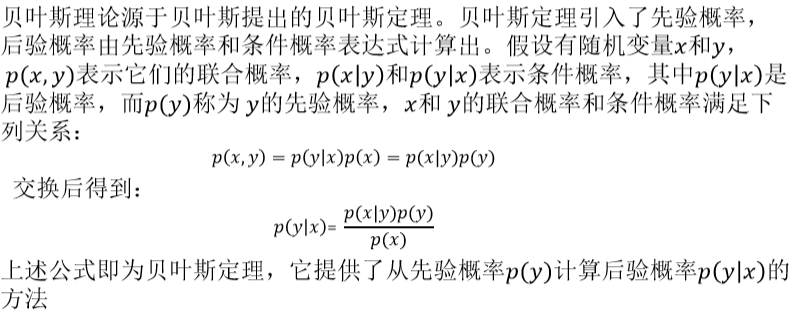

2. 第一个公式是朴素贝叶斯的核心。

## 2.1. 垃圾邮件问题的实例
1. x表示垃圾邮件的文字信息,y表示垃圾邮件的类别
2. 先验概率如何计算?用已经标注好的，人工标注的邮件
3. 我们通过语料库可以来进行学习分析，获得部分事情的先验概率。

## 2.2. 贝叶斯概率基础
1. 概率论
    1. 古典概率
    2. 几何概率
    3. 条件概率
    4. 加法定理
    5. 减法定理
    6. 独立事件
    7. 联合概率分布
    8. 条件概率分布
1. 贝叶斯概率
    1. 先验概率
    2. 后验概率
    3. 全概率公式
    4. 贝叶斯公式

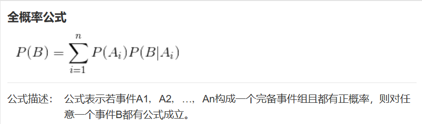
<a href = "https://www.cnblogs.com/yemanxiaozu/p/7680761.html">区分了解先验概率和后验概率</a>

# 3. 朴素贝叶斯分类模型
1. 朴素贝叶斯分类模型是一种简单的**构造分类器**的方法。
2. 朴素贝叶斯分类模型是将问题分为**特征向量和决策向量**两类，并假设问题的特征向量都是相互独立地作用于决策向量的，即问题的特征之间都是互不相关的。
    + x是特征向量，y是决策向量，判断类别。
    + 不像是决策树，它是计算先验概率等概率。
3. 尽管有这样过于简单的假设，但朴素贝叶斯分类模型能指数级降低贝叶斯网络构建的复杂性，同时还能较好地处理训练样本的**噪声**和无关属性，所以朴素贝叶斯分类模型仍然在很多现实问题中有着高效的应用，例如入侵检测和文本分类等领域。目前许多研究学者也在致力于改善特征**变量间的独立性**的限制使得朴素贝叶斯分类模型可以应用到更多问题上。
    + 独立保证其各个部分之间无关，如果不独立，我们用正交的方法来是的各部分无关。

## 3.1. 模型内容

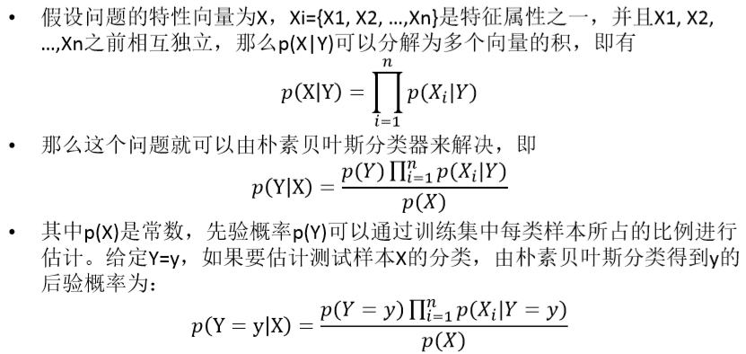

1. 第一个公式是乘法定理，所以为了保证这个公式一定成立，所以我们需要让各个部分事件之间独立
2. 第二部分，就是把乘法定理带入贝叶斯公式，然后我们就可以轻松的使用每个词来进行运算和分析。
3. 接下来，我们可以在后面计算得到相应的后验概率。

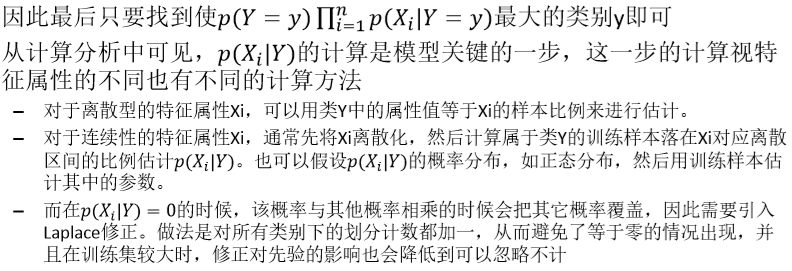

1. 第一个公式中，我们可以使用已经拥有的语料库来进行计算。
2. 离散型的特征值:我们用比例来估计
3. 连续型的特征值:就是价格是滑动，首先我们现将其进行离散化，数清楚不同类别。
    + 我们需要用样本

## 3.2. 模型流程

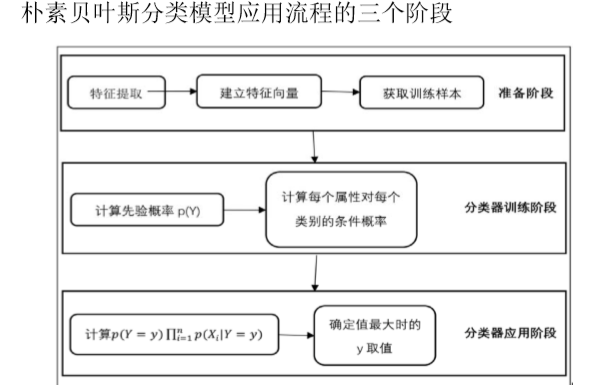

1. 问题确定后，要准备好标志好的样本(包含提取出来的重要词汇)
2. 最后用概率的大小来分辨到底属于哪一类。

## 3.3. 朴素贝叶斯分类器的提升
1. 朴素贝叶斯分类器还可以进行**提升(Boosting)**，提升方法的主要思想是学习多个分类器组成一个**分类器序列**，序列中后面的分类器对前面的分类器导致的错误分类的数据给予**更高的重视**，即调整前一个分类器分类**错误**的训练集的权值，并对训练集重新计算权值以调整下一个分类器，以此类推，最终得到提升后的强分类器。
    + 对于一开始被分类错误的部分，我们使用加强学习的方法。
2. 朴素贝叶斯分类模型结构简单，只有**两层结构(一个x一个y)**。由于**特征向量**间的相互独立，算法简单易于实现。同时算法有稳定的分类效率，对于不同特点的数据集其分类性能差别不大。朴素贝叶斯分类在小规模的数据集上表现优秀，并且分类过程时空开销小。算法也适合增量式训练，在数据量较大时，可以人为划分后分批增量训练。

## 3.4. 朴素贝叶斯的python实现
1. 以下是应用sklearn库中朴素贝叶斯（高斯）分类模型进行分析的示例代码。数据源是通过sklearn中的聚类生成器（make_blobs）生成的**50000**个随机样本，每个样本的**特征数为2个**，共有**三个类簇**，样本集的标准差是1.0，随机数种子为42。
    + 内部数据是机器产生的
```python
centers = [(‐5, ‐5), (0, 0), (5, 5)]
X,y=make_blobs(n_samples=50000,n_features=2,cluster_std=1.0,centers=centers,shuffle=False, random_state=42) # 随机产生样本
y[:n_samples// 2] = 0
y[n_samples// 2:] = 1
sample_weight= np.random.RandomState(42).rand(y.shape[0])
X_train, X_test, y_train, y_test,sw_train,sw_test=train_test_split(X, y, sample_weight, test_size=0.9, random_state=42) # 将样本集分成测试集和样本集
clf= GaussianNB() # 朴素贝叶斯模型
clf.fit(X_train, y_train)# 训练
prob_pos_clf= clf.predict_proba(X_test)[:, 1]# 预测
target_pred= clf.predict(X_test)
score = accuracy_score(y_test, target_pred, normalize = True)# 评分
print("accuracy score:",score)
```

2. 通过GuassianNB算法fit之后，对测试集X_test进行预测，结果存在 prob_pos_clf中

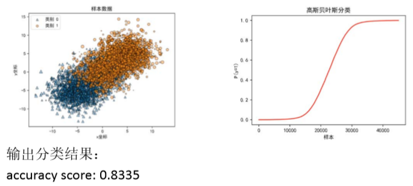

3. 如果不是仿真数据，是真实数据，那么将第二行到第四行替换成相应的文件数据库读写。

## 3.5. 例子实现:朴素贝叶斯分类模型

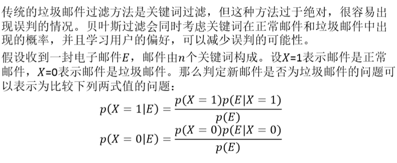

计算过程
---
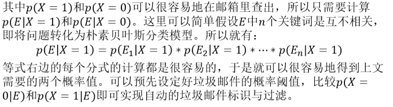

1. E<sub>1</sub>、E<sub>2</sub>、...、E<sub>n</sub>是每一个词的词频，所以我们近似认为他们之间是独立的。

# 4. 贝叶斯网络推理
1. 贝叶斯定理的缺点:独立性的要求高。
    + 很难保证两个时间之间是完全独立的。
    + 但是很多时候，因素是复杂的，调整成完全独立的是不合理的。
2. 不确定性推理是机器学习的重要研究内容之一。用概率论方法进行不确定推理的一般流程是首先将问题抽象为一组随机变量与其联合概率分布表，然后根据概率论公式进行推理计算，但这个流程复杂度高。
3. 不是简单的贝叶斯带入了，而是进行相应的分析，将问题抽象为一组随机变量与其联合概率分布表，然后根据概率论公式进行推理计算，但这个过程复杂度高。

## 4.1. 例子:警铃模型
1. 题目:欧阳老师的家中安置了一套智能监控设备，在家中**遭受盗窃或发生火灾**，设备会发出刺耳的警铃声，欧阳老师的邻居是**小明和小红**，假设两个邻居一般都在家中，他们听到欧阳老师家中的警报时会给欧阳老师打电话，但警报响的时候两个邻居可能会听不见。某天，出门在外的欧阳老师接到了小明的电话，小明说听到了欧阳老师家中的警报声。欧阳老师想知道家中遭受盗窃的可能性有多大？
2. 五个变量:
    1. 警报(A)、遭受盗窃(B)、发生火灾(C)、接到小明电话(D)、接到小红电话(E)，每一个变量都有Yes和No两种取值。

### 4.1.1. 各种概率的情况

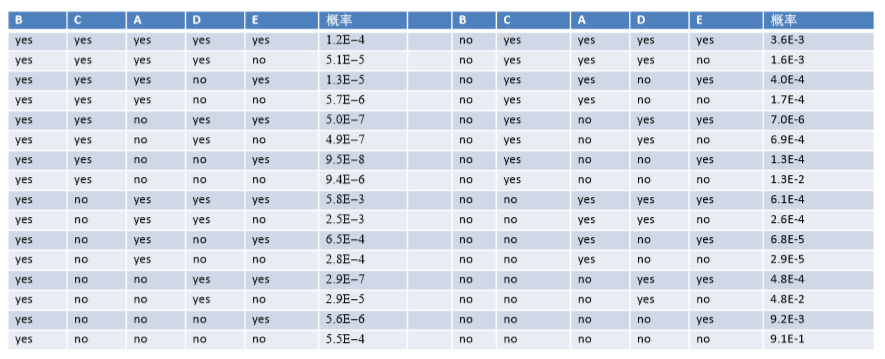

1. 我们会用到2<sup>5</sup>种概率情况。

### 4.1.2. 问题分解
1. 我们需要计算P(B=y|D=y)的概率
2. 计算p(B,D)这个先验概率
    + 如果各个事件无关那么直接加起来即可。

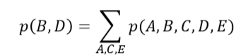

3. 计算结果

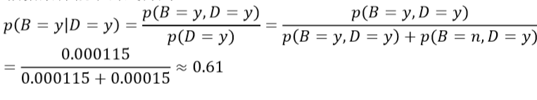

### 4.1.3. 不确定性分析的问题
1. 在例子中的问题是其复杂度过高，包含n个变量的联合概率有2<sup>n</sup>个项，其中有2<sup>n</sup>-1个独立参数，当n增加时，独立参数个数成指数型增长。

### 4.1.4. 问题解决

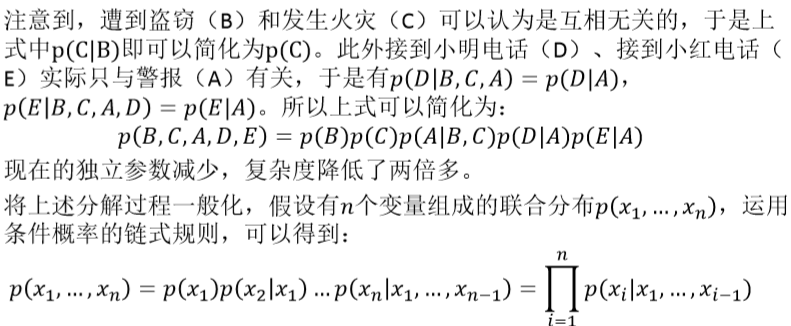

1. 利用条件概率的链式规则:P(B,C,A,D,E)=P(B)P(C|B)P(A|B,C)P(D|B,C,A)P(E|B,C,A,D)
2. 然后分析其独立性进行简化。

## 4.2. 优化的贝叶斯网络

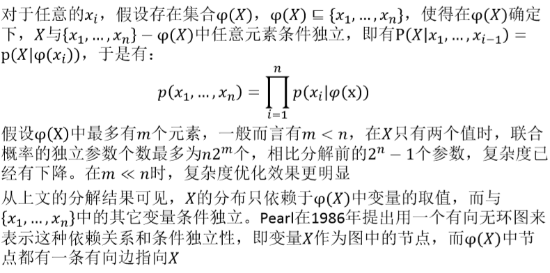

1. 不能使用两层贝叶斯网络，我们要利用他们之间的关系。
2. 在链式图中有些是有关系的而有些是没有关系的

### 4.2.1. 警铃问题的一种链式图


1. 左侧的图片就是简答贝叶斯网络，右侧是这个问题的概率表。最右边一列是在B，C的条件下的A的概率。

### 4.2.2. 如何定量表示图中节点间的依赖关系呢？


1. 概率表格可能是估计出来的，也可能是学习出来的

## 4.3. 贝叶斯网络的Python实现

<a href = "https://blog.csdn.net/qq_33789319/article/details/80511449">实现</a>

# 5. 贝叶斯网络的表示
1. 朴素贝叶斯是一个X，一个Y，而贝叶斯网络是多个X和一个Y。
2. 贝叶斯网络是使用有向无环图来表示变量间依赖关系的概率图模型。网络中每个节点表示一个随机变量，每一条边表示随机变量间的依赖关系，同时每个节点都对应一个**条件概率表**(Condition Probability Table，CPT)，用于描述该变量与父变量之间的依赖强度，也就是联合概率分布。 


1. 参数就是受到影响的参数概率表。

# 6. 贝叶斯网络的构建
1. 贝叶斯网络的构建一般有三种方式
    1. 根据问题和领域专家知识手工构建
    2. 通过对数据进行分析得到贝叶斯网络
    3. 结合了领域专家知识和数据分析得到贝叶斯网络
2. 贝叶斯网络是由有向无环图结构和对应的条件概率表构成，所以手工构建的过程也包括了确定网络结构和确定网络参数两个环节。
3. 网络参数在手工构建时一般通过数据统计分析和专家知识获得,常通过假设条件分布具有某种规律以减少网络参数的个数

## 6.1. 构建的通常流程


# 7. 贝叶斯网络的学习
1. 贝叶斯网络学习是对数据进行统计分析获取贝叶斯网络的过程。学习包括了**参数学习和结构学习**两部分。
    + 参数学习是在网络结构已知的情况下确定参数即条件概率表中的值。
    + 结构学习则既需要确定网络结构G以定性反映变量间的依赖关系，又需要确定网络参数以定量得到条件概率表中的值
2. 在对贝叶斯网络进行参数学习时，我们已经知道了网络结构G和G中所有节点或部分节点的状态值，这些状态值就是需要进行学习的**数据集**。

# 8. 贝叶斯网络推理
1. 贝叶斯网络的**推理**是指在已知网络结构G和参数Θ下，给定某些证据或变量的值通过概率论的方法求目标变量值的过程。贝叶斯网络的推理主要包括两种，一种为自顶向下的推理，一种为自底向上的推理 
2. 推理主要运用的方法有精确推理和近似推理两种，分别有一些算法来解决实际问题。不同情况下有不同因素影响推理，**贝叶斯网络拓扑结构和推理任务**是两大主要复杂度来源。
3. **网络的大小、变量的类型和分布情况、推理任务的类型和相关证据的特征**都会影响推理过程和结果，实际应用中也应灵活选择推理方法

## 8.1. 精准推理
1. 精确推理最简单的方法即计算**全局的联合概率**，但直接对联合概率进行计算的效率很低，常常采用**变量消元法**分别联合概率的求解达到简化计算的目的。
2. 变量消元法利用链式乘积法则和条件独立性对联合概率计算表达式进行变换，改变基本运算的次序改变消元的次序，最终达到减少计算量的目的。该方法的基本思想可以通过一个简单例子描述，假设有如下所示的简单贝叶斯网络
    + A通过语料库学习等方法来学习完成。
    + B、C的条件概率表都需要准备好。


3. 精准推理的公式

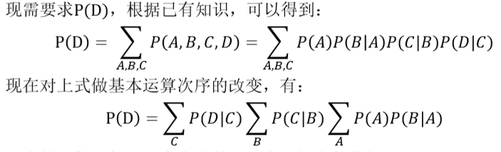

1. 这样子，现在的计算量相比改变次序前已经有了较大的降低
2. 注意到:上面简单的改变次序使得运算局部化，计算只涉及到与某个变量相关额部分，这样可以将指数级降低运算复杂度。
3. 减低复杂度的关键:找到一个最优的变量消元次序。

## 8.2. 近似推理
1. 在贝叶斯网络节点很多或依赖关系很复杂时，精确推理的复杂度很高，通常需要降低推理的复杂度，在问题的因果关系在网络中可独立于某一块存在时，可以将这一部分结构提取出来用精确推理的方法推理。**在不能利用局部独立时，就需要降低计算的精度，即采用近似推理的方法。**
2. 随机抽样算法是最常用的近似推理方法。该方法又被认为蒙特卡洛算法或随机仿真。
    + 算法的基本思想上根据某种概率分布进行随机抽样以得到一组随机样本，再根据这一组随机样本近似地估计需要计算的值

# 9. 贝叶斯网络的应用
1. 贝叶斯网络经过长期的发展，现已被应用到人工智能的众多领域。包括模式识别、数据挖掘、自然语言处理、辅助智能决策等等。其中针对很多领 域核心问题的分类问题，大量卓有成效的算法都是基于贝叶斯理论设计
2. 在医疗领域，贝叶斯网络用于医疗诊断
3. 在工业领域，贝叶斯网络用于对工业制品的故障检测和性能分析
4. 在军事上也被应用于身份识别等各种战场推理
5. 在生物农业领域，贝叶斯网络在基因连锁分析、农作物推断、兽医诊断、 环境分析等等问题上都有大量的应用
6. 在金融领域可用于构建风控模型
7. 在企业管理上可用于决策支持
8. 在自然语言处理方面可用于文本分类、中文分词、机器翻译

## 9.1. 中文分词
1. 中文分词问题可以描述为给定一句话，将其切分为合乎语法和语义的词语序列。一个经典的中文分词案例是对“南京市长江大桥”的分词。正确的 分词结果为“南京市/长江大桥”，错误的分词结果是“南京市长/江大桥” 。下面我们使用贝叶斯算法来解决这一问题。


### 9.1.1. 使用贝叶斯网络


1. 算法:K-gram:一个词的出现和前面k个词有关。

## 9.2. 机器翻译


1. 按照计算得到的相应概率，可以得到相应的值。

## 9.3. 故障诊断
1. 故障诊断是为了找到某种设备出现故障时故障的所在部件，在工业领域，自动的故障诊断装置能节省一线工作人员大量的预判断时间。基于规则的系统可以被用于故障诊断，但是起不能处理不确定性问题，在实际环境中难以灵活应用。贝叶斯网能较好地描述可能的故障来源，在处理故障诊断的不确定问题上有优秀的表现。多年来研究人员开发出了多种基于贝叶斯网络的故障诊断系统，包括对汽车启动故障的诊断、波音飞机的故障诊断、核电厂软硬件的故障诊断等等。

### 9.3.1. 故障诊断的网络

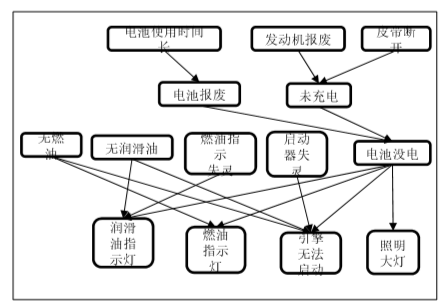

1. 根据网络，按照联合概率来计算最后的简化的联合概率。

## 9.4. 疾病诊断
1. 首先建立网络。
2. 然后根据语料库来建立相应的条件概率表。
3. 疾病诊断是从一系列历史经验和临床检验结果中对病人患有疾病种类和患病程度的判断。机器学习在疾病诊断领域有较多的应用，在上世纪70年代就有基于规则设计的产生式专家系统用于对疾病进行诊断，但是该类型系统不能处理不确定性使其诊断正确率远低于临床医生。后来研究人员基于贝叶斯网络设计了新的疾病诊断系统以处理不确定性问题，新系统的诊断准确程度已可与专业临床医生相当。下面是一个对胃部疾病建模的简单贝叶斯网络的部分，网络结构与条件概率不一定符合真实情况，这里关键是对贝叶斯网络的应用予以阐释。假设我们已经根据历史诊断经验得到了如下图所示贝叶斯网络结构


### 9.4.1. 疾病诊断过程


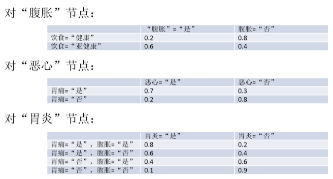
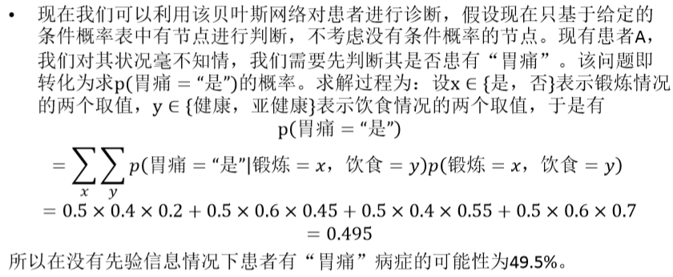
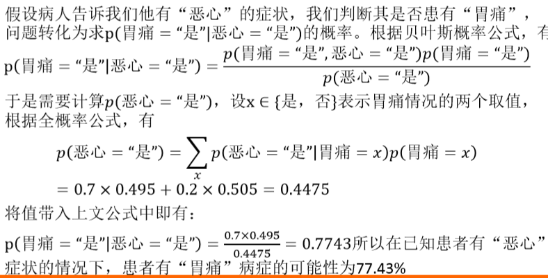

1. 可以用贝叶斯网络，也可以用低层贝叶斯