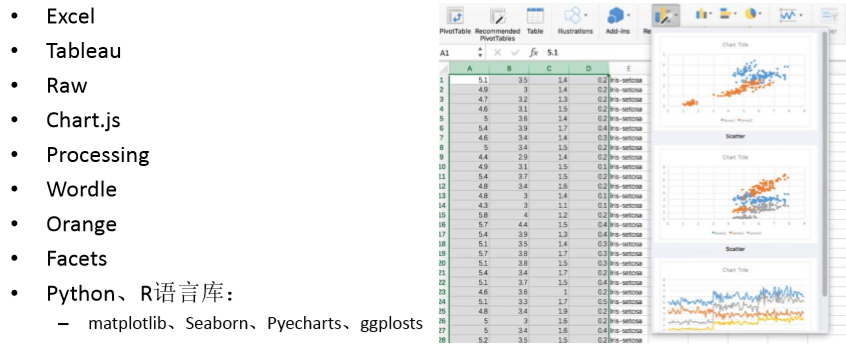

**可视化分析**

# 1. 什么是可视化分析
1. 可视化分析是一种**数据分析方法**，利用人类的形象思维将数据关联，并映射为形象的**图表**。人脑对于视觉信息的处理要比文本信息容易得多，所以可视化图表能够使用户更好地理解信息，可视化分析凭借其直观清晰，能够提供新洞察和发现机会的特点活跃在诸多科学领域

## 1.1. 可视化的作用
1. 在数据分析中，通过绘制图表更容易找到**数据中的模式**。传统的数据分析方法存在一些局限性，需要借助于分析师丰富的分析经验。可视化分析方法将数据以图像的方式展现，提供友好的交互，还可以提供额外的记忆帮助，对于将要分析的问题，无需事先假设或猜想，可以自动从数据中挖掘出更多的隐含信息
2. 在机器学习领域，缺失数据、过度训练、过度调优等都会影响模型的建立，可视化分析可以帮助解决其中一些问题
3. 可视化分析在机器学习的数据预处理、**模型选择**、参数调优等阶段也同样发挥重要作用。在数据建模的过程中，容易辨别出数据的分布、异常、参数取值对模型性能的影响等
    + 用来确定具体是用K-Means算法还是其他类型的算法好。
4. 在分析结果展示时，通过建立可视化仪表板，组合多幅可视化图表，从不同的角度来描述信息，全方位展示分析结论
5. 除了辅助数据分析之外，可视化分析为看似冰冷的数据带来更多趣味性，直观清晰的表达拥有更多的受众。在信息传播领域，可视化结果的独特风格(颜色、线条、轴线、尺寸等)不仅将有用的信息展示出来，更像是种精美的艺术品，让数据展示也变得更加富有情感

## 1.2. 可视化分析方法
1. 为了获得易于理解的可视化结果，人机交互很重要。可视化分析的常用方法大致可以划分为三个层次：**领域方法、基础方法以及方法论基础**。
2. 领城方法领域方法是根据数据的来源领域以及数据的性质进行可视化，包括地理信息可视化、空间数据可视化、文本数据可视化、跨媒体数据可视化、实时数据可视化等。
3. 可视化基础方法基础方法包括**统计图表、视觉隐喻**。常见的统计图表有柱状图、折线图、饼图、箱图、散点图、韦恩图、气泡图、雷达图、热地图、等值线等，不同的统计图表有各自的适用场合。
4. 可视化分析的方法论基础是视觉编码，视觉编码是指受众对于接收到的视觉刺激进行编码，所以视觉编码的关键在于使用符合目标用户人群视觉感知习惯的表达方法，鉴于视觉感知习惯往往与一个人的知识、经验、心理等多种特异性的因素相关，而且视觉感知是一种视觉信息直接映射与信息提取、转换、存储、处理、理解等后续活动结合而成的过程。

## 1.3. 常见的可视化工具

### 1.3.1. Seaborn库
1. <a href = "https://mp.weixin.qq.com/s/Qezd714Hi1K4QwtODveL0A">Seabon库</a>
2. <a href = "https://mp.weixin.qq.com/s/-qhdB3rYsLxDsuw50iEOFw">Matplotlib+Seaborn的异同</a>