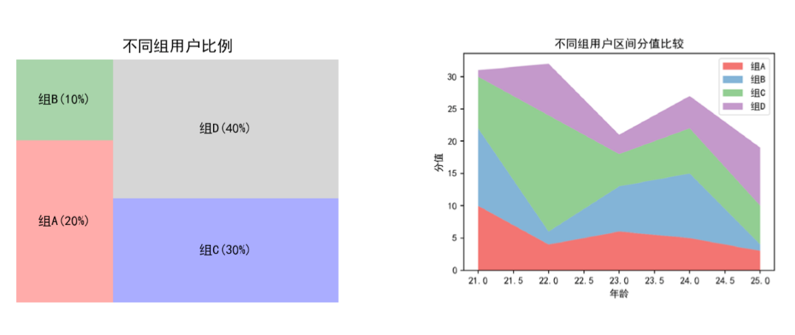

**可视化方法**
1. 这个主要是介绍了各个相应的可视化图。

# 1. 饼图
```py
import matplotlib.pyplot as plt
plt.rcParams['font.sans-serif']=['SimHei']#用来正常显示中文
plt.rcParams['axes.unicode_minus']=False#用来正常显示负号
labels='财经15%','社会30%','体育15%','科技10%','其它30%'#初始化参数autopct为显示的百分比样式
sizes=[15,30,15,10,30]
explode=(0,0.1,0,0,0)#突出第2项
fig1,ax1=plt.subplots()
pie = ax1.pie(sizes, explode=explode, labels=labels, autopct='%1.1f%%',shadow=False, startangle=90)
patches=pie[0]#设置分块的填充模式
patches[0].set_hatch('.')
patches[1].set_hatch('-')
patches[2].set_hatch('+')
patches[3].set_hatch('x')
patches[4].set_hatch('o')
#以上的语句主要是用来设置填充的
plt.legend(patches,labels)
ax1.axis('equal')
plt.title('新闻网站用户兴趣分析')
plt.show()
```
1. 效果

# 2. 柱状图
```py
import numpy as np
N=5
inMeans=(20,25,30,35,27)
outMeans=(25,35,34,20,25)
inStd=(2,3,4,1,2)
outStd=(3,5,2,3,3)
ind=np.arange(N)#Bar坐标位置
width=0.5#Bar的宽度
#使用plt.bar()方法生成两个国人和国外两组柱子 
p1=plt.bar(ind,inMeans,width,yerr=inStd) 
P2=plt.bar(ind,outMeans,width,bottom=inMeans,yerr=outStd) #查看不同组用户的总分值基础上，查看组内不同类别的用户分值占比情况
plt.ylabel('分值')
plt.title('不同组用户下国内外用户分值') 
plt.xticks(ind,('组1','组2','组3','组4','组5'))
plt.yticks(np.arange(0,81,10))
plt.legend((p1[0],p2[0]),('国内','国外')) 
plt.show()
```
1. 效果

# 3. 不同类型的图形

## 3.1. 时间序列可视化
1. 折线图:发展趋势
2. 柱状图:变量的分布趋势
3. 散点图:也是发展趋势

## 3.2. 比例的可视化
1. 比例图:变形的饼状图
2. 面积图:内容丰富



## 3.3. 关系可视化
1. 散点图:
2. 泡泡图:泡泡的大小是不一样的
    + 泡泡可能是带来的销售额
    + 一个图片可以了解超过两个变量之间的关系
3. 直方图:研究变量的概率分布
4. 组直方图:每一个小组的得分满足一个分布规律

## 3.4. 差异可视化
1. 热度图:颜色的深浅表示产量
2. 箱图(盒图):一个变量和另一个变量之间的关系，
3. 多坐标图:每一个竖线都是一个变量
4. 社交网络图:做相关性和关系分析

## 3.5. 空间关系可视化
1. 韦恩图

# 4. 平行坐标图
1. 表达高维数据的可视化

# 5. 各种python图的实现
1. <a href = "https://mp.weixin.qq.com/s/DLkIrHywq74m5SF1b3Z1Pw">50个数据可视化最有价值的图表(附完整Python代码)</a>

