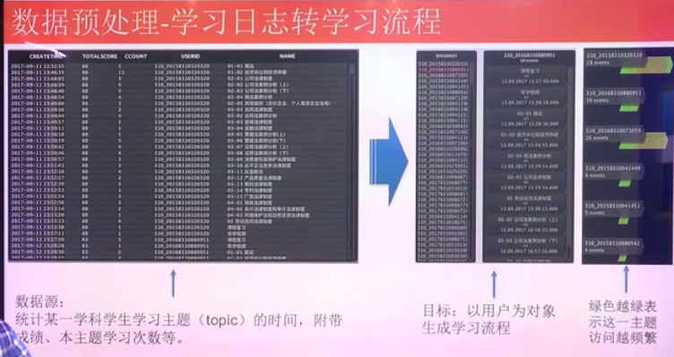
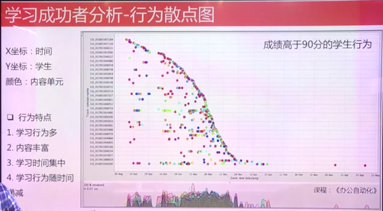
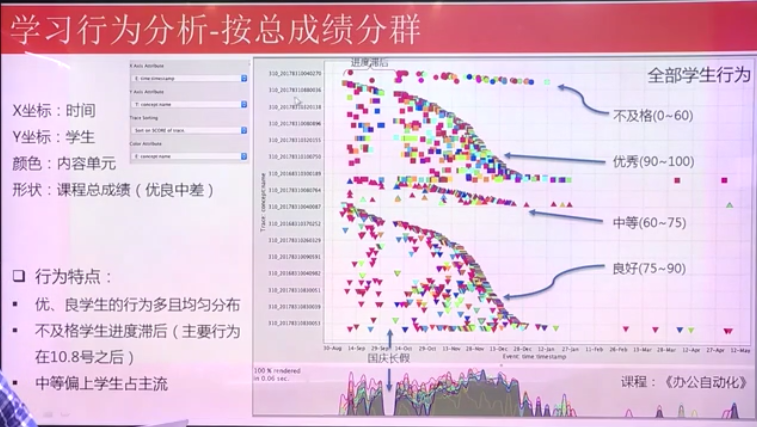
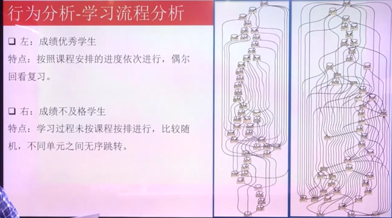
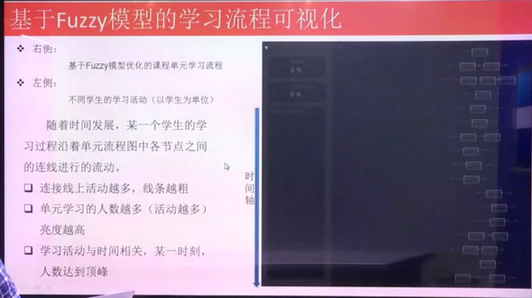

**数据分析实例**

# 1. 项目案例一:基于流程挖掘的学习行为分析

## 1.1. 项目背景
1. 以MOOC为例，其教学参与人数多，规模大
2. 如何通过分析学生学习数据确定是否需要帮助等问题。
    + 学情预警

## 1.2. 数据背景
1. 根据学生学习留下来的信息数据

## 1.3. 实现

### 1.3.1. 数据预处理——学习日志转学习流程

1. 点击网页的时间，访问的时间，你测试的正确的比例。
2. 数据源比较杂，数据量比较大。
    + 数据存储的形式是半结构化的。
3. 学情预警等问题
    + 通过单元的通过率等角度来考虑
4. 结论:我们从流程的角度来看能否分析一个学生学习的方式。
    + 好学生、不好学生的不同的流程来对比

### 1.3.2. 学习流程分析-行为散点图
1. 学习成功者分析

2. 学习失败者分析

3. 按学习行为分析-按总成绩分群

### 1.3.3. 行为分析-学习流程分析

基于Fuzzy模型的学习流程分析
---

1. 和优秀的同学进行比较
2. 对知识点、轨迹和成绩进行分类。
3. 推理是否之前的知识点存在问题。