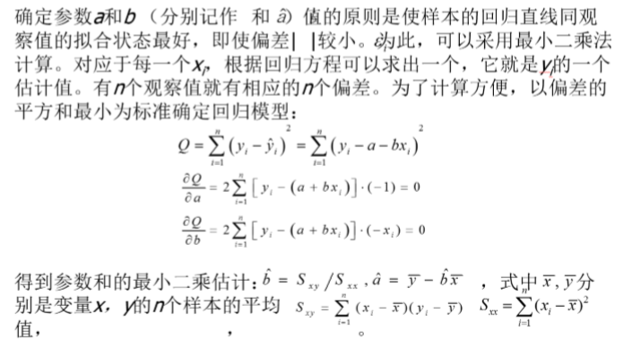
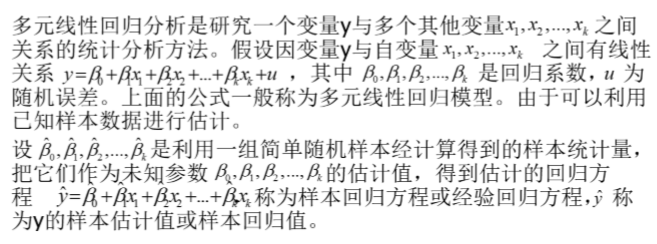
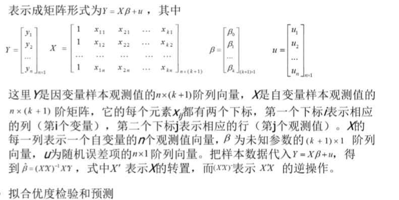
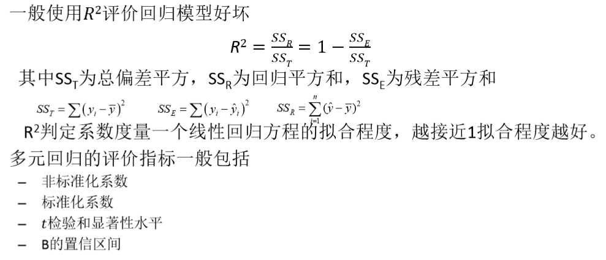
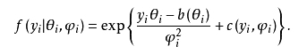
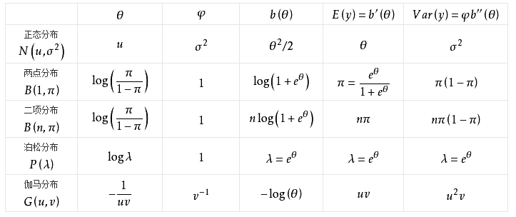

# 1. 线性回归
1. 线性回归是种通过拟合自变量与因变量之间最佳线性关系，来预测目标变量的方法
2. 回归过程是给出一个**样本集**，用函数拟合这个样本集，使样本集与拟合函 数间的误差最小
3. 回归分析包括以下内容
    + 确定输入变量与目标变量间的回归模型，即变量间**相关关系的数学表达式**
    + 根据样本**估计并检验回归模型**及**未知参数**
    + 从众多的输入变量中，判断哪些变量对目标变量的影响是显著的
    + 根据输入变量的已知值来估计目标变量的平均值并给出预测精度
4. 线性回归的类型包括**简单线性回归和多元线性回归**
    + 简单线性回归使用一个自变量，通过拟合最佳线性关系来预测因变量
    + 多元线性回归使用多个独立变量，通过拟合最佳线性关系来预测因变量
5. 非线性回归归根结底还是线性回归

## 1.1. 单变量回归
1. 一元线性回归是描述两个变量之间线性相关关系的最简单的回归模型，如下图。在散点图中两个变量呈线性关系。一元线性回归模型表示为y = a + bx + ε，其中a和b是系数，ε是随机变量。在这个线性模型中，自变量x是非随机变量。随机变量要求服从正态分布。

1. 单变量回归的线性回归方程如上。
2. 而我们在求解a和b的时候，其实是对二元函数求偏导后得到全局最优解。而我们得到解叫做**闭式解**或者**解析解**

## 1.2. 单变量回归的假设函数
1. 我们假设x和y成线性关系，所以我们认为满足如假设函数的关系
2. x被称为属性值
3. y被称为标记(显然这是在监督学习的时候)

## 1.3. 代价函数

1. 这里的cost是关于a和b的代价函数。
2. 人们一般通常使用J来代表的代价函数。
3. 我们可以画出代价函数和b的函数图像来进行抽象
   1. b作为x周
   2. 代价函数的值为y
4. 代价函数的理解(使用两个参数):获得一个3D图
   1. 等高线图:每一个椭圆表示一个同代价的点，横纵轴是两个参数。

## 1.4. 计算线性回归的最优解
1. 我们使用了拉格朗日法来求最优解(最小二乘法)
2. 首先求x和y的偏导数，并令其分别为零
3. 计算上述两个式子的结果(通过高斯消元法)

## 1.5. 使用Batch梯度下降法计算线性回归算法

1. 一定要同时更新两个参数
2. 大多数的线性回归的函数都是一个凸函数(弓形函数) —— 意味着只有一个全局最优解
3. 这种梯度下降，每一步都遍历了所有的训练集。

# 2. 多变量回归(多元线性回归)
1. 属性:每一个影响的因素。
2. 属性值:属性可能的取值。
3. 数据集:包含着相应的属性数据的集合。
4. 目前考虑的问题是一个**监督学习**的问题

## 2.1. 什么是多变量线性回归

## 2.2. 多变量回归的假设函数

## 2.3. 多变量回归的代价函数

## 2.4. 求闭式解
1. 我们类似单变量回归来看这个问题，易知这个方程组是m+1阶可解的。
2. 

# 3. 线性回归模型优化
1. 拟合:就是把平面上一系列的点，用一条光滑的曲线连接起来。
2. 表示形式:函数的形式来表示。
    + 拟合出来的是直线(曲线),曲线是什么情况呢?就是将他自己和他自己的多项式
3. 问题出现:欠拟合、过拟合和合适的结果

## 3.1. 奥卡姆剃刀定理
1. 如无必要，勿增实体

## 3.2. 避免过拟合的方法
1. 在适当的时候停止训练，让模型刚好处在那个拟合数据的节点
2. 我们在线性模型中，可以使用交叉验证和正则化的方法来避免过拟合。

### 3.2.1. 正则化
1. 目的:让最后的模型变得正确。
2. 在一开始的时候，我们假设每一个参数θ一开始都是不确定的，是一个随机数，经过梯度下降法不断迭代，让θ慢慢接近我们想要的值。

3. 注意这里的θ是一个参数，而不是参数组成的矩阵。λ是一个正值，那么为什么我们要加上分式呢?
    + 我们变化这个式子:
    + 此时你能看到，每一次迭代都会导致θ的值减少一点点
4. 新的问题，我们是要对所有的θ都进行如上操作吗?不是的，我们需要优化和**高次项**对应的参数θ
    + 如果λ很大，高次项系数变小的速度很快，模型有欠拟合的趋势，如果λ很小，高次项系数变小的速度很慢，模型有过拟合的倾向。
5. **目标:找到一个最好的合适的λ**
6. 正则化可以解决正规方程不可解的情况。
    + 正规方程不可解的问题是中左侧的矩阵不可逆
    + 解决方法是把他变得可逆

## 3.3. 局部加权线性回归
1. 主要目的是避免**过拟合**。
2. 为了防止我们的假设函数太复杂，导致模型过渡依赖于已知的**数据集**，而缺乏**泛化**能力
    + 那么我们是不是能使用简单的线性模型呢？
3. 答案是显然的:不可以，过于简单的线性模型会导致欠拟合，那么我们就选择使用**局部加权线性回归**来完成
    + 出于局部性:我们必然只能在某些观测点附近进行调整，因此模型会对其他点变得非常不准确。
4. 当我们确定了需要预测的属性值的时候，我们可以优先考虑这个点附近的数据集，而削弱了远处的点对模型的影响。

## 3.4. 削弱远处数据集的影响，重点考虑近处的数据集。
1. 我们使用核函数来表示权重。
2. 核函数的形式:,这就是高斯核函数。
3. 代价函数为
4. 所以我们对每一个平方乘以相应的高斯核函数，结果为
5. 接下来只需要按照求偏导即可

## 3.5. 扩展到一般情况
1. 我们设对角矩阵W如下

2. 在多元线性回归中，我们代价函数的矩阵形式中把W成进来，然后对其求偏导，置零，最后我们得到了**局部加权下线性回归**的**正规方程**的**闭式解**。
3. 当然你也可以使用梯度下降法来计算这个问题。

# 4. 线性回归检验

1. 用来保证刚刚的假设是成立的

# 5. 线性回归实例

1. 箱图主要是针对非数值型变量。
2. R2是可以接受的。

# 6. 实例
1. <a href = "https://mp.weixin.qq.com/s/fAu0jwL_V-2WN6Loa3wdcQ">用Python的Scikit-Learn实现线性回归</a>
2. <a href = "https://mp.weixin.qq.com/s/SdpiQEcCHQa_wT-qvurgoA">多元线性回归</a>

# 7. 正则化线性回归
1. 岭回归和LASSO回归

# 8. 广义线性回归

## 8.1. 指数族分布

1. 𝜃𝑖是指数族的自然参数(natural parameter)，是我们感兴趣的参数；
𝜑𝑖称为尺度参数或讨厌参数；

