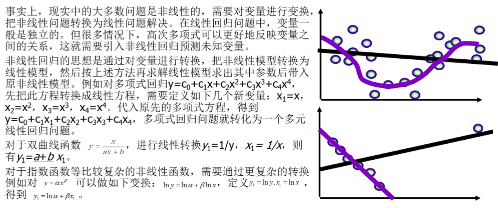
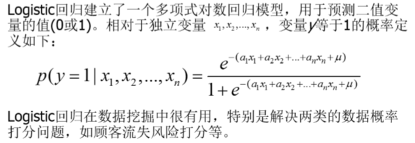
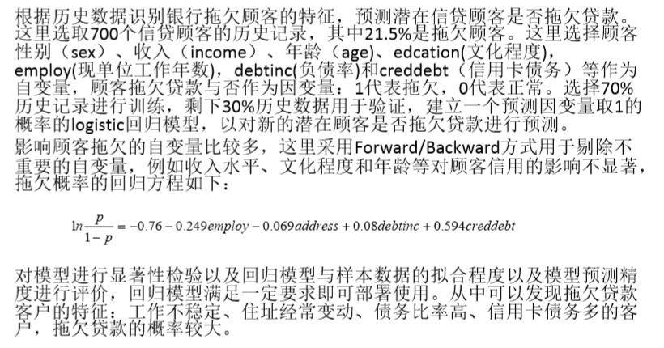

# 1. 非线性模型
1. 在统计学中，非线性回归是回归分析的一种形式，非线性模型是由一个或多个自变量非线性组合
2. 一些常见非线性模型
    + 阶跃函数
    + 分段函数
    + 样条曲线
    + 广义加性模型
3. 非线性模型的degree为1的时候，模型就退化成了线性模型。

# 2. 非线性回归

1. 求加权平均，多元非线性回归问题我们需要化归成为一元非线性回归问题。
2. 排除因为噪声点而导致非线性问题。
3. 将非线性回归问题转化为线性回归问题。

# 3. Logistics回归

1. 逻辑回归是一种预测分析，解释因变量与一个或多个自变量之间的关与线性回归不同之处就是它的目标变量有几种类别，所以逻辑回归主要用于解决分类问题，与线性回归相比，它是用概率的方式，预测出来属于某一分类的概率值。如果超过50%，则属于某一分类。此外，它的可解释强，可控性高，并且训练速度快，特别是经过特征工程之后效果更好
2. 按照逻辑回归的基本原理，求解过程可以分为以下三步
    + 找一个合适的预测分类函数，用来预测输入数据的分类结果，一般表示为h函数，需要对数据有一定的了解或分析，然后确定函数的可能形式
    + 构造一个损失函数，该函数表示预测输出（h）与训练数据类别（y）之间的偏差，一般是预测输出与实际类别的差，可对所有样本的Cost求R方值等作为评价标准，记为J(θ)函数
    + 找到J(θ)函数的最小值，因为值越小表示预测函数越准确。求解损失函数的最小值是采用梯度下降法实现

## 3.1. 应用logistic回归模型预测银行顾客是否拖欠贷款

1. 依旧使用R2校验来确定假设是否成立。

## 3.2. 如何训练逻辑回归?
1. 熵
2. 交叉熵
3. KL散度
4. 极大似然估计