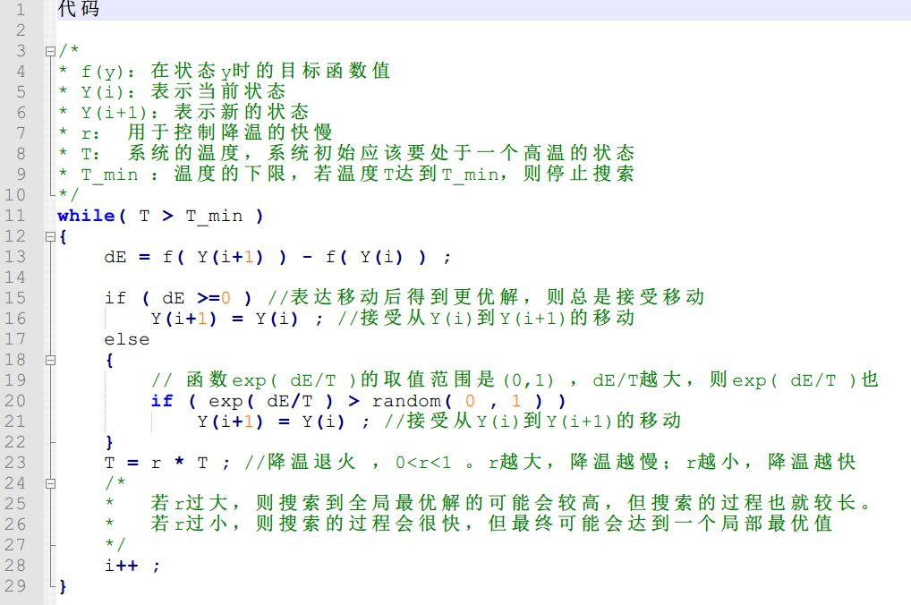

**模拟退火算法**
---
# 1. 什么是模拟退火算法
1. 模拟退火算法(Simulated Annealing Arithmertic, SAA)的思想借鉴于固体的退火原理，当固体的温度很高的时候，内能比较大，固体的内部粒子处于快速无序运动，当温度慢慢降低的过程中，固体的内能减小，粒子的慢慢趋于有序，最终，当固体处于常温时，内能达到最小，此时，粒子最为稳定。模拟退火算法便是基于这样的原理设计而成。
2. 模拟退火算法是一种通用概率演算法，用在一个大的搜寻空间内找寻命题的最优解。是解决TSP问题的有效方式之一。
3. 模拟退火算法相对于爬山算法而言，是在一定情况下跳出局部最优解(有一定概率不)

# 2. 模拟退火算法步骤
1. 初始化温度T(充分大)，温度下限T min(充分小)，初始解X，每个T值迭代次数L
2. 随机生成临域解x_new;
3. 设f(x)函数来计算用来计算解得好坏，计算出f(x_new)-f(x);
4. 如果f(x_new)-f(x)>0，说明新解比原来的解好，则无条件接受，如果f(x_new)-f(x)<0，则说明旧解比新解好，则以概率exp((f(xnew)-f(x))/k*T)接受x_new作为解。
5. 如果当前温度< Tmin时，则退出循环，输出当前结果，否则减少当前温度，回到第2步继续循环，常用的降温方法为T= a*T (0< a <1)，一般a取接近1的值

# 3. java实现模拟退火算法
```java
public class SATest {
    public static final int T = 1000;// 初始化温度
    public static final double Tmin = 1;// 温度的下界
    public static final int k = 100;// 迭代的次数
    public static final double delta = 0.98;// 温度的下降率
    public static double getX() {
        return Math.random() * 100;
    }
 /**
 * 评价函数的值,即对应上文中的f(x)
 * @param x目标函数中的一个参数
 * @param y目标函数中的另一个参数
 * @return函数值
 */
public static double getFuncResult(double x, double y) {
    double result = 6 * Math.pow(x, 7) + 8 * Math.pow(x, 6) + 7 * Math.pow(x, 3) + 5 * Math.pow(x, 2) - x * y;
    return result;
}
 /**
 * 模拟退火算法的过程
 * @param y目标函数中的指定的参数
 * @return最优解
 */
public static double getSA(double y) {
    double result = Double.MAX_VALUE;// 初始化最终的结果
    double x[] = new double[k];
    // 初始化初始解
    for (int i = 0; i < k; i++) {
        x[i] = getX();
        }
        // 迭代的过程
        while (t > Tmin) {
            for (int i = 0; i < k; i++) {
                // 计算此时的函数结果
                double funTmp = getFuncResult(x[i], y);
                // 在邻域内产生新的解
                double x_new = x[i] + (Math.random() * 2 - 1);
                // 判断新的x不能超出界
                if (x_new >= 0 && x_new <= 100) {
                    double funTmp_new = getFuncResult(x_new, y);
                    if (funTmp_new - funTmp < 0) {
                        // 替换
                        x[i] = x_new;
                        } else {
                            // 以概率替换
                            double p = 1 / (1 + Math.exp(-(funTmp_new - funTmp) / T));
                            if (Math.random() < p) {
                                x[i] = x_new;
                            }
                        }
                }
            }
        T = T * delta;
        }
        for (int i = 0; i < k; i++) {
            result = Math.min(result, getFuncResult(x[i], y));
        }
        return result;
    }
        public static void main(String args[]) {
            // 设置y的值
            int y = 0;
            System.out.println("最优解为：" + getSA(y));
        }
}
```

# 4. 旅行商问题(TSP,Traveling Salesman Problem)
1. 有若干个城市，任何两个城市之间的距离都是确定的，现要求一旅行商从某城市出发必须经过每一个城市且只在一个城市逗留一次，最后回到出发的城市，问如何事先确定一条最短的线路已保证其旅行的费用最少？

# 5. 伪代码实现


# Python实现退火算法
```py
import datetime
import math
import random
from tqdm import tqdm

# 计算两个城市之间的距离
def distance(city1,city2):
    return math.sqrt(pow(city1[0]-city2[0],2) + pow(city1[1]-city2[1],2))

# 计算道路的长度
def path_len(arr):
    path = 0
    index = arr[0]
    for i in range(N - 1):
        index1 = arr[i]
        index2 = arr[i + 1]
        dis = distance(city_pos[index1 - 1],city_pos[index2 - 1])
        path += dis
    last_index = arr[N - 1]
    first_index = arr[0]
    last_dis = distance(city_pos[last_index - 1],
                        city_pos[first_index - 1])
    path += last_dis
    return path

# 初始化
def init():
    for i in range(N):
        city_list.append(i + 1)

# 产生一个新解
# 随机交叉两个位置的方式来产生新的解
def create_new():
    r1 = random.random()
    r2 = random.random()
    pos1 = int(r1 * N)
    pos2 = int(r2 * N)
    temp = city_list[pos1]
    city_list[pos1] = city_list[pos2]
    city_list[pos2] = temp

T0 = 50000.0 # 初识温度
T_end = 1e-8
q = 0.98 # 退火系数
L = 1000 # 每个温度的迭代次数
N = 31
city_list = [] # 存放一个解的地方

city_pos = [[1304,2312],[3638,1315],[4177,2244],
            [3712,1399],[3488,1535],[3326,1556],
            [3238,1229],[4196,1004],[4312,790],
            [4386,570],[3007,1970],[2562,1756],
            [2788,1491],[2381,1676],[1332,695],
            [3715,1678],[3918,2179],[4061,2370],
            [3780,2212],[3676,2578],[4029,2838],
            [4263,2931],[3429,1908],[3507,2367],
            [3394,2643],[3439,3201],[2935,3240],
            [3140,3550],[2545,2347],[2778,2826],
            [2370,2975]]

if __name__ == '__main__':
    start = datetime.datetime.now()
    print("开始时间:",end = "")
    print(start)
    count = 0 # 记录降温次数
    T = T0 # 初始温度
    init() # 初始化一个解
    while(T > T_end):
        # print("第" + str(count + 1) + "次退火,当前温度:" + str(T) +",结束温度:" + str(T_end))
        for i in range(L):
            city_list_copy = city_list.copy() # 保存初始解
            create_new() # 产生新解
            f1 = path_len(city_list_copy) # 初始解目标函数值
            f2 = path_len(city_list) # 新解目标函数值
            df = f2 - f1
            if(df >= 0):
                r = random.random()
                if(math.exp(-df/T) <= r):
                    city_list = city_list_copy.copy()
        T *= q #降温
        count += 1
    finish = datetime.datetime.now() # 退火结束
    print("结束时间",end = "")
    print(finish)
    duration = (finish - start)

    print("模拟退火算法，初始温度T0 = {%.2f},降温系数q = {%.2f},"
          "每个温度迭代 {%d} ,共降温 {%d} 次，得到的TSP最优路径："
          %(T0,q,L,count))
    for i in range(N - 1):
        print("{%d}-->" %(city_list[i]),end = "")
    print(str(city_list[N - 1]))
    len = path_len(city_list) # 最优路径长度
    print("求出来的距离是:" + str(len))
    print("程序用时:" + str(duration))
```

# 6. 参考
1. <a href = "https://blog.csdn.net/zj15527620802/article/details/82121414">常用的启发式算法</a>
2. <a href = "https://mp.weixin.qq.com/s/IvpEKSZWJ-vDVGOKRkSzdQ">用模拟退火(SA, Simulated Annealing)算法解决旅行商问题</a>