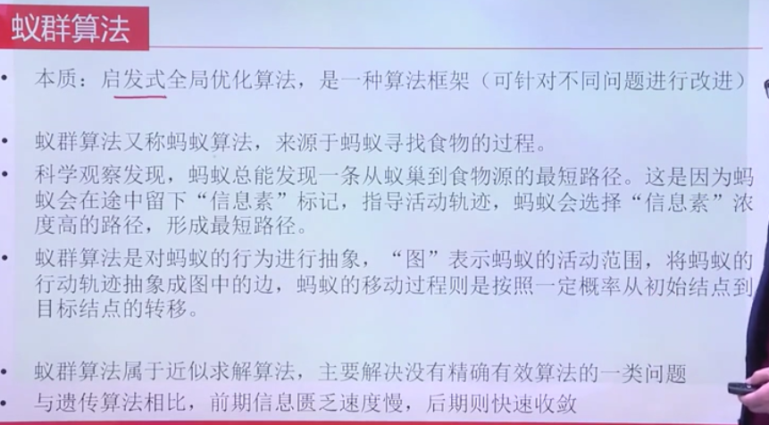
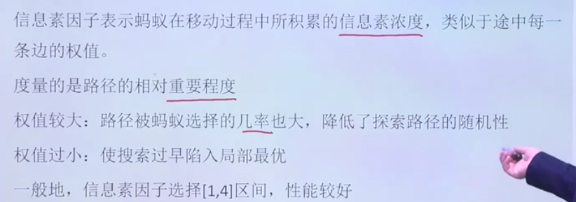
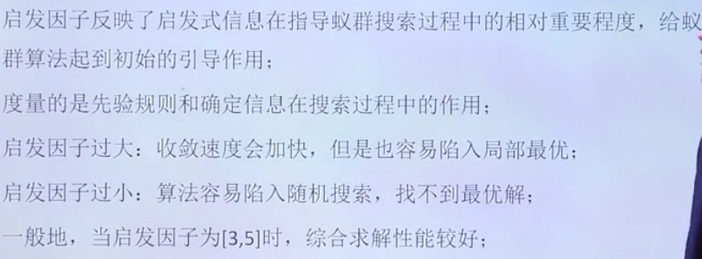
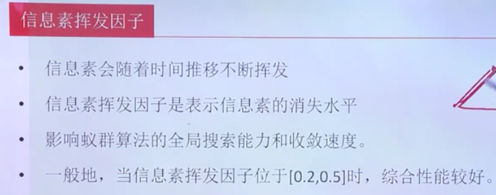
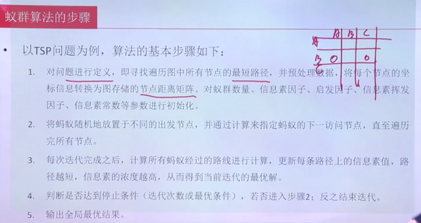
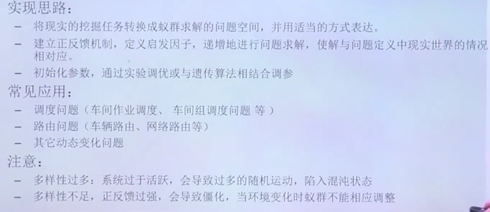
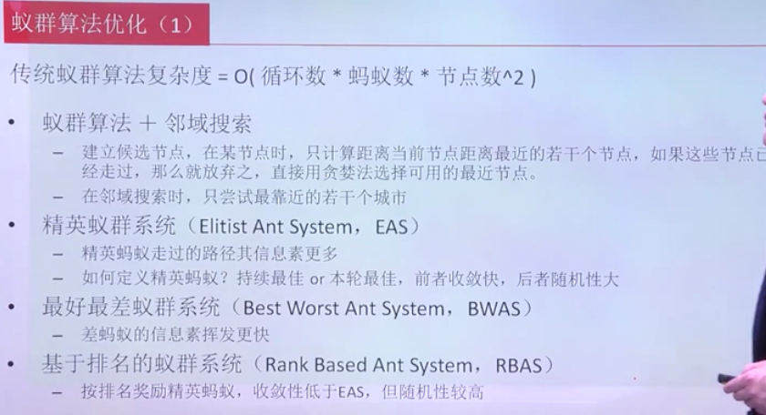
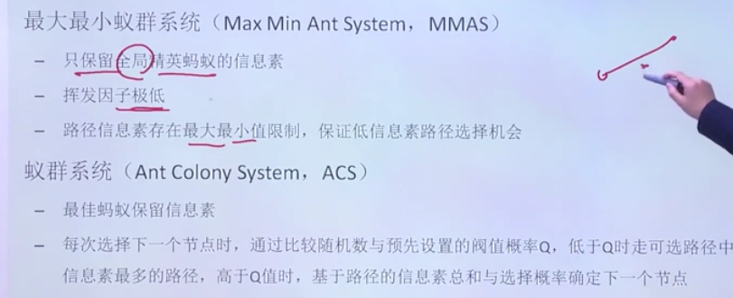

**蚁群算法(ACO)**
---

# 1. 什么是ACO(蚁群算法)
1. 简单介绍一下蚁群算法的思路。我们尝试复原一下蚂蚁寻找食物的场景。想象有一只蚂蚁找到了食物，这时它需要将食物带回蚁穴。对于这一只蚂蚁而言，它显然并不知道应该怎么走。那么，这只蚂蚁有可能会随机选择一条路线。
2. 这条路线很可能是一条远路。但是，蚂蚁一路上留下了记号，也就是信息素。如果这只蚂蚁继续不停地搬运食物，或者有许多其他蚂蚁一块搬运的话。他们总会在运气好的时候走到更快往返的路线上。蚂蚁选择的路越好，相同时间内往返的次数也就更多，也就在路上留下了更多的**信息素**(相当于交互)。
3. 于是，蚂蚁们总会发现，有一些路径的信息素更浓，这些路径就是更好的路线。于是蚂蚁也就更多地向信息素更浓的路径上偏移。蚂蚁们不停重复这个过程，最终总能找到一条确定的路线，而这条路线就是蚂蚁们找到的最优路径。

4. 抽象成图，调整信息素，主要解决没有准确有效算法的一类问题，比较难得到最优解。

# 2. 蚁群算法的概念

## 2.1. 蚂蚁数量

1. 数量大，更容易得到精确的最优解，但是会让求解过程变慢。
2. 建议蚂蚁的数量在1.5倍左右，至少要超过节点的个数

## 2.2. 信息素因子

1. 权值有效地降低了探索路径的随机性

## 2.3. 启发因子

1. 要求完成一些才可以完成约束
2. 启发因子过大容易导致局部最优
3. 启发因子过小:导致很长时间找到最优解

## 2.4. 挥发因子

1. 主要影响蚁群算法的全局搜索能力和收敛能力
2. 可以更加动态地适应更改的需求

## 2.5. 信息素常数

# 3. 蚁群算法的步骤
1. 初始化蚂蚁数量、可行路段、每条路段距离、每条路段的初始信息素大小等信息
2. 设定蚂蚁的起点、终点。
3. 蚂蚁从起点出发根据信息素浓度，有一定的概率性选择路段，浓度越高，概率越大，逐步回到终点。
4. 在蚂蚁走过的路径上，根据每条路段的长度按比例释放信息素，短的路段释放的信息素多，长的路段释放的信息素少。
5. 对所有路段的信息素进行挥发。
6. 回到第二步进行循环，直到蚂蚁数量迭代完。

1. 路径越短，信息素浓度越高

# 4. 蚁群算法应用

1. 样本实验调优以及遗传算法来调参
2. 用遗传算法来确定相应的参数
3. 多样性多容易陷入混沌
4. 有可能多样性不足，正反馈不足，导致**僵化**

# 5. 蚁群算法的优化

1. 算法复杂度如上
2. 蚁群搜索+邻域搜索
3. 精英蚁群系统
    + 不同方式来选择精英蚂蚁
4. 最好最差蚁群系统
5. 基于排名的蚁群系统
    + 按照好坏奖励经营蚂蚁，收敛性地域EAS

6. 最大最小蚂蚁系统
    + 挥发因子极低
7. 蚁群系统

# 6. 参考
1. <a href = "https://blog.csdn.net/zj15527620802/article/details/82121414">常用的启发式算法</a>