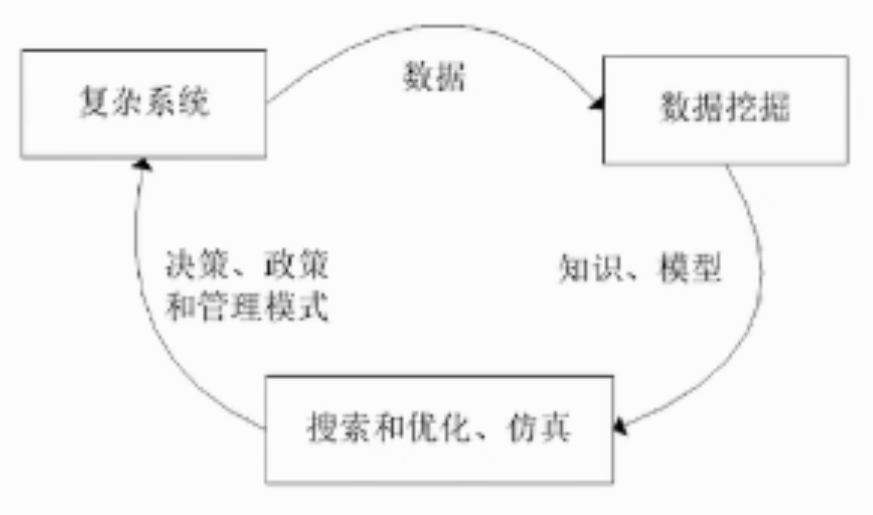
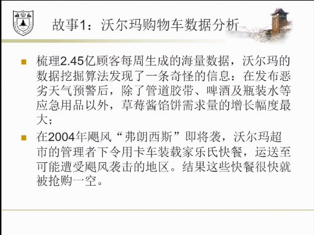
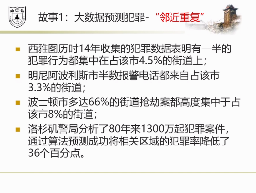
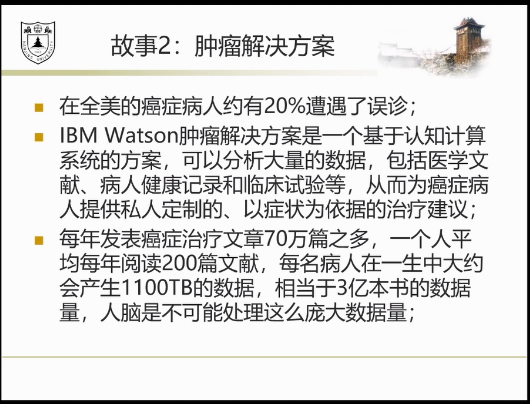
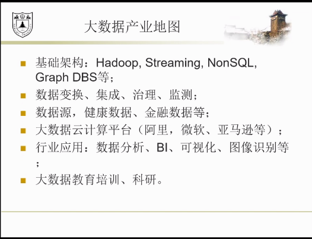
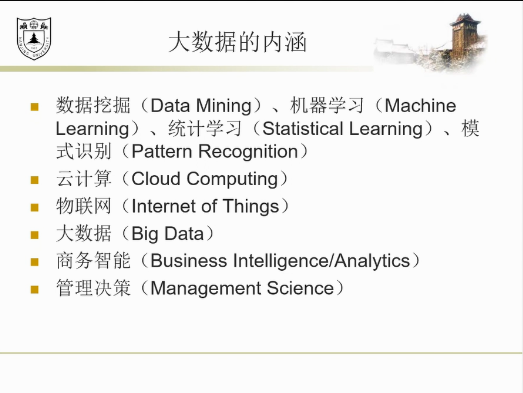
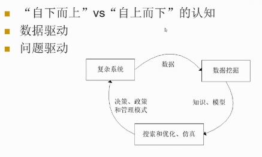
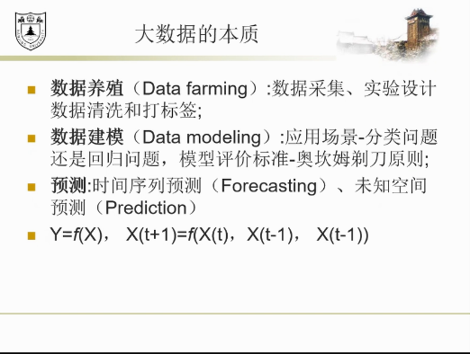
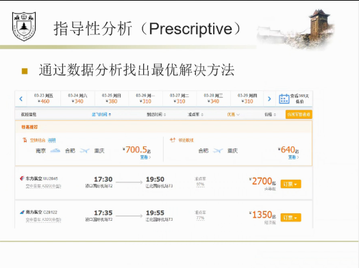

数据思维-从数据分析到商业价值
---

1. 收集数据->决策更加合理

# 1. 引入:中央空调系统
1. 收集具体的信息:湿度、请求程度等。
2. 前端收集数据，后端处理数据进行反应。

# 2. 故事一:沃尔玛购物车数据分析

1. 通过数据关联信息得到关联特征，利用这个来完成分析。
2. 将原来隐藏在经验中的东西，通过数据分析的方式获取出来，做到自动化控制

# 3. 故事二:大数据预测犯罪-"邻近重复"

1. 可视化之后可以改变人的行为

# 4. 故事三:肿瘤解决方案

1. 大量自动阅读文献
2. 贝叶斯公式

# 5. 大数据产业地图

1. 数据源的质量不太好，都是分散进行存储的，难以体现数据安全的问题。
2. 数据打通之后也有数据安全的问题。
3. 云计算:阿里做的非常好，投入很多。
   1. 通过数据中心进行计算转化。
   2. 大规模的服务器如何进行管理使用

# 6. 大数据与小数据

1. 物联网:通过传感器继承到一起

## 6.1. 大数据分析思维

### 6.1.1. 描述性分析

### 6.1.2. 预测性分析

1. 宏观经济预警(根据之前的数据预测未来经济问题)

### 6.1.3. 指导性分析

# 7. 数据挖掘的流程

1. 神经网络的使用还是受限的