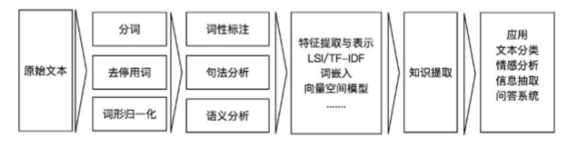
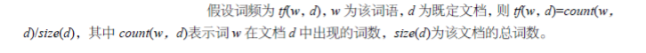
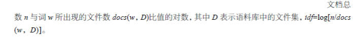
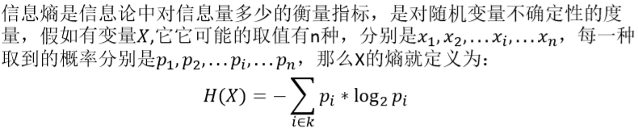
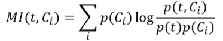
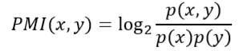
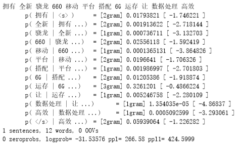
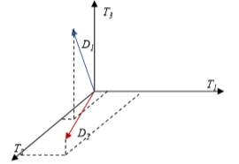

<!-- TOC -->

- [1. 文本分析](#1-文本分析)
    - [1.1. 文本分析过程](#11-文本分析过程)
    - [1.2. 文本特征提取及表示](#12-文本特征提取及表示)
- [2. TF-IDF算法](#2-tf-idf算法)
- [3. 信息增益](#3-信息增益)
- [4. 互信息](#4-互信息)
    - [4.1. 点互信息](#41-点互信息)
    - [4.2. 卡方统计量](#42-卡方统计量)
- [5. 词嵌入(将词进行向量化)](#5-词嵌入将词进行向量化)
    - [5.1. Word2Vec](#51-word2vec)
    - [5.2. GloVe](#52-glove)
    - [5.3. Word2Vec和Glove的特点](#53-word2vec和glove的特点)
    - [5.4. 词嵌入的Python实现](#54-词嵌入的python实现)
- [6. 语言模型](#6-语言模型)
    - [6.1. n-gram模型](#61-n-gram模型)
    - [6.2. SRILM](#62-srilm)
- [7. 向量空间模型(VSM)](#7-向量空间模型vsm)
    - [7.1. VSM在文本检索处理中的优势](#71-vsm在文本检索处理中的优势)
    - [7.2. VSM的缺陷](#72-vsm的缺陷)
    - [7.3. 其他阅读资料](#73-其他阅读资料)

<!-- /TOC -->
# 1. 文本分析
1. 文本分析是机器学习领域重要的应用之一，也称之为文本挖掘。通过对文本内部特征提取，获取隐含的语义信息或概括性主题，从而产生高质量的结构化信息，合理的文本分析技术能够获取作者的真实意图。典型的文本挖掘方法包括文本分类、文本聚类、**实体挖掘、观点分析**、文档摘要和实体关系提取等，常应用于论文查重、垃圾邮件过滤、情感分析、智能机器和信息抽取等方面 

## 1.1. 文本分析过程
1. 文本分析的过程从文本获取开始，一般经过分词、文本特征提取与表示、特征选择、知识或信息挖掘和具体应用等步骤
    + 分词是一个将输入结构化的好方法。
    + 命名实体识别，识别人名等特征。
    + 词义消歧，我们消除词在当前情况下的歧义。



1. 知识提取:人为或者机器进行提取

## 1.2. 文本特征提取及表示
1. 文本的特征表示是文本分析的基本问题，将文本中**抽取**出的特征词进行向量化表示，将**非结构化的文本转化为结构化**的计算机可以识别处理的信息，然后才可以建立文本的数学模型，从而实现对文本的计算、识别、分类等操作。通常采用向量空间模型。(Vector Space Model, VSM)来描述文本向量，在保证原文含义的基础上,找出最具代表性的文本特征，与之相关的有TFIDF、信息增益(Information Gain)和互信息(MI)等。

# 2. TF-IDF算法
1. TF‐IDF (Term Frequency‐Inverse Document Frequency)是一种文本统计方法，主要用来评估文本中的一个词对语料库中一篇文档的重要程度，其中Term Frequency指词频，即某一个给定的词语在该文件中出现的频率



2. Inverse Document Frequency指的是逆文档频率：



3. 基本思想是：字词的重要性与它在**当前文档**中出现的次数(词频)**成正比**，与它在**整个语料库**中出现的频率**成反比**。例如，某个词在当前这篇文章中出现的词频较高，并且在其他文章中很少出现，则认为此词具有很好的类别区分能力，适合作为当前文章的**特征词**。

# 3. 信息增益
1. 信息增益表示了某一个特征项的存在与否对类别预测的影响，定义为考虑某一特征项在文本中出现前后的信息熵之差



2. 一个变量可能的取值越多，它携带的信息量就越大，即熵与值的种类多少以及发生概率有关
3. 信息熵在分类问题时其输出就表示文本属于哪个类别的值
4. 信息增益是信息论中比较重要的一个计算方法，估算系统中新引入的特征所带来的信息量，即信息的增加量
5. 信息增益表示在其引入特征的情况下，信息的不确定性减少的程度，用于度量特征的重要性。可以通过计算信息增益来选择使用哪个特征作为文本表示

# 4. 互信息
1. 互信息(MI)表示两个变量与是否有关系，以及关系的强弱，可用于文本分类。MI计算的公式如下：
    + 
2. 从互信息的定义可见，某个特征词在某个类别C<sub>i</sub>出现频率高，但在其他类别出现频率比较低，则它与该类C<sub>i</sub>的互信息就会比较大。用互信息作为特征词和类别之间的测度，如果特征词属于该类，它们的互信息量最大。由于该方法为统计方法，不需要对特征词和类别之间关系的性质做任何假设，因此适合于文本特征和类别的匹配检验

## 4.1. 点互信息
1. 点互信息(Pointwise Mutual Information, PMI) 可用于度量事物之间的相关性，在文本分析领域，可用其计算词语间的语义相似度，基本思想是统计两个词语同时出现的概率，如果概率越大，其相关性就越大，关联度越高。两个词语x与y的PMI值计算公式如下
    + 
2. 互信息在文本处理方面的主要缺点是没有将词与词之间的顺序、句法和语义等信息考虑进去，这限制了某些领域的应用效果

## 4.2. 卡方统计量
1. 卡方x<sup>2</sup>统计量在统计学中是用来检测两个事件的独立性。在文本特征选择中，两个事件分别指词项的出现与类别的归属，用于统计词项和类别之间 的独立性。卡方的计算公式如下:
    + 
2. 卡方是基于显著性统计来选择特征的，它**统计文档中是否出现词t**，却不管在该文档中出现了几次，这会使得它对低频词有所偏袒。特征选择时可能选出更多的少见词项，而漏掉出现次数较多的关键词，少见词项对分类并无用处，这就是所谓的“低频词缺陷”。因此卡方检验也经常与其他因素(如词频)综合来扬长避短
    + 说明这一个词对于文档的分类的影响有多大。
3. 卡方和互信息的出发点不同，但它们的准确性却差不多，且都主要用于监督式文本分类，在非监督式分类中，般使用TF‐IDF 作为特征词的选取方法。
4. 筛选哪些词对于文档的分类有意义的。

# 5. 词嵌入(将词进行向量化)
1. 词嵌入是将词转化为向量表示，即使用**低维、稠密、实值**的词向量来表示每个词，从而使计算词语相关度成为可能。两个词具有语义相关或相似，则它们所对应的词向量之间距离相近。度量向量之间的距离可以使用经典的欧拉距离和余弦相似度等
2. 在向量空间中，每一个词用1和0组成的向量表示（如[0,0,0,0,...,0,1,0,...,0,0,0]），有多少个词语就有多少维向量，这就是独热（one‐hot）表示方法。如果要表示句子，则用句中的多个词构成一个向量矩阵。很明显，某种语言的词汇数量越多，词向量就越大，而句子的向量矩阵就会越大。但是，**one‐hot(独热算法)**表示方法存在“词汇鸿沟” 问题，即词与词之间没有同义、词序、搭配等关联信息，仅从词的向量中看不出两个词之间关系。为了解决这一问题，就需要对词向量进行训练，建立词向量之间的关系。训练方法是通过大量的现有语料句子传入神经网络模型中，用模型的参数来表示各个词向量之间的关系。
    + one-hot的缺点:词会比较多的时候，会导致比较稀疏。
3. 训练词向量的典型工具有Word2Vec和GloVe等。

## 5.1. Word2Vec
1. Word2Vec认为经常在一个句子中出现的词语相似度是比较高的，即对于一个中心词，最大化周边单词的概率。Word2Vec采用三层网络进行训练，最后一层采用霍夫曼树(Huffman)来预测。
2. 将词转换成为一个比较长，但是不像one-hot那么长的向量。
3. 将独热编码输入到输入层，然后输出层输出的是独热编码。

## 5.2. GloVe
1. GloVe是通过**共现计数**来实现的:首先，构建一个词汇的共现矩阵，每一行是一个词，每列是句子。通过共现矩阵计算每个词在每个句子中出现的频率。由于句子是多种词汇的组合，其维度非常大，需要降维，即对共现矩阵进行降维。
2. 共现矩阵用来统计哪些词汇一起出现。

## 5.3. Word2Vec和Glove的特点
1. Word2Vec和Glove比较容易且快速地融合新的句子加入词汇表进行模型训练。
2. Glove在并行化处理上更有优势，处理速度较快。

## 5.4. 词嵌入的Python实现
1. gensim是一款开源的Python工具包，用于从文本中无监督地学习文本隐层的 向量表示，并提供了相似度计算、信息检索等API接口。以下是gensim官网 上训练和使用Word2Vec模型的demo代码
```py
from gensim.models import Word2Vec
from gensim.models.word2vec import LineSentence
sentences = LineSentence('sentence_list.txt')
model = Word2Vec(sentences, size=128, window=5, min_count=5, workers=4)
items = model.most_similar('学习')
for item in items:
    print item[0], item[1]
model.similarity('英语', '数学')
```

# 6. 语言模型
1. 语言模型(Language Model)是通过概率分布的方式来计算句子完整性的模型，广泛应用于各种自然语言处理问题，例如语音识别、机器翻译、分词、词性标注等。例如，用于确定哪个词语序列的可能性更大，即句子的合法性判断。或者用于给定若干个词，预测下一个最可能出现的词话。也可用于计算某句子中词语搭配是否合理
2. 
    + 计算一下联合概率,然后确定哪些词在一起可以组成一个句子。
3. 由于上式中的参数过多，计算复杂度过高，需要近似的计算方法。最常用n-gram模型方法，此外还有决策树、最大熵、马尔科夫模型和条件随机域等方法

## 6.1. n-gram模型
1. n‐gram模型也称为n‐1阶马尔科夫模型，它是一个有限历史假设，即当前词的出现概率**仅仅与前面n‐1个词相关**。当n取1、2、3时，n‐gram模型分别称为unigram、bigram和trigram语言模型。n越大，模型越准确，也越复杂，需要的计算量就越大。最常用的是bigram，其次是unigram和trigram，n取≥4的情况较少
    + 适用于填空，并且这个比较像强数学归纳法。
2. 一般使用**困惑度**进行语言模型评测。
3. 训练工具有SRILM和rnnlm。

## 6.2. SRILM
1. 基于SRILM工具，可以用如下命令生成语言模型： 
    + ngram‐count ‐text input.txt ‐lm output.lm
2. 其中，input.txt是经过分词后的语料文本，每一行是一个句子。生成词频统计和语言模型保存在count.lm文件中。
3. 执行如下命令可以基于语言模型来生成测试语句的困惑度
    + ngram‐ppltest.txt ‐lm output.lm‐debug 2 > test_result.ppl
4. 其中test.txt是待测试的文本句子，每行是一个经过分词的句子。通过‐lm指定在上步中训练好的语言模型。检测结果储存在test_result.ppl中，示例如下
    + 全新在拥有条件下的
    + 骁龙在全新，拥有条件下的



5. 检测结果最后一行是评分基本情况，其中logprob是整个句子的概率，它由各词条件概率值相加得到的。ppl、ppl1均为困惑度指标，它们的值越小，句子质量越高

# 7. 向量空间模型(VSM)
1. 向量空间模型能把文本表示成由多维特征构成的向量空间中的点，从而通过计算向量之间的距离来判定文档和查询关键词之间的相似程度
2. 对于任一文档d<sub>j</sub>∈D,D为文档数据集，可将其表示成如下n维向量的形式:d<sub>j</sub>=(w<sub>1j</sub>,w<sub>2j</sub>,...,w<sub>nj</sub>)。其中w<sub>tj</sub>为第d<sub>j</sub>个特征词在文档中的权重，n为文档d<sub>j</sub>的总特征词数。则此时文档数据集D可以看做n维空间下的一定数量的向量集合，**TF‐IDF**值也常常被选作为特征词的权重。而文档之间的相似度 指两个文档内容相关程度的大小，当文档以**向量**来表示时，则可以使用文档内积或夹角余弦值来表示，两者夹角越小说明相似度越高
3. 用VSM将文档表示成向量形式后，在基于向量的文本相似度计算中，常用的相似度计算方案有内积、Dice系数、Jaccard系数和夹角余弦值
4. 判断两个文档是否足够相似(抄袭):抽取特征向量查询即可。

## 7.1. VSM在文本检索处理中的优势
1. 对特征词的权重计算进行了改进，权重的计算通过对文本特征项的出现频次统计实现(TF‐IDF值)，使问题的复杂性大为降低，改进了检索效果
2. 将文档简化为特征词及其权重集合的向量表示，对文档内容处理简化为VSM中向量运算
3. 根据文档和查询之间的相似度对检索结果进行排序，使对检索结果数量的控制与调整具有相当的弹性与自由度，有效地提高了检索效率

4. 

## 7.2. VSM的缺陷
1. 各特征词之间的关系做了相互独立的前提假定，并且**没有考虑词的顺序**，这会失掉大量的文本结构信息，降低了语义的准确性。
2. **相似度的计算量较大**，当有新文档加入时，必须重新计算特征词的权重。
3. 在特征词权重的计算中，只考虑其**出现次数**等统计信息(如**TF‐IDF**算法)，而以该信息来反映特征词的重要性，不免全面

## 7.3. 其他阅读资料
1. <a href = "https://mp.weixin.qq.com/s/XX-GFKbwFa18lyjVmIAUIg">语料与向量空间模型</a>