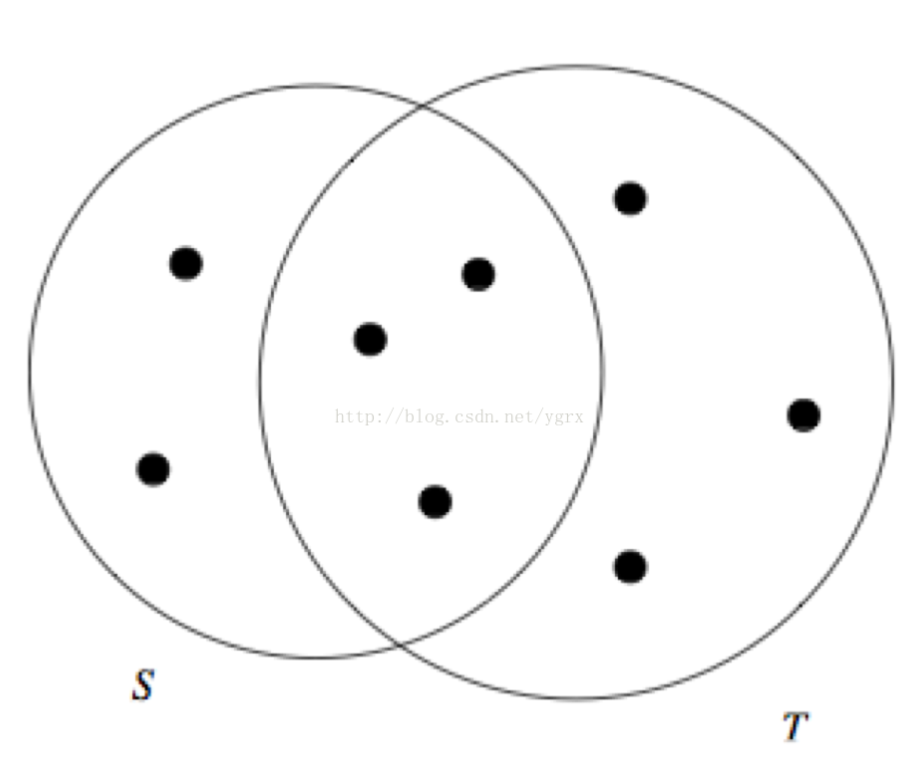

文本相似度计算-JaccardSimilarity和哈希签名函数
---

# 1. 文本相似度计算的应用场景
1. 过滤相似度很高的新闻，或者网页去重
2. 考试防作弊系统
3. 论文抄袭检查

# 2. 文本相似度计算的基本方法
1. 余弦定律
2. JaccardSimilarity方法

## 2.1. JaccardSimilarity方法
1. 实际上就是两个集合的交集除以两个集合的并集，所得的就是两个集合的相似度，直观的看就是下面这个图。



## 2.2. 统计文本中的词语
1. 使用k-shingle算法，k是一个变量，表示提取文本中的k个字符，这个k可以自己定义。
2. JaccardSimilarity算法的具体实现
```py
file_name_list=["/Users/wuyinghao/Documents/test1.txt","/Users/wuyinghao/Documents/test2.txt","/Users/wuyinghao/Documents/test3.txt"]
hash_contents=[]
#获取每个文本的词汇词频表
for file_name in file_name_list:
    hash_contents.append([getHashInfoFromFile(file_name,5),file_name])

for index1,v1 in enumerate(hash_contents):
    for index2,v2 in enumerate(hash_contents):
        if(v1[1] != v2[1] and index2>index1):
            intersection=calcIntersection(v1[0],v2[0]) #计算交集
            union_set=calcUnionSet(v1[0],v2[0],intersection) #计算并集
            print v1[1]+ "||||||" + v2[1] + " similarity is : " + str(calcSimilarity(intersection,union_set)) #计算相似度
```

# 3. 算法优化
1. 大量文本或者单个文本内容较大，比较的时候会有大量的存储空间。

# 4. 将词汇表进行hash
1. 首先，我们将词汇表进行hash运算，将词汇表中的每个词汇hash成一个整数，降低存储空间。

# 5. 使用特征矩阵来描述相似度
1. 一个特征矩阵的任何一行是全局所有元素中的一个元素,任何一列是一个集合。
2. 若全局第i个元素出现在第j个集合里面,元素(i, j)为1,否则为0。
3. 通过特征矩阵，两个文本的相似性就是他们公共的元素处理所有的元素。

# 6. 继续优化特征矩阵，使用hash签名
1. 先找到一组自定义的哈希函数H1,H2...Hn
2. 将每一行的第一个元素，就是词汇表hash后得到的数字，分别于自定的哈希函数进行运算，得到一组新的数
3. 建立一个集合(S1,S2...Sn)与哈希函数(H1,H2...Hn)的新矩阵T，并将每个元素初始值定义为无穷大
4. 对于任何一列的集合，如果T(Hi,Sj)为0，则什么都不做
5. 对于任何一列的集合，如果T(Hi,Sj)不为0，则将T(Hi,Sj)和当前值比较，更新为较小的值。

# 7. 模糊计算相似度的代码实现
```py
res=[]
    for index1,v1 in enumerate(file_name_list):
        for index2,v2 in enumerate(file_name_list):
            g_hash.clear()
            g_val=0
            hash_contents=[]
            min_hashs=[]
            if(v1 != v2 and index2>index1):
                hash_contents.append(getHashInfoFromFile(v1)) #计算集合1的词汇表
                hash_contents.append(getHashInfoFromFile(v2)) #计算集合2的词汇表
                adjContentList(hash_contents) #调整hash表长度
                a=[x for x in range(len(g_hash))]
                minhash_pares=[2,3,5,7,11] #最小hash签名函数参数
                for para in minhash_pares:
                    min_hashs.append(calcMinHash(para,len(g_hash),a)) #最小hash签名函数生成        
                sig_list=calcSignatureMat(len(min_hashs)) #生成签名列表矩阵
                for index,content in enumerate(hash_contents):
                    calcSignatures(content,min_hashs,sig_list,index) #计算最终签名矩阵
                simalar=calcSimilarity(sig_list) #计算相似度
                res.append([v1,v2,simalar])
    return res
```