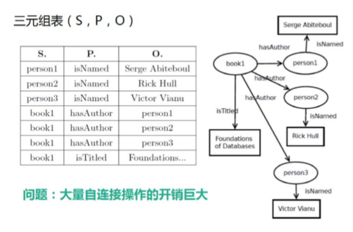
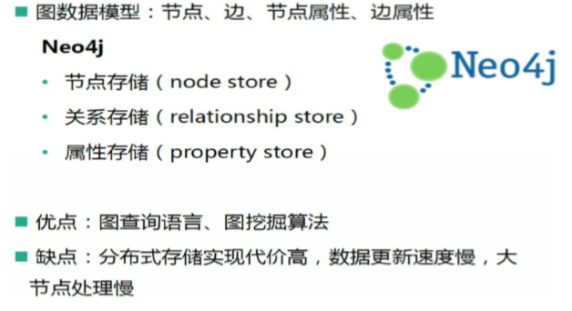
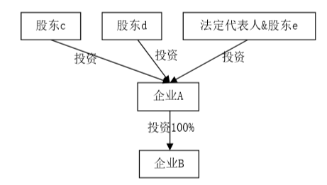

**知识图谱**
---
<!-- TOC -->

- [1. 知识图谱实例](#1-知识图谱实例)
- [2. 知识图谱](#2-知识图谱)
    - [2.1. 定义](#21-定义)
    - [2.2. 知识图谱相关概念](#22-知识图谱相关概念)
        - [2.2.1. 本体](#221-本体)
        - [2.2.2. 知识库](#222-知识库)
        - [2.2.3. 链接数据](#223-链接数据)
        - [2.2.4. 语义网络](#224-语义网络)
    - [2.3. 知识图谱的存储](#23-知识图谱的存储)
        - [2.3.1. 知识图谱的三元组表存储](#231-知识图谱的三元组表存储)
        - [2.3.2. 知识图谱的属性表存储](#232-知识图谱的属性表存储)
        - [2.3.3. 知识图谱的图存储](#233-知识图谱的图存储)
    - [2.4. 知识图谱的分类](#24-知识图谱的分类)
- [3. 知识图谱挖掘与计算](#3-知识图谱挖掘与计算)
    - [3.1. 权威节点分析](#31-权威节点分析)
    - [3.2. 相似节点发现](#32-相似节点发现)
        - [3.2.1. 实例解释如何构建知识图谱](#321-实例解释如何构建知识图谱)
    - [3.3. 知识图谱的体系架构](#33-知识图谱的体系架构)
    - [3.4. 知识抽取](#34-知识抽取)
    - [3.5. 知识融合](#35-知识融合)
    - [3.6. 知识推理](#36-知识推理)
    - [3.7. 知识表示](#37-知识表示)
- [4. 知识图谱的应用](#4-知识图谱的应用)
    - [4.1. 基于知识图谱的企业信息查询](#41-基于知识图谱的企业信息查询)
- [5. 参考](#5-参考)

<!-- /TOC -->
# 1. 知识图谱实例

1. 让机器学习人类对于关系等进行分析。而不仅仅是计算
2. 找到奥巴马，然后得到以奥巴马为中心的关系网络

# 2. 知识图谱

## 2.1. 定义
1. 知识图谱是**结构化**的语义知识库，用于以**符号形式**描述物理世界中的概念及其相互关系，由实体之间通过关系相互连接，构成网状的知识结构。
2. 知识图谱的**目标**是为了让机器能够理解文本背后 的含义。
3. 为此，需要对可描述的事物(实体)进行建模，填充它的属性，拓展它和其他实体的联系，即**构建机器的先验知识**。此外，还涉及**知识提取、表达、存储和检索**一系列技术。
    + 先验知识可以避免某些问题使用机器学习
4. 知识图谱首先是由Google于2012年提出，**目的**是为了提升搜索结果的质量和提高检索效率，有知识图谱作为辅助，搜索引擎能够理解用户查询背后的语义信息，获取字符串背后隐含的对象或事物，这样返回的结果更为精准。此后，各个机构也开始着手打造各种知识库，比较知名的有DBPedia、NELL、OpenIE、Freebase、Google KG、BabeNet、WordNet和Yago等。
5. 语义网:2006年被提出，呼吁推广、完善使用本体模型来形式化表达数据中的隐含语义，RDF(Resource desciption framework)模式和互联网本体语言的形式化模型也就伴随而生。

## 2.2. 知识图谱相关概念

### 2.2.1. 本体
1. **本体**这个术语来自哲学概念，用于描述((实体和实体间的关系))。例如，“描述”都是“**本体**”的外在符号，人们所看到的图像、说的语言、对事物的感觉都是符号到本体的某种映射，所以它只可意会不可言传。在信息科学中的本体指的是**语义**层面的意思。在人工智能领域中，本体就是用**详细的描述方法**定义出来的概念或者概念体系，建立本体的过程就是一个定义概念的过程
2. Tom Gruber把本体定义为概念及其关系的形式化描述。本体类似于**数据库中的表结构**，主要用来定义类和关系，以及类层次和关系层次等。最常用的本体描述语言有**RDF和网络本体语言**(Ontology Web Language, OWL)等，可以用于定义**同义词、反义词**，以及对属性的值域施加约束等。本体通常被用来为知识图谱定义图谱结构，个本体库是由类、属性和实例组成，在OWL里统称为**实体(entity)**
3. 每个实体(概念的外延)是可以用于一个全局唯一确定的ID来标识，每个属性-属性键对可用来刻画实体的内在特性。

### 2.2.2. 知识库
1. 知识库(Knowledge Base)是人工智能的经典概念之一。最早作为专家系统(Expert System)的组成部分，用于实现决策推理。
2. 知识库中的知识有很多种不同的形式，例如本体知识、关联性知识、规则库和案例知识等

### 2.2.3. 链接数据
1. 链接数据(Linked Data)是由Tim Berners Lee 于2006年提出，为了强调语义互联网的目的建立数据之间的链接，而非仅仅把结构化的数据发布到网上。
2. 链接数据最接近于知识图谱的概念

### 2.2.4. 语义网络

1. 语义网络(Semantic Network) 最早是1960年由认知科学家 Allan M. Collins 作为知识表示的一种方法提出。其中WordNet是最典型的语义网络。
2. 与知识图谱相比，早期的语义网络更加侧重描述**概念及其之间的关系**，而知识图谱更加强调**数据或事物**之间的链接
3. 知识图谱是一种更加复杂的语义网络。
    + 利用了一些语义网络的技术。

## 2.3. 知识图谱的存储
1. 按照存储方式的不同，知识图谱的存储可分为基于**表**结构的存储和基于**图**结构的存储。
2. 基于表结构的存储采用**二维数据表**的方式存储数据，例如**三元组表、属性表以及关系数据库**
3. 基于图结构的存储可以使用**图数据库**

### 2.3.1. 知识图谱的三元组表存储

1. S:人名书名，P:表示语义，O:人名书名
2. P就类似是一个关系R。
3. 三元组往往是实体、关系、实体的形式。

### 2.3.2. 知识图谱的属性表存储

1. 表格形式:概念 + 属性(一个或者多个)

### 2.3.3. 知识图谱的图存储

1. 对于大型的知识图谱的优势比较大。
2. 图数据库:Neo4j
3. 支持分布式图查询

## 2.4. 知识图谱的分类
1. 通用知识图谱:更加关注广度，强调融合更多的实体
2. 行业知识图谱:依靠特定行业的数据来构建，具有更加独特的行业意义。

# 3. 知识图谱挖掘与计算
1. 知识图谱的挖掘主要是基于图运算的理论，从海量结点中寻找权威节点（重要节点），与目标节点最近（路径最短）且最权威的节点
    + 两个权威节点之间的最短连线。
2. 最短路径路径算法有Dijkstra算法和Floyed算法
3. Dijkstra算法步骤：
    1. 初始时，S只包含原点v,距离为0。用U表示与S对立的顶点集合。
    2. 从U中选取一个距离v最小的顶点k，把k加入S集合。
    3. 以k为另一个原点，对U中每个顶点修改到原点的最短距离，若到k的距离小于到v的距离，则将原有的距离修改为更小的值。
    4. 重复2、3步骤，直到所有顶点都加入S集合

## 3.1. 权威节点分析
1. **权威节点分析**是从知识图谱中分析结点的权威性，从中发现权威结点。
    + 权威结点分析常用于社交网络权威人物或权威机构的发现。权威结点分析主要采用互投票方法的方式，其思想来源于PageRank思想
2. PageRank是指被越多的优质网页所指向的网页，具有更高的**优质概率**。如果两个网页存在链接指向，说明这两个网页是存在关联，因此可采用一个相关性的参数来衡量。
    + 页面的质量是一个累计值，由所有指向此页面的链接通过递归算法计算得到。
    + 一个页面拥有越多的被指向页面，那么它的优质度就更高，反之，网页优质度就越低。
    + 指向他的网页是否指向别的网页比较少，越少越好
    + 这个指向他的网页是否很重要，如果是，则越优质。
3. 如果知识图谱的数据量非常庞大，为了降低算法开销，可采用**分块式**的方式来实现算法，先计算每个分块图的PageRank,根据各数据块之间的相关性，得到新图的PageRank, 再反复**迭代**，分析权威节点
4. 权威节点分析还可采用基于**结点属性及结点间关系**的多特征方法，将节点属性和关系综合分析

## 3.2. 相似节点发现
1. **相似节点发现**是指从知识图谱海量节结中，寻找与已知节点相似的结点，可基于结点进行属性计算以及关系计算。常常应用于企业寻找**潜在客户**、专利检索等
2. 假定一个无向图G= (V,E,M)，V中结点总数为N，M	a1,..,am，其中ai是结点关联属性的m个取值。在原始图G中加入属性结点和属性边构造属性扩展图，针对属性扩展图G'=(V',E',M),使用基于结构情境的相似度计算方法,计算每个结构结点的结构相似度，属性边的加入会使得具有同一属性的结点之间的相似度增大，对于每个属性结点，计算其到所有与之相连的结构结点的转移概率，并将此转移概率与结点的结构相似度相结合计算出最终的结点相似度，最后使用改进的K‐means聚类算法(使用大规模的分布式聚类算法)在结点相似度的基础上对结点进行**聚类**，求得最终结构。其中聚类初始中心点的选取遵循**最大最小**原则。具体步骤如下：
3. 知识图谱有**自顶向下和自成向上**两种构建方式。自顶向下的方式需要专家 手工编辑形成数据模式，而自底向上的构建，则是借助一定的技术手段， 基于行业现有标准，从公开采集的数据中提取出资源模式进行映射，选择 其中置信度较高的新模式，经人工审核之后，加入到知识库中。这个过程需要随时间不断更新循环，根据知识获取的逻辑，这步骤包含三个阶段： 信息抽取、知识融合以及知识加工

1. 首先确定应用场景，然后去查找新的属性和关系找出来。
2. 知识图谱在一开始的时候可以人来进行辅助。(进行审核)。
3. 去确定是否使用专用语料库。

### 3.2.1. 实例解释如何构建知识图谱
1. 下面以电商领域知识图谱构建为例，介绍知识图谱的一般构建过程。
    1. 确定**领域本体**，一个本体描述的是一个特定的领域。例如要描述的领域是“电商”。
    2. **列举领域内的术语集合**，指定领域中的一组重要概念。例如，要描述“电商”这个领域，可以列举出“商品”、“卖家”、“买家”、“厂家”等概念。
    3. **确认基本术语之间的关系**，包括**分类、类间层次结构和属性等**。即确定概念之后，再确定这些概念之间的关系，例如并列关系、包含关系和关联关系等，“平台”与“卖家”是包含关系。
    4. 添加**约束规则**，包括属性约束（例如商品品牌、大小和重量等）、值约束（例如，只有卖家才可以发布商品）等。
    5. 定义实例，将具体的实例信息导入到之前建立的结构中，形成知识库
    6. 检查和验证，通过对本体自身的不一致和置入本体的实例集进行一致性检查

## 3.3. 知识图谱的体系架构
1. 知识图谱一般主要由自顶向下和自底向上的两种构建方式。
    + 自顶向下指的是先为知识图谱定义好本体与数据模式，在将实体加入到数据库。
    + 自底向上是指从一些开放连接数据中提取出实体，选择其中置信度高的加入到指数库，在构建顶层的本体模式。

## 3.4. 知识抽取
1. 从公开的半结构化、非结构化的数据中抽象出实体、关系、属性等知识要素。

## 3.5. 知识融合
1. 消除实体、关系、属性等指称项与事实对象之间的歧义，形成高质量的知识库。

## 3.6. 知识推理
1. 在已有的知识库基础上进一步深挖隐含的知识，从而丰富数据库

## 3.7. 知识表示
1. 形成综合向量，帮助知识库的建构、推理、融合以及应用。

# 4. 知识图谱的应用
1. 知识图谱的应用非常广泛，特别适合于智能客服、金融、公安、航空和医疗等“知识密集型”领域
2. 很多金融公司构建了金融知识库对金融知识进行集成与管理，并辅助金融专家进行风控控制和欺诈识别等
3. 生物医学专家通过集成和分析大规模的生物医学知识图谱，辅助其进行药物发现
4. 在公安领城中，对人员、位置、事件和社交关系等信息应用知识图请可以及时发现热点事件的发展、传播与关键点，提早做出感知和识别，从而实现预防犯罪

## 4.1. 基于知识图谱的企业信息查询
1. 辅助银行找到相关的企业，避免银行欺诈等行为
2. 企业A关联族谱的数据结构

3. A、B两家公司的直接人员关联节点图

4. 从原始的工商信息中，公司A、B没有任何关联。计算A、B公司是否有疑似 关联可以通过下面的多特征维度识别去重算法：
    + 将公司A的所有直接相邻节点去掉重复名称后得到数组A{c, d, E, f}
    + 将公司B的所有直接相邻节点去掉重复名称后得到数组B{c, d, f, h}
    + 循环数组B中的元素，将B中的元素添加进A中，如果遇到添加失败返回false，则将当前元素 添加进临时数组temp中
    + 统计temp数组中元素数量，定义相似度衡量的阀值
    + 大于设定的阀值表示两家公司有疑似关联，否则没有关联

5. 企业A关联风险分析
    + 要把个体放到一些情况之下
    + 通过看一个企业和别的企业之间的风险
    + 还可以做一些串标分析等

6. 针对目标公司的企业关联风险有4个指标衡量
    + 通过PageRank计算出来的每家企业的**PR值**。
    + 到直接影响的企业与目标评估企业相互关联层级数，第一层影响大于第二层，第二层影响大于第三层，依次递减。
    + 受到直接影响的企业对目标评估企业的持股百分比，对目标企业持股比例越大，对目标企业影响就越大。
    + 对影响事件进行风险评估分类。根据人员种类分析对公司影响，如法定代表人、股东、主要人员、普通员工。针对影响事件划分不同影响等级，如行政处罚、经营异常、失信事件、被执行人事件、法院公告等。针对正负新闻舆情进行影响等级分类。越重要的人物对企业影响越大，越重要的事件对企业影响越大，负面新闻对公司影响大。
7. 经过这4个指标的综合衡量得到的风险影响因素，将对风险划分为5个等级，越大的数字表风险依次递增。其中，1为无风险，5为最严重风险，将这些风险分析后并最终显示给用户
8. 企业投资关系路径分析
    + 找到企业的投资关系

9. 企业知识图谱数据存储及使用
10. 在企业相关的数据维度中，以工商信息中的数据作为企业知识图谱的基础来源。工商信息主要包括工商照面信息(Company)、股东信息(Partner)、人员信息(Employee)、分支机构(Branch)和历史变更记录(Change)等
    + 主要通过法人公布的信息、政府公开的信息等
11. 实体和关系在提取后，选择免费开源的图数据库Neo4j作为关联关系存储的数据库。作为一个高性能的图形数据库，Neo4j 将结构化好的数据存储在网络上而不是关系表中，基于图的搜索，具有完全事务管理功能，能很好支撑动态数据特性的应用需求。利用Neo4j 提供的Cyhper语法，开发人员可以专注业务场景，而直接使用自带的图挖掘算法

# 5. 参考
1. <a href = "https://mp.weixin.qq.com/s/Ob8n6BNm-VZkWvx37bbOkA">综述 | 知识图谱技术综述（上）</a>