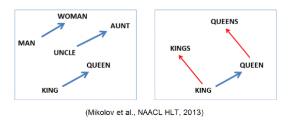
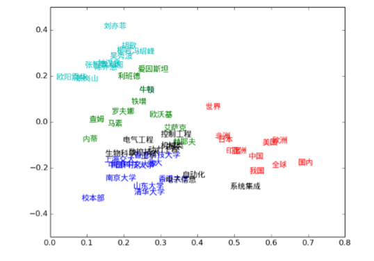
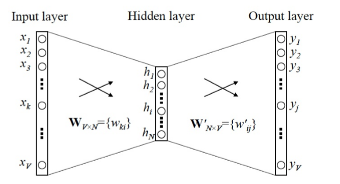
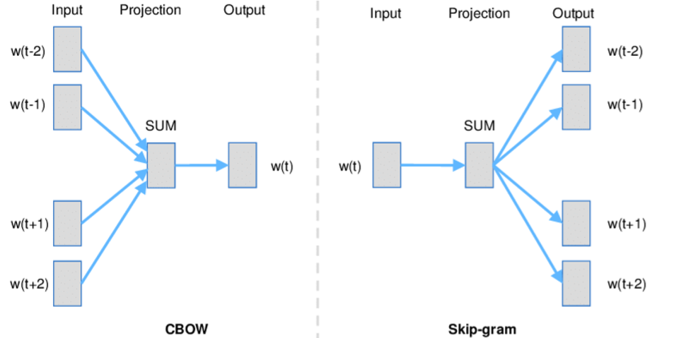

**自然语言理解**

# 1. 自然语言处理(NLP)

## 1.1. 自然语言理解

### 1.1.1. ANSII码
1. 其在我们学习过程中的缺点是
    + 长度不均等
    + 单纯的数字序列，不具备语义信息
    + 浪费存储空间
2. 问题解决:One Hot(独特编码)

### 1.1.2. 独特编码(One hot)
1. 每一个单词的位元组合中，在一个字节内只容许单一位元为1，其他位元都必须为0
    + 也就是一个单词对应一个**One-Hot**
2. 另一种情况下，单一位元为0，其他位元都为0，则被记做One-cold
3. 如何查找?
    + 字典序
    + ASCII序
    + 词频序
4. One Hot编码会无限长吗?
    + 不会，词频过低会被舍弃
5. One Hot对于每一个模型都需要重新定义，很难进行复用

存在的合理性
---
1. 语言作为符号系统的**任意性**:语言的外在表现，如语音、文字等，与其语义联系是偶然的，非本质的，或者说，语言的“能记”和“所记”的对应是任意的。
2. 语言作为符号系统的**依存性**:语言符号在获得社会群体的公认和使用后，其音和义的关系就固定下来，任何人不得随意改变语义的语音形式或者语音的语义形式。
3. 语言作为符号系统的**线条性**：符号的使用只能在时间的线条上绵延，一个符号跟着一个符号依次出现。
4. 语言作为符号系统的**系统性**：这里只讨论组合和聚合的关系。组合关系是指若干较小的语言单位组合成较大的语言单位,其构成成分之间的关系；聚合关系指具有相同组合功能的语言单位之间的关系。

### 1.1.3. Word Vector(词向量)
1. 如何设计合理的词向量？
    + 手动设计的词向量维度小、单词多、人的主观性影响词汇本身的客观性。
2. 一个合格的词向量的形式
    + 类比度(Analogy task)
    + 相似度(Similarity task)

### 1.1.4. 分布式假设Distributional Hypothesis
1. The Distributional Hypothesisis that words that occur in the same contexts tend to have similar meanings (Harris, 1954).
2. The underlying idea that "a word is characterized by the company it keeps" was popularized by Firth (1957), and it is implicit in Weaver's (1955) discussion of word sense disambiguation (originally written as a memorandum, in 1949).
3. 语言的线条性决定了其分布特性。
4. 分布式假设就是在阐明语言中组合和聚合的内在联系

## 1.2. 自然语言生成

## 1.3. Word2Vec
1. 框架模型结构

2. 其存在的必然性:
    1. 通过已有的语料库的学习，得到语汇的组合关系和聚合关系。
    2. 更一般的说**word2vec通过这些关系重新拟合出了语法**
    3. 同时，它还拟合除了社会生活**情理规则**
3. 一句话被说出来或记下来，从通常意义上讲，是符合**语法规则**的，也是符合**情理规则**的。可以说，人类社会像一个机器，这个机器根据语法规则和情理规则不停的制造新的语汇序列。而学习器则是拿到了这些语汇序列之后，反推出其中的**语法规则和情理规则**。

# 2. OCP

## 2.1. 光学字符识别(General Optical Character Recognition)
1. 目标检测Object Detection(找到位置find the position)
    + Yolov3(you only look once)
    + Faster-Rcnn(候选区search selective)
2. 分类Classification(识别文字recognize the word)
    + Multi-digit number classification(卷积神经网络convolution neuro network)
    + RNN/LSTM/GRU + CTC(时间序列time sequence)

# 3. ASR(从现实语音到虚拟文字)
1. 现在的ASR也是基于**深度学习**的

## 3.1. 自动语音识别(General Automatic Speech Recognition)
1. 特征提取Feature Extract
2. 隐马尔科夫模型Hidden Markov Model
3. 基于模式匹配的动态时间规整法Dynamic Time Warping - 状态输出概率密度函数（高斯混合模型）Gaussian Mixture Model

# 4. TTS(从虚拟文字到显示语音)

## 4.1. 文本语音转换(General Text To Speech)
1. 文本分析：对输入文本进行语言学分析，逐句进行词汇的、语法的和语义的分析，以确定句子的低层结构和每个字的音素的组成，包括文本的断句、字词切分、多音字的处理、数字的处理、缩略语的处理等。
2. 语音合成：把处理好的文本所对应的单字或短语从语音合成库中提取，把语言学描述转化成言语波形。
3. 韵律处理：合成音质(Qualityof Synthetic Speech)是指语音合成系统所输出的 语音的质量，一般从清晰度(或可懂度)、自然度和连贯性等方面进行主观评价。

# 5. 参考
1. orz 田鸿龙 自然语言理解