CNN | 图形定位与识别
---

# 1. 传统的目标检测

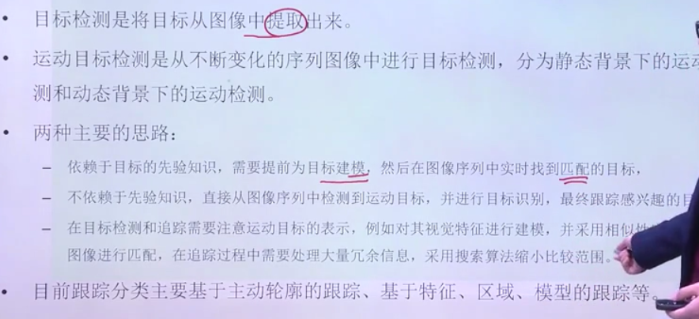

## 1.1. 传统的目标检测与追踪

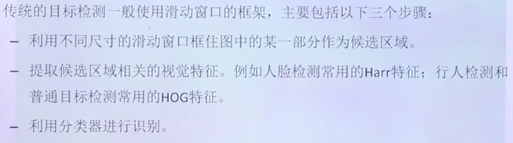

1. 选择很多的候选区域一个个进行检测

## 1.2. 交集并集比(IoU)

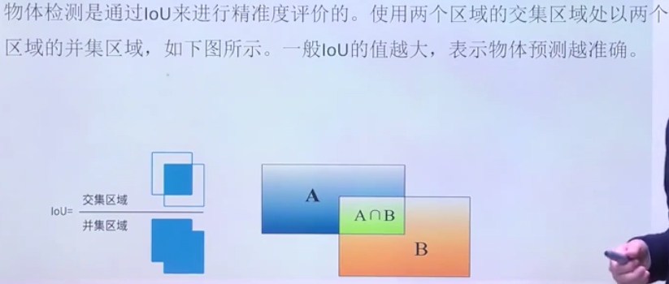

## 1.3. mAP

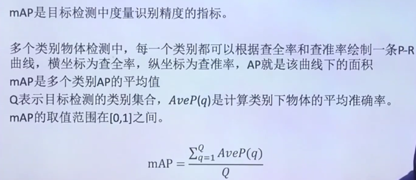

1. 查全率和查准率

## 1.4. ROI

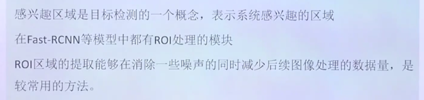

1. 减少后续数据处理量

## 1.5. NMS(非极大值抑制)

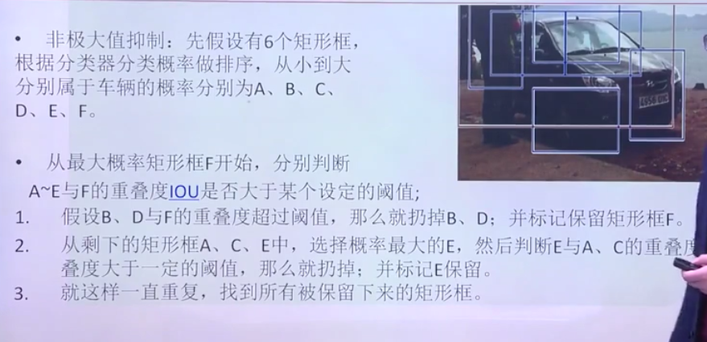

1. 未必最后的最大的，而是最符合车的轮廓的。

## 1.6. 选择性搜索

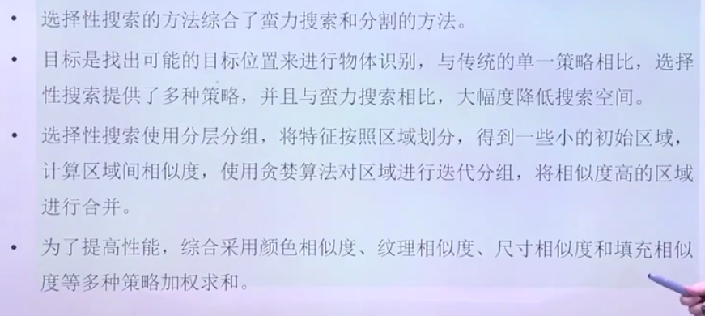

1. 降低搜索的难度等，进行分层分组分区来完成。
    + 根据颜色相似度、纹理相似度

## 1.7. 目标检测各部分对应

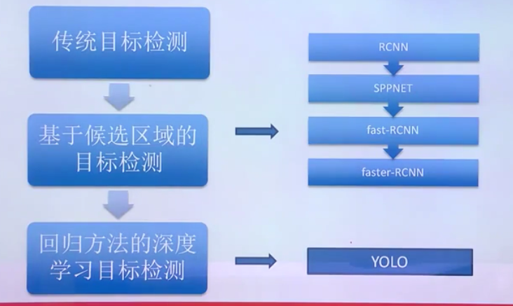

# 2. R-CNN

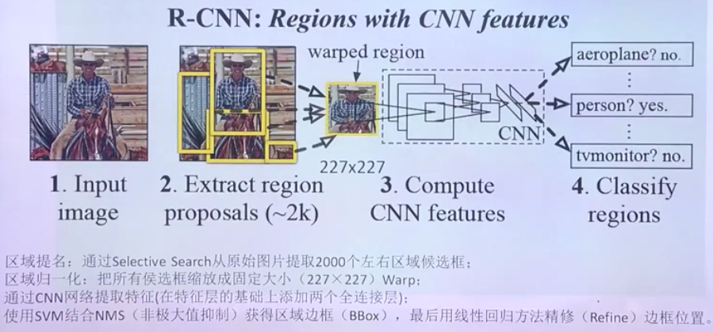

1. 首先提取出2000个左右的候选框
2. 卷积神经网络对于输入的部分进行分类，按照阈值来进行反馈。
3. SVM计算的是加权和(和softmax对比)

## 2.1. 训练过程

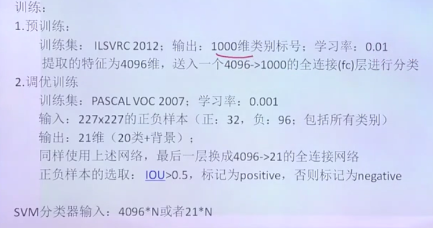

1. 最后输出一个20个类别的分类器。

## 2.2. 训练SVM分类器

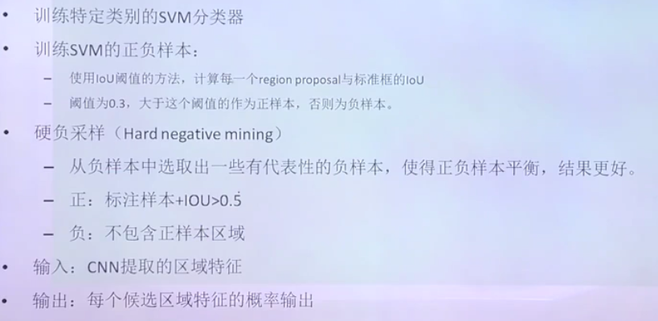

1. 正负样本进行的比例会失衡，所以我们硬负采样，选择部分有交集的部分作为负采样来提高分类器的效果。

## 2.3. 获取每个类别的边框(BBox)

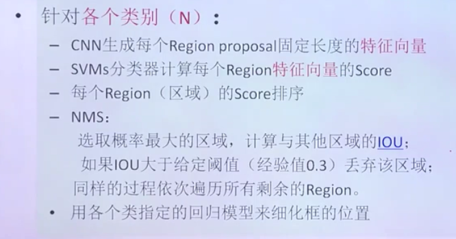

## 2.4. R-CNN缺点
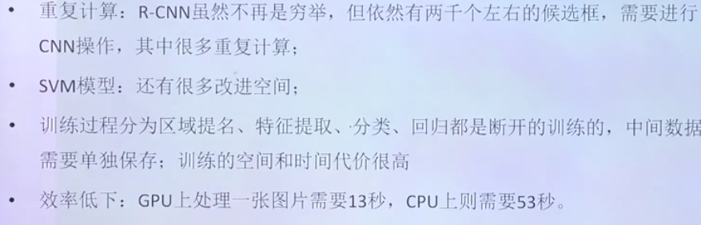

1. 所有的过程都是断开的。

## 2.5. 卷积输入图片尺寸大小改进

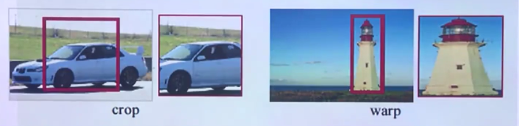
1. 完全的矩形框可能会导致图像横纵比例失调等问题。

问题解决
---
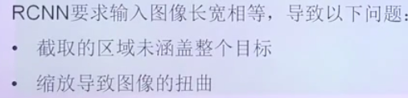

# 3. SPP-Net:池化生成固定长度的图像

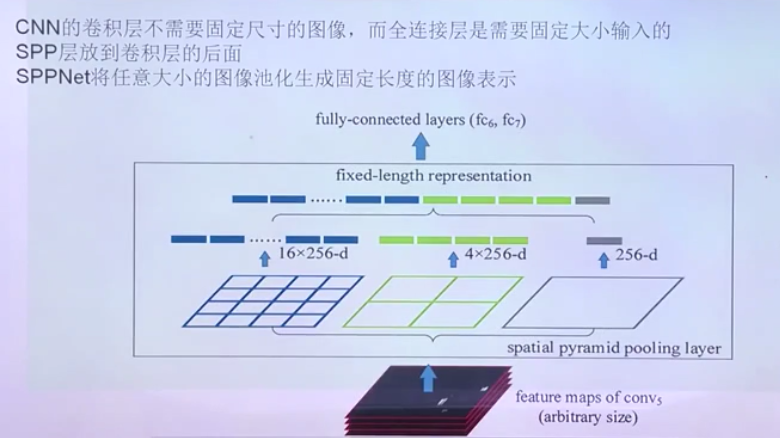

1. 无论什么输入，我们都进行卷积操作，然后将卷积结果拼接到一起。
2. CNN只有全连接层需要固定大小

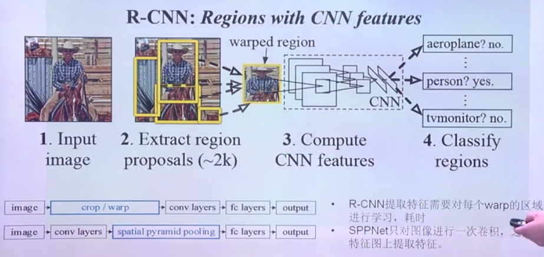

3. 也就是我们在池化层完成图片大小的调整

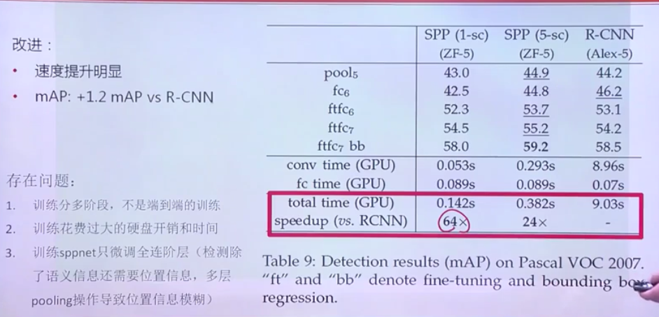

4. 问题:依旧不是端到端的等

# 4. Fast-R-CNN

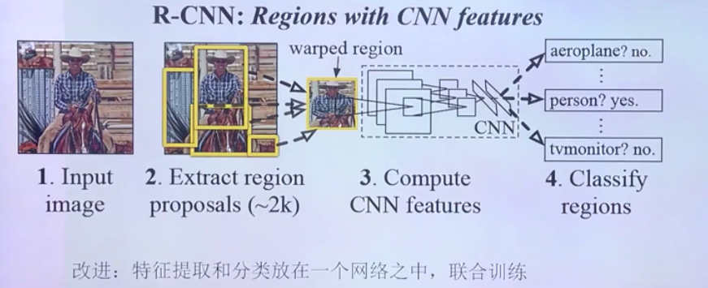

1. 提取特征和区域放置到一起来完成。

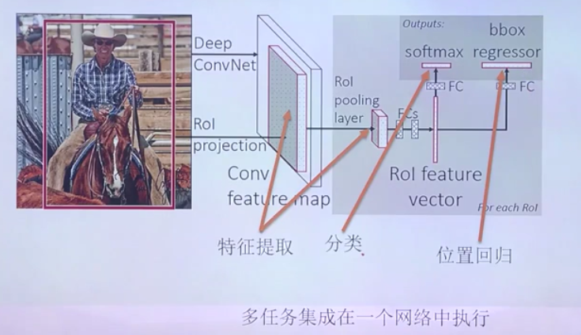

## 4.1. 损失函数

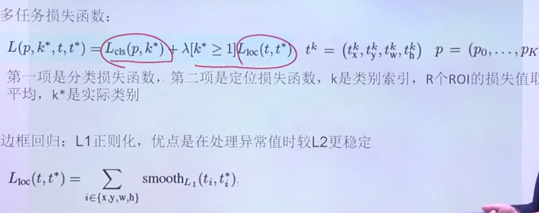

## 4.2. 流程

1. 使用anchor box进行试验，从而确定最佳。

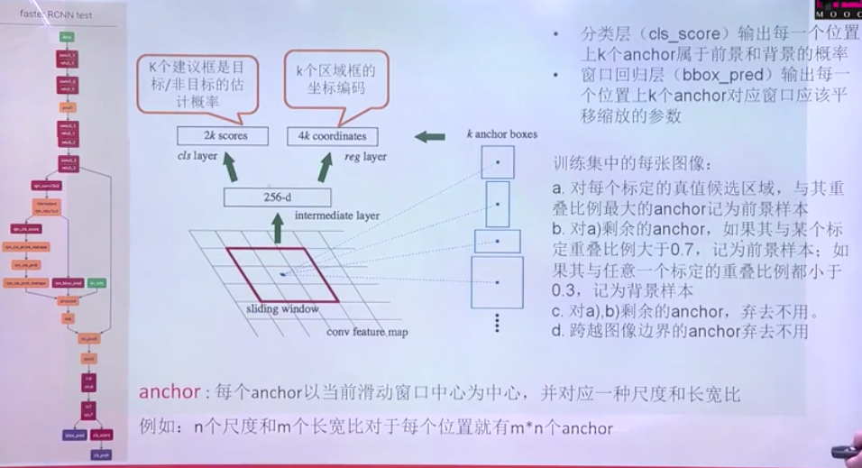

1. 前景样本比例，背景样本比例
2. 标记结束后弃用其他的anchor

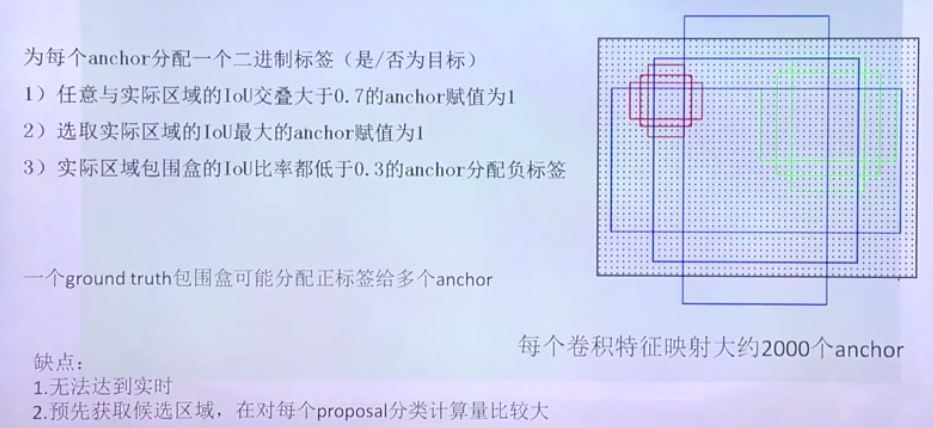

1. anchor box每一个样本都会有多个标签。

## 4.3. Fast-R-CNN与SPP-Net比较

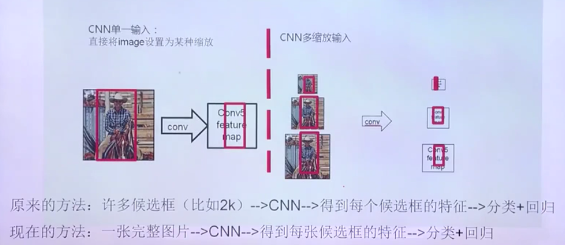

1. 不用再将图片进行大小调整。

## 4.4. 特点

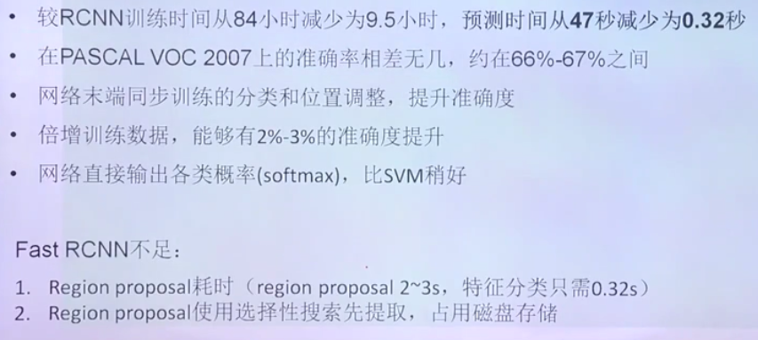

# 5. YOLO

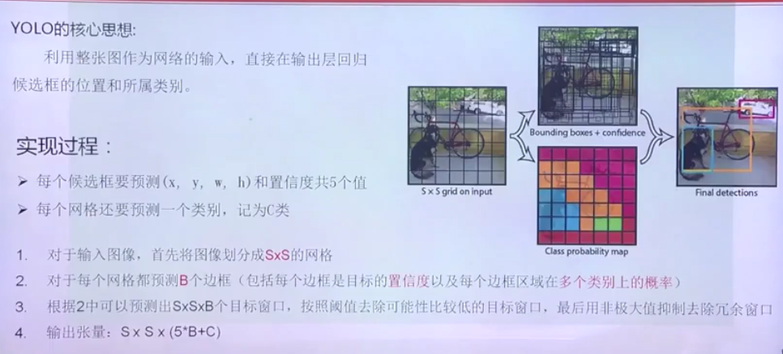

1. 不是进行随意进行学习
2. 过程:首先确定的参数和置信度以及类别。

## 5.1. 网络过程

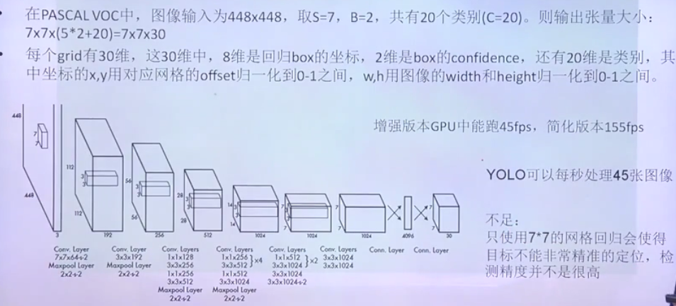

## 5.2. 损失函数

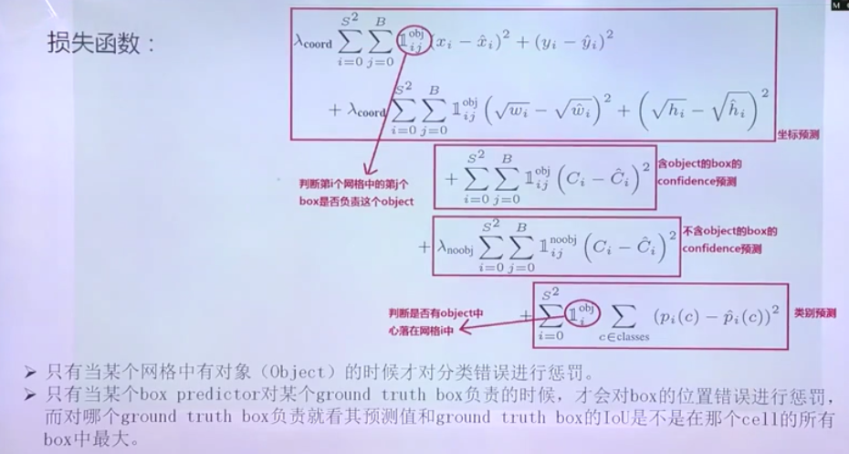

1. 如果有这个物体，才进行惩罚

## 5.3. 不足
1. 因为分成了7*7的网格，所以物体过小可能无法识别出来。

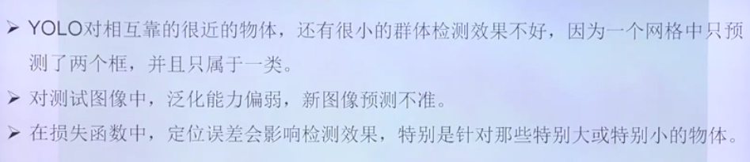

2. 泛化能力弱，很难识别新的物体
