CNN(卷积神经网络)
---
1. 卷积神经网络是需要大量样本进行训练的。

# 1. 卷积神经网络的结构

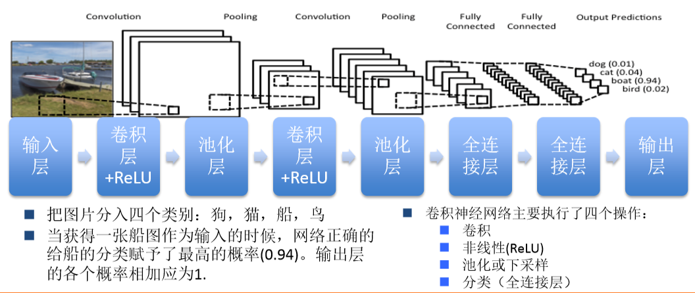

1. 卷积层:用传统全连接方法做会容易过拟合
    + 使用ReLU不容易过拟合和梯度消失

# 2. 基本单元

## 2.1. 输入层

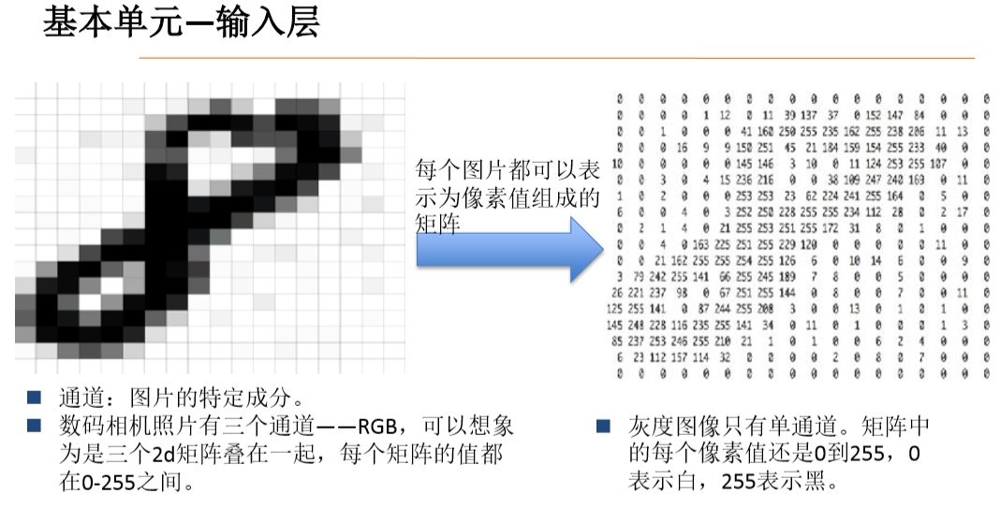

1. 三基色:RGB
    + 红蓝绿，每一个彩色图都可以调制出来。
    + 所以我们用三个矩阵来表示这一个数字
2. 灰度图可以通过对于RGB图(CYMK通道)的操作进行生成。

### 2.1.1. 可视化的每一层的结果(通道)

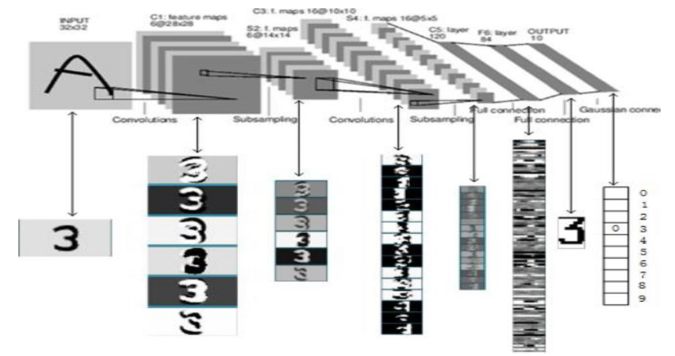

1. 了解不同的通道的卷积操作的结果。
2. 图越来越模糊，特征值逐渐丢失，而之后再次叠加。
3. 模拟人的视觉神经。
4. 通道中某一处的数值表示的就是对当前特征强弱的反映。

### 2.1.2. 输入的图像特征
1. 28*28的黑白图形如果直接输入，那么有近40万个待优化的参数。
    + 待优化的参数过多，容易导致模型过拟合。
2. 因此我们在实际应用中，会先对原始图像进行特征提取，把提取到的特征喂给全连接网络，再让全连接网络计算出分类评估值。
    + 全连接(NN):每个神经元与前后相邻层的每一个神经元都有连接关系，输入是特征，输出为预测的结果。 

## 2.2. 卷积层

### 2.2.1. 什么是卷积
1. 卷积是一种**有效提取图片特征**的方法。一般用一个正方形**卷积核**，遍历图片上的每一个像素点。图片与卷积核重合区域内相对应的每一个像素值乘卷积核内相对应点的权重，然后求和，再加上偏置后，最后得到输出图片中的一个像素值。 

### 2.2.2. 填充
1. 全零填充(same padding):是向图像边缘添加0值。

### 2.2.3. 卷积过程
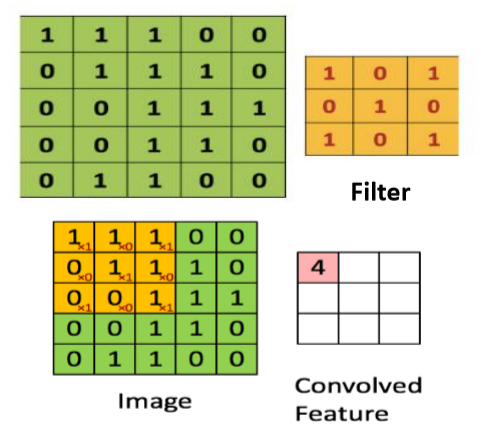

1. Filter:"**滤波器**"或者"**特征探测器**"，这里的重点就是，理解滤波器对于原输入图片来说，是个特征探测器。它的元素是通过网络训练得到的。
    + 对于RGB而言，我们通过使用三个特征过滤器来获取一个三通道的输出。
2. **卷积**操作:在原始图片(绿色)上从左往右、从上往下按照一定步数滑动橙色矩阵，并且在每个位置上，我们都对两个矩阵的对应元素相乘后求和得到一个整数，这就是输出矩阵(粉色)的元素。注意，3x3矩阵每次只"看见"输入图片的一部分，即**局部感受野**。
3. Convolved Feature:在原图上滑动滤波器、点乘矩阵所得的矩阵称为"**卷积特征**"、"激励映射"或"特征映射"。
    + 输出大小:原始图像大小 - 核函数大小 + 步长
4. 深度(Depth):深度就是卷积操作中用到的滤波器个数。这里对图片用了两个不同的滤波器，从而产生了两个特征映射。你可以认为这两个特征映射也是堆叠的2d矩阵，所以这里特征映射的"深度"就是2。
5. 步幅(Stride):步幅是每次滑过的像素数。当Stride=2的时候每次就会滑过2个像素。步幅越大，特征映射越小。
6. 卷积核一般是由厚度的，即通道(Channel)，通道越多，获得的特征图(Feature)就越多

## 2.3. 池化层
1. 空间池化，也叫亚采样或下采样降低了每个特征映射的维度，但是保留了最重要的信息。
2. 空间池化可以有很多种形式：最大(Max)，平均(Average)，求和(Sum)等等。
    + 最大池化成效最好。
3. 池化是为了获得样本的高层特征。

最大池化
---
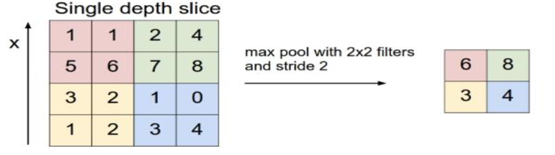

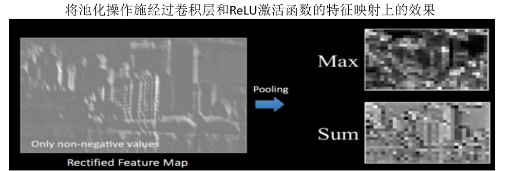

3. 池化层的功能
    + 减少网络中的参数计算数量，从而遏制过拟合
    + 增强网络对输入图像中的小变形、扭曲、平移的**鲁棒性**(输入里的微小扭曲不会改变池化输出 ——因为我们在局部邻域已经取了最大值/平均值)。
    + 帮助我们获得不因尺寸而改变的等效图片表征。这非常有用，因为这样我们就可以探测到图片里的物体，不论那个物体在哪。

## 2.4. 全连接层
1. 使用**softmax激励函数**作为输出层的多层感知机(Multi-Layer Perceptron)。
2. 全连接表示上一层的每一个神经元，都和下一层的每一个神经元是相互连接的。
3. 卷积层和池化层的输出代表了**输入图像的高级特征**，全连接层的**目的**就是类别基于训练集用这些特征进行分类。
4. 除了分类以外，加入全连接层也是学习特征之间非线性组合的有效办法。卷积层和池化层提取出来的特征很好，但是如果考虑这些特征之间的组合，就更好了。
5. 卷积层和池化层的**输出**代表了输入图像的**高级特征**，**全连接层的目的**就是类别基于训练集用这些特征进行分类。
6. 除了分类以外，加入全连接层也是学习特征之间非线性组合的有效办法。卷积层和池化层提取出来的特征很好，但是如果考虑这些特征之间的组合，就更好了。

使用tensorflow等框架中的可视化工具可视化过程
---
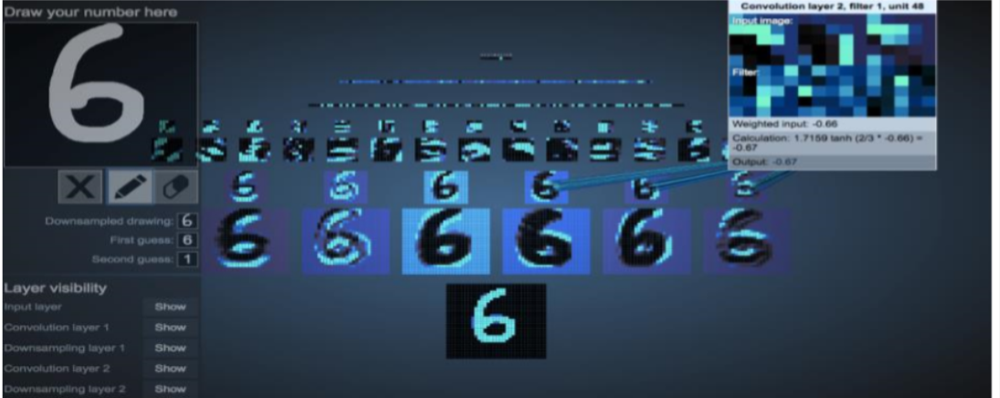

# 3. CNN训练
1. 学习如何训练CNN

## 3.1. 反向传播训练

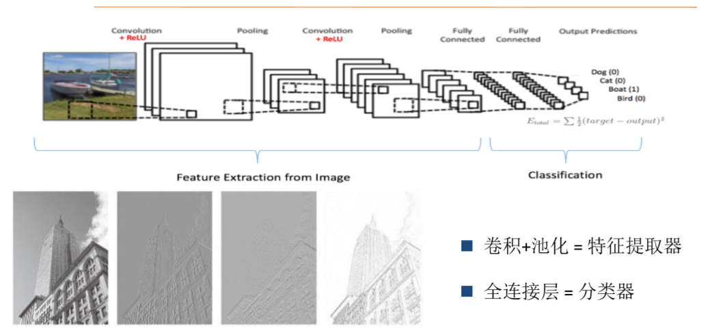

1. 卷积+池化 = 特征提取器
2. 全连接层 = 分类器
3. 有批处理和梯度下降法等多种处理方法

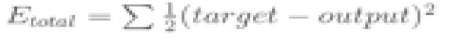

1. 目的就是让上面的式子的值最小

### 3.1.1. 训练过程
1. Step 1: 用随机数初始化所有的滤波器和参数/权重
2. Step 2: 网络将训练图片作为输入，执行前向步骤(卷积，ReLU，池化以及全连接层的前向传播)并计算每个类别的对应输出概率。
    + 假设船图的输出概率是[0.2, 0.4, 0.1, 0.3]
    + 因为第一个训练样本的权重都是随机的，所以这个输出概率也跟随机的差不多
3. Step 3: 计算输出层的总误差
    + 总误差=1/2 ∑ (目标概率−输出概率)^2
4. Step 4: 反向传播算法计算误差相对于所有权重的梯度，并用梯度下降法更新所有的滤波器/权重和参数的值，以使输出误差最小化。
    + 权重的调整程度与其对总误差的贡献成正比。
    + 当同一图像再次被输入，这次的输出概率可能是[0.1, 0.1, 0.7, 0.1]，与目标[0, 0, 1, 0]更接近了。这说明我们的神经网络已经学习分类特定图片了，学习的方式是调整权重/滤波器以降低输出误差。
    + 如滤波器个数、滤波器尺寸、网络架构这些参数，是在Step 1之前就已经固定的，且不会在训练过程中改变——只有滤波矩阵和神经元权重会更新。
5. 简单来讲，我们就是从头传入，从后面进行反馈，调整参数和偏置的属性

### 3.1.2. 算法优化

局部最小值
---
1.  长期以来，人们普遍认为，神经网络很难优化是因为较大的神经网络中包含很多局部极小值(local minima，使得算法容易陷入到其中某些点。这种看法持续二三十年，至少数万篇论文中持有这种说法。

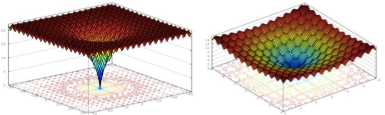

梯度下降法(Gradient Descent)
---

1. Gradient Descent的局限
    + 学习率很难选。若过小，收敛速度很慢。若过大，那么会阻碍收敛，即在极值点附近振荡
    + 每次更新都是使用相同的学习速率。
    + 鞍点经常被一个相等误差的平原包围，导致SGD很难摆脱，因为梯度在所有方向都近似于0。
2. BGD(批处理梯度下降法)
    + 在更新每一参数时使用所有的样本
    + 当样本量很大时，训练过程会很慢
3. SGD(随机梯度下降法)
    + 通过每个样本来更新一次
    + 噪音较BGD要多，使得SGD并不是每次迭代都向着整体最优化方向
4. MBGD(小批量梯度下降法)
    + Mini-batch Gradient Descent
    + 两种方法的折中
    + 一组10-20个样本

### 3.1.3. 防止过拟合
L1/L2正则化
---
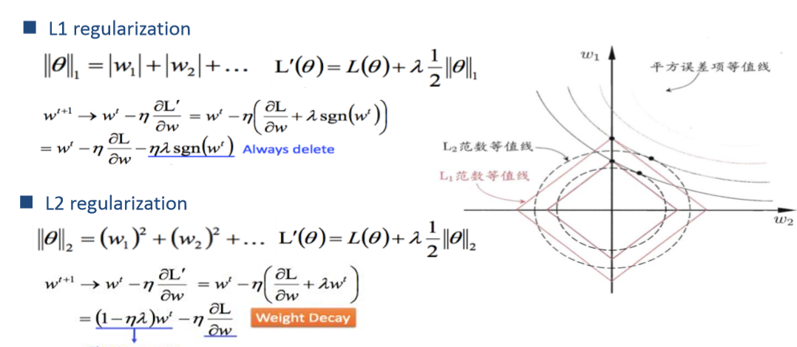

1. 通过添加惩罚项来避免过拟合
2. 如果是神经网络，Θ就是权重。
3. 参考范数

Early Stopping
---
1. 每一个epoch结束时(一个epoch即对所有训练数据的一轮遍历)计算validation data的total loss，当loss不再降低时，就停止训练，这样可以防止overfitting。
2. 找到过拟合的点

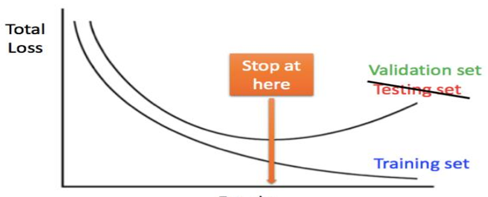

Dropout
---
1. DNNs是以概率p舍弃部分神经元，其它神经元以概率q=1-p被保留，舍去的神经元的输出都被设置为零。
2. Dropout在实践中能很好工作是因为其在训练阶段阻止神经元的共适应
3. Dropout的ensemble思想:我们可以按照一定概率舍去(不是删除，而是在之后的训练中不再进行考虑),最后训练结束后再次连接起来。

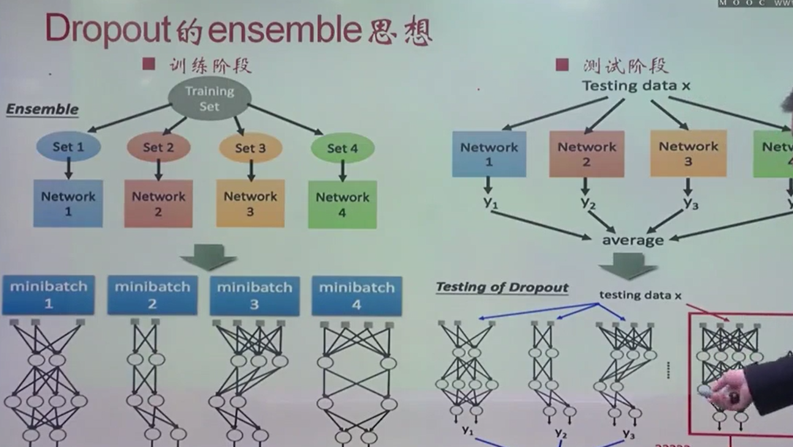

# 4. CNN结构演化

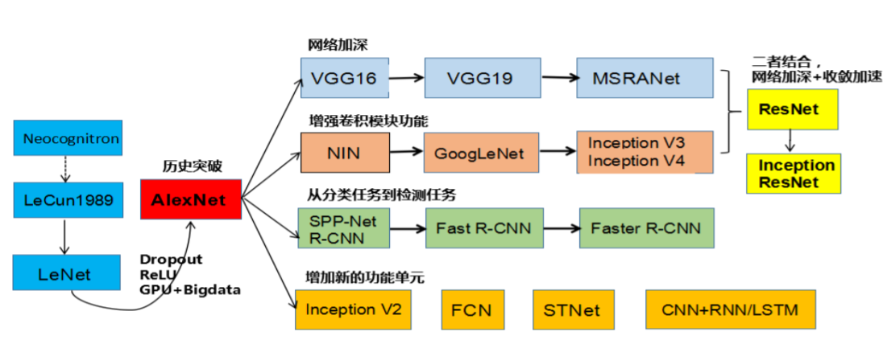

1. 很多的模型都是对于LeNet进行的改进

# 5. 实例源程序
1. 

# 6. 基于卷积神经网络的股票预测

## 6.1. 数据预处理
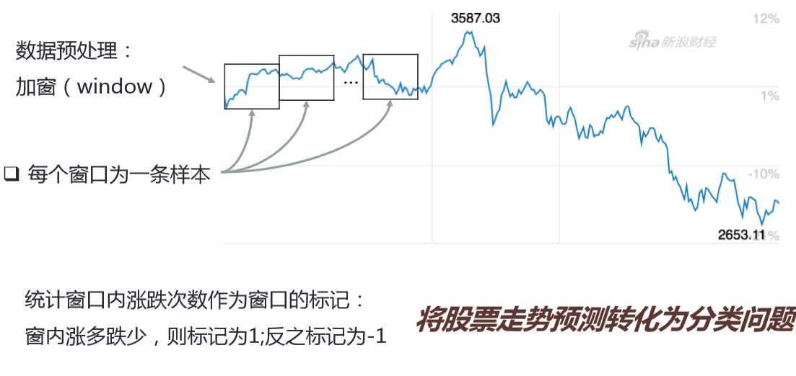

1. 加窗法，通过机器来进行标注
    + 标记为涨还是跌
2. 效率比较低(我们将图片整个作为一个涨或者跌)
    + 忽略了很多的细节

## 6.2. 通常的处理方法
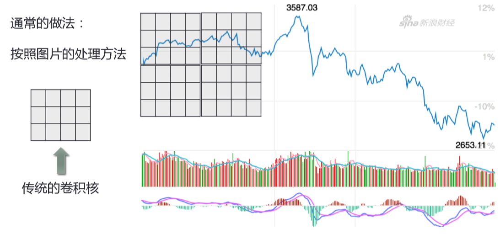

## 6.3. 卷积和池化设计
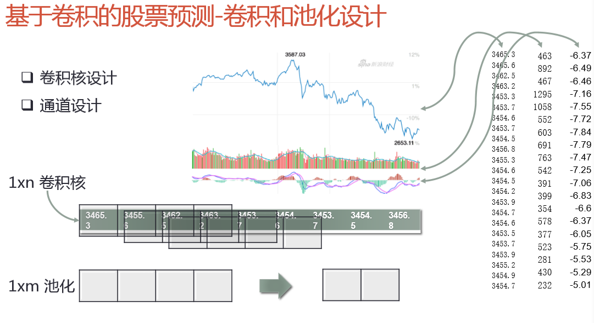

1. 在一个时间点中，我们将每一个时间点用一个值来描述，然后横向存储成为数组。
2. 经过卷积操作再次得到一个新的一维卷积结果。

## 6.4. 通道设计
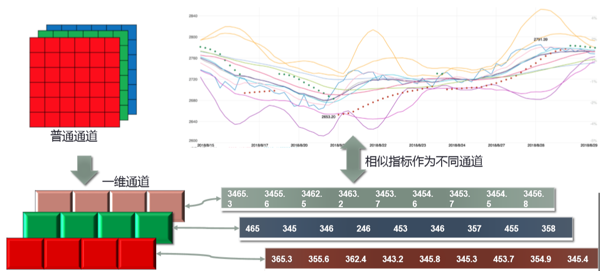

1. 加上多个核函数(也就是加上了多通道)

## 6.5. 股票预测效果
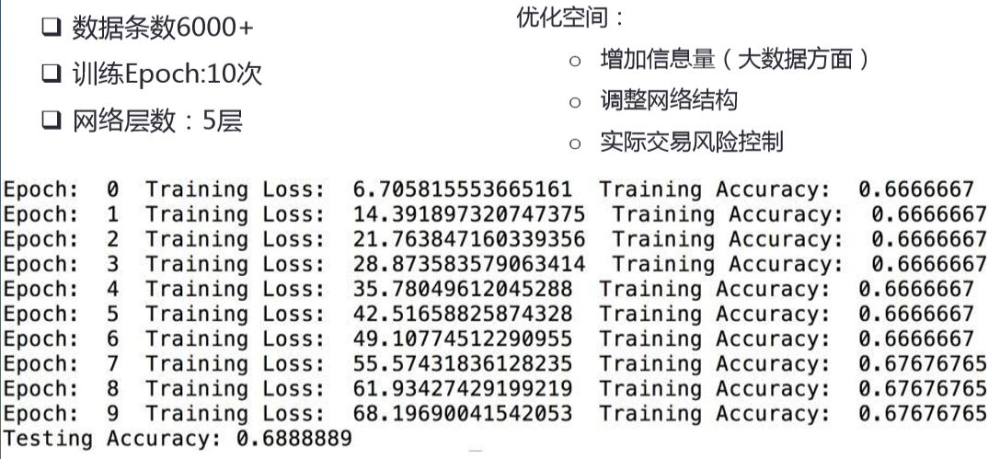

1. 使用tnsorflow来对基本的神经网络进行训练。

## 6.6. 优化
1. 多通道:
    1. 收盘价等
    2. 时间价值走向
2. 首先去噪声随机化情况，完成数据预处理之后，再进行加窗

# 7. 相关课程及参考
1. 2019年 MOOC 商务数据挖掘
2. <a href = "https://blog.csdn.net/qian2213762498/article/details/82924819">卷积网络中的通道(Channel)和特征图</a>
3. <a href = "https://www.jianshu.com/p/3699da3639de">(Tensorflow)手把手CNN入门：手写数字识别</a>