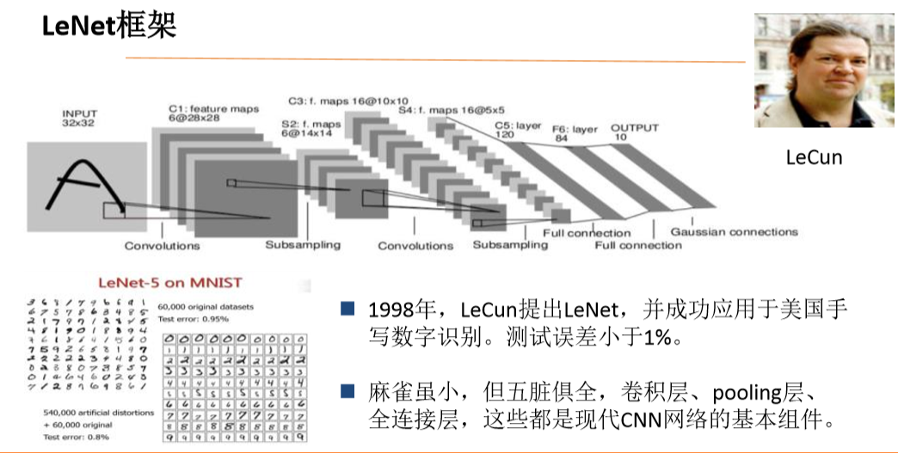
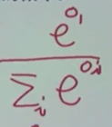
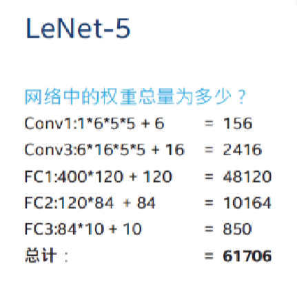

LeNet框架
---

# 1. LeNet框架内容



1. 将手写输入编码写入
2. 中间的神经网络分为多层
    + 对应BP神经网络增加了很多隐层
    + 其中的隐层不使用全连接

# 2. 结构图


## 2.1. 输入层
1. 输入层使用点阵像素编码(32*32)，然后输入的是编码而不是图
    + 输入一个704维向量

## 2.2. C1:卷积层(Convolutions)
1. 用一个卷积核(卷积核函数)进行变化，将f中的特征保留下来。
    + 这是一个步幅为1的卷积层
    + 每一个内核有5*5 = 25个权重(外加一个偏置项，因此实际数量为26)。权数 = 26 * 6 = 156
2. 核函数相当于过滤器，然后相乘叠加，直到操作覆盖f的定义域
3. 使用了6卷积核来获得6个结果(28*28)
    + 28 * 28也就意味着这是对于其中信息的压缩。
    + 为什么使用6个卷积层?是因为不同的卷积核函数是为了获得不同的图像特征。
    + 28如何得到?(步长为1) 28 = 32(原来向量的边数) - 5(核函数大小) + 1(步长)
4. 这一层
    + 深度为6
    + 一个通道25个权重
    + 输出为`6*28*28`
    + 权数总数:6*26 = 156个(权重150个，偏置6个)
    + 同一个通道之间共享权重

## 2.3. Subsampling(子采样)
1. 这个层是2*2的池化层(步幅为2)实际上是一个池化的结果，也就是对卷积的操作的结果进行进一步的压缩。
2. 压缩成了6个14*14的点阵
3. 什么是池化?使用一个`2*2`的矩阵去扫原来的卷积层C1，将整个编码全部化为`2*2`，结果就是把4个单元压缩成一个单元
    + 可以取4个单元的平均值:平均池化
    + 可以取4个单元的最大值:最大池化
4. 这一层
    + 输出大小为`6*14*14`

## 2.4. C2:卷积层
1. 对于池化结果进行第二次进行卷积，得到一个16通道的结果
2. 再次使用卷积核函数(`14*14->10*10`)
3. 我们可以算出卷积核函数还是为5*5的
4. 通道6 -> 16：说明卷积核不止1个
    + 增加卷积核的数量主要就是为了进一步细化图像的具体特征，并且增加我们的观察的维度
    + 线条等特殊的特征
5. 这一层
    + 深度为16
    + 使用步幅为2的`5*5`
    + 权数总量为`15*151 = 2416`

## 2.5. Subsampling(子采样)
1. 再次进行一次池化操作，也就是(`10*10->5*5`)
2. 使用2*2的卷积核函数
3. 至此已经进行了4次的提取，也就是对于信息进行了提取和滤波。
4. 到第一个全连接层之间，我们把其拉直为一个400(16*25)长度向量

## 2.6. 全连接层I
1. 将刚刚“变平”的长度向量变换成为一个120维的向量

## 2.7. 全连接层II
1. 将120维向量全连接到84维向量

## 2.8. 输出层
1. 和目标相同，因为是手写数字，所以是变换为10维向量
2. 我们使用softmax函数(概率化),恰好针对10个数字的概率，将其概率化为[0,1],根据最大似然法，确定最可能是哪一个数字。



## 2.9. 总结:每一个层的权重和权重和



# 3. 一些其他计算
1. 假设有5个大小为7x7、步长（S）为1的卷积核。此时如果你向这一层传入一个维度为224x224x3的数据，那么神经网络下一层所接收到的数据维度是多少？
    + 218 * 218 * 5

# LeNet-5 python实现
```py
import tensorflow as tf
IMAGE_SIZE = 28
NUM_CHANNELS = 1
CONV1_SIZE = 5
CONV1_KERNEL_NUM = 32
CONV2_SIZE = 5
CONV2_KERNEL_NUM = 64
FC_SIZE = 512
OUTPUT_NODE = 10
def get_weight(shape, regularizer):
 w = tf.Variable(tf.truncated_normal(shape,stddev=0.1))
 if regularizer != None: tf.add_to_collection('losses', tf.contrib.layers.l2_regularizer(regularizer)(w)) 
 return w
def get_bias(shape): 
 b = tf.Variable(tf.zeros(shape))  
 return b
def conv2d(x,w):  
 return tf.nn.conv2d(x, w, strides=[1, 1, 1, 1], padding='SAME')
def max_pool_2x2(x):  
 return tf.nn.max_pool(x, ksize=[1, 2, 2, 1], strides=[1, 2, 2, 1], padding='SAME')
def forward(x, train, regularizer):
    conv1_w = get_weight([CONV1_SIZE, CONV1_SIZE, NUM_CHANNELS, CONV1_KERNEL_NUM], regularizer) 
    conv1_b = get_bias([CONV1_KERNEL_NUM]) 
    conv1 = conv2d(x, conv1_w) 
    relu1 = tf.nn.relu(tf.nn.bias_add(conv1, conv1_b)) 
    pool1 = max_pool_2x2(relu1)
    conv2_w = get_weight([CONV2_SIZE, CONV2_SIZE, CONV1_KERNEL_NUM, CONV2_KERNEL_NUM],regularizer) 
    conv2_b = get_bias([CONV2_KERNEL_NUM])
    conv2 = conv2d(pool1, conv2_w) 
    relu2 = tf.nn.relu(tf.nn.bias_add(conv2, conv2_b))
    pool2 = max_pool_2x2(relu2)
    pool_shape = pool2.get_shape().as_list() 
    nodes = pool_shape[1] * pool_shape[2] * pool_shape[3] 
    reshaped = tf.reshape(pool2, [pool_shape[0], nodes])
    fc1_w = get_weight([nodes, FC_SIZE], regularizer) 
    fc1_b = get_bias([FC_SIZE]) 
    fc1 = tf.nn.relu(tf.matmul(reshaped, fc1_w) + fc1_b) 
    if train: fc1 = tf.nn.dropout(fc1, 0.5)
    fc2_w = get_weight([FC_SIZE, OUTPUT_NODE], regularizer)
    fc2_b = get_bias([OUTPUT_NODE])
    y = tf.matmul(fc1, fc2_w) + fc2_b
    return y
##########

#coding:utf-8
import tensorflow as tf
from tensorflow.examples.tutorials.mnist import input_data
import mnist_lenet5_forward
import os
import numpy as np
BATCH_SIZE = 100
LEARNING_RATE_BASE =  0.005 
LEARNING_RATE_DECAY = 0.99 
REGULARIZER = 0.0001 
STEPS = 50000 
MOVING_AVERAGE_DECAY = 0.99 
MODEL_SAVE_PATH="./model/" 
MODEL_NAME="mnist_model"
def backward(mnist):
    x = tf.placeholder(tf.float32,[
 BATCH_SIZE,
 mnist_lenet5_forward.IMAGE_SIZE,
 mnist_lenet5_forward.IMAGE_SIZE,
 mnist_lenet5_forward.NUM_CHANNELS]) 
    y_ = tf.placeholder(tf.float32, [None, mnist_lenet5_forward.OUTPUT_NODE])
    
    y = mnist_lenet5_forward.forward(x,True, REGULARIZER) 
    global_step = tf.Variable(0, trainable=False)
    ce = tf.nn.sparse_softmax_cross_entropy_with_logits(logits=y, labels=tf.argmax(y_, 1))
    cem = tf.reduce_mean(ce) 
    loss = cem + tf.add_n(tf.get_collection('losses'))
    learning_rate = tf.train.exponential_decay( 
        LEARNING_RATE_BASE,
        global_step,
        mnist.train.num_examples / BATCH_SIZE, 
  LEARNING_RATE_DECAY,
        staircase=True) 
    
    train_step = tf.train.GradientDescentOptimizer(learning_rate).minimize(loss, global_step=global_step)
    ema = tf.train.ExponentialMovingAverage(MOVING_AVERAGE_DECAY, global_step)
    ema_op = ema.apply(tf.trainable_variables())
    with tf.control_dependencies([train_step, ema_op]): 
        train_op = tf.no_op(name='train')
    saver = tf.train.Saver()
    with tf.Session() as sess: 
        init_op = tf.global_variables_initializer() 
        sess.run(init_op)
        ckpt = tf.train.get_checkpoint_state(MODEL_SAVE_PATH) 
        if ckpt and ckpt.model_checkpoint_path:
         saver.restore(sess, ckpt.model_checkpoint_path)
        for i in range(STEPS):
            xs, ys = mnist.train.next_batch(BATCH_SIZE) 
            reshaped_xs = np.reshape(xs,(  
      BATCH_SIZE,
         mnist_lenet5_forward.IMAGE_SIZE,
         mnist_lenet5_forward.IMAGE_SIZE,
         mnist_lenet5_forward.NUM_CHANNELS))
            _, loss_value, step = sess.run([train_op, loss, global_step], feed_dict={x: reshaped_xs, y_: ys}) 
            if i % 100 == 0: 
                print("After %d training step(s), loss on training batch is %g." % (step, loss_value))
                saver.save(sess, os.path.join(MODEL_SAVE_PATH, MODEL_NAME), global_step=global_step)
def main():
    mnist = input_data.read_data_sets("./data/", one_hot=True) 
    backward(mnist)
if __name__ == '__main__':
    main()

#####################
#coding:utf-8
import time
import tensorflow as tf
from tensorflow.examples.tutorials.mnist import input_data
import mnist_lenet5_forward
import mnist_lenet5_backward
import numpy as np
TEST_INTERVAL_SECS = 5
def test(mnist):
    with tf.Graph().as_default() as g: 
        x = tf.placeholder(tf.float32,[
            mnist.test.num_examples,
            mnist_lenet5_forward.IMAGE_SIZE,
            mnist_lenet5_forward.IMAGE_SIZE,
            mnist_lenet5_forward.NUM_CHANNELS]) 
        y_ = tf.placeholder(tf.float32, [None, mnist_lenet5_forward.OUTPUT_NODE])
        y = mnist_lenet5_forward.forward(x,False,None)
        ema = tf.train.ExponentialMovingAverage(mnist_lenet5_backward.MOVING_AVERAGE_DECAY)
        ema_restore = ema.variables_to_restore()
        saver = tf.train.Saver(ema_restore)
  
        correct_prediction = tf.equal(tf.argmax(y, 1), tf.argmax(y_, 1)) 
        accuracy = tf.reduce_mean(tf.cast(correct_prediction, tf.float32))
        while True:
            with tf.Session() as sess:
                ckpt = tf.train.get_checkpoint_state(mnist_lenet5_backward.MODEL_SAVE_PATH)
                if ckpt and ckpt.model_checkpoint_path:
                    saver.restore(sess, ckpt.model_checkpoint_path)
     
                    global_step = ckpt.model_checkpoint_path.split('/')[-1].split('-')[-1] 
                    reshaped_x = np.reshape(mnist.test.images,(
                    mnist.test.num_examples,
                 mnist_lenet5_forward.IMAGE_SIZE,
                 mnist_lenet5_forward.IMAGE_SIZE,
                 mnist_lenet5_forward.NUM_CHANNELS))
                    accuracy_score = sess.run(accuracy, feed_dict={x:reshaped_x,y_:mnist.test.labels}) 
                    print("After %s training step(s), test accuracy = %g" % (global_step, accuracy_score))
                else:
                    print('No checkpoint file found')
                    return
            time.sleep(TEST_INTERVAL_SECS)
def main():
    mnist = input_data.read_data_sets("./data/", one_hot=True)
    test(mnist)
if __name__ == '__main__':
    main()
```