**RNN**
---

# 1. 循环神经网络
1. 循环神经网络是一种对**序列数据**建模的神经网络。RNN不同于前向神经网络，它的层内、层与层之间的信息可以**双向传递**，更高效地存储信息，利用更复杂的方法来更新规则，通常用于处理信息序列的任务。RNN在**自然语言处理、图像识别、语音识别、上下文的预测、在线交易预测、实时翻译**等领域得到了大量的应用。
2. 学习率太大会导致网络无法收敛，在训练过程中代价函数震荡。
3. 深层网络结构中，学习到的特征一般与**神经元的参数量**有关，也与**样本的特征多寡**相关

# 2. RNN基本原理
1. RNN主要用来处理**序列数据**，在传统的神经网络模型中，是从输入层到隐含层再到输出层，每层内的节点之间无连接，循环神经网络中一个当前神经元的输出与**前面的输出**也有关，网络会对前面的信息进行记忆并应用于当前神经元的计算中，隐藏层之间的节点是有连接的，并且隐藏层的输入不仅包含输入层的输出还包含上一时刻隐藏层的输出。理论上，RNN可以对**任意长度**的序列数据进行处理。

## 2.1. 网络结构图
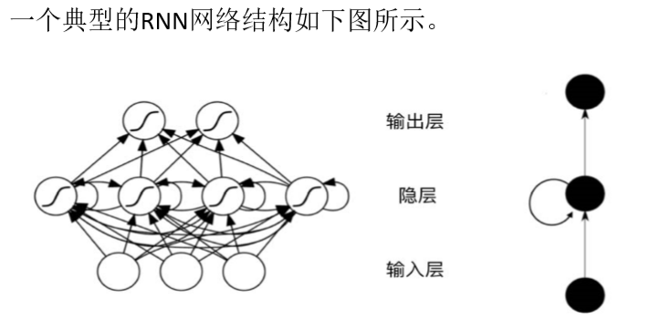

1. 总体上和BP神经网络是对应的。
2. 特点:循环神经网络的隐层是进行循环处理的。
    + 仅仅是在隐层进行循环。

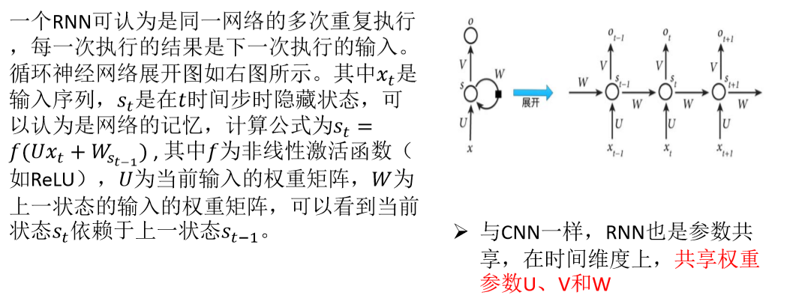
1. 将隐层展开，输入层通过权重，通过计算向前传递，
2. 主要是隐层神经元的结果循环输入输出，一般使用ReLU激活函数。
    + 为什么使用ReLU激活函数？
3. 时序可能会很长，根据问题的性质而决定
4. NLP通过word2Vec进行向量化

## 2.2. 基本结构公式表示
1. RNN包含输入单元，输入集标记为xt，而输出单元的输出集则被标记为yt。RNN还包含隐藏单元，这些隐藏单元完成了主要工作。在某些情况下，RNN会引导信息从输出单元返回隐藏单元，并且隐藏层内的节点可以自连也可以互连。RNN的基本结构可以用以下公式表示。
    + ht = fw(ht-1,xt)
2. 其中ht表示新的目标状态，而ht-1则是前一状态，xt是当前输入向量，fw是权重参数函数，目标值的结果与当前的输入、上一状态的结果有关系，以 此可以求出各参数的权重值。

# 3. RNN实例
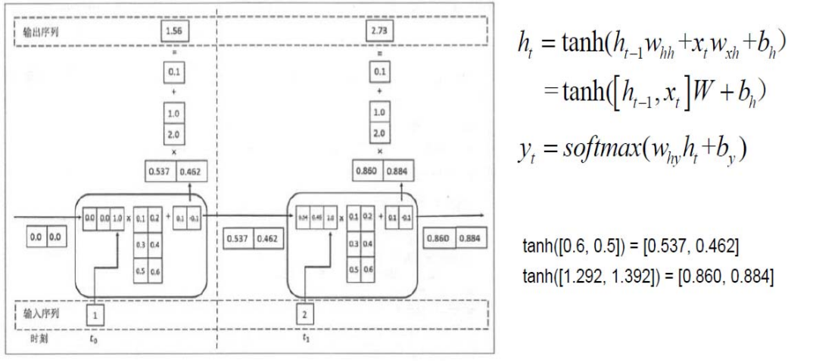

1. 输入神经元未必只有一个神经元。
2. 隐层最右边是偏置。
3. 输入时刻要和上一时刻输出合并作为输入(三维向量)。
4. 合并后的输入和权重向量相乘加上偏置矩阵。
5. 使用双曲正切或ReLU，不用sigmoid防止梯度消失。
6. softmax函数是调整输出层的概率化。
    + 转化为[0,1]并且加起来为1的。
7. 多隐层只要多进行上述操作即可。

# 4. RNN分类
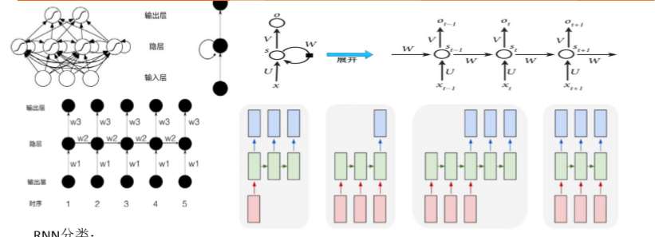

1. 输入一个输出多个，例如输入一张图像，输出这个图像的描述信息。
2. 输入是多个，输出则是一个，例如输入段话，输出这段话的情感。
3. 输入是多个，输出也是多个，如机器翻译输入一段话输出也是一段话(多个词)。
4. 多个输入和输出是同步的，例如进行字幕标记。 

# 5. RNN的训练
1. 在每个时间节点t = 0,1,2,3,4 神经网络的输出都会产生误差值：E0, E1，E2，E3，E4 。与前馈神经网络类似，RNN也使用反向传播梯度下降法更新权重。

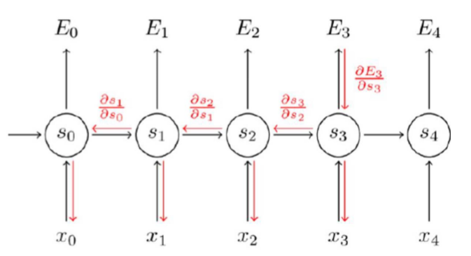

2. RNN是有监督的，设计代价函数减少整体误差。
3. 使用MiniBGD来进行权重更新。
4. 权重的更新和很多个梯度下降的导数有关。

## 5.1. RNN运行实例

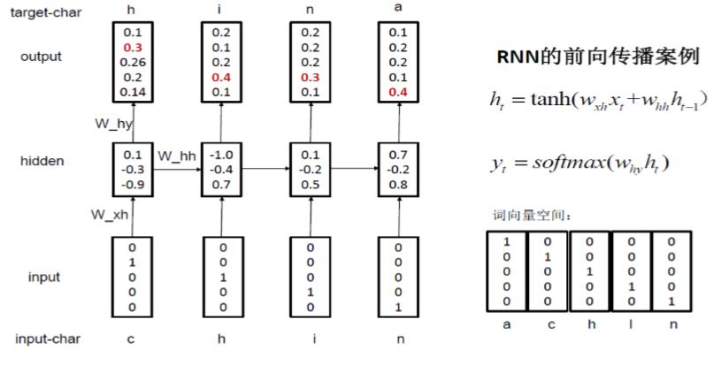

1. 目的是给出单词的前几个字母，需要补出后面的字母。
2. 使用的是独热编码(one-hot)。
3. 输出层是错一位的，所以最后一个是a。

# 6. RNN缺陷

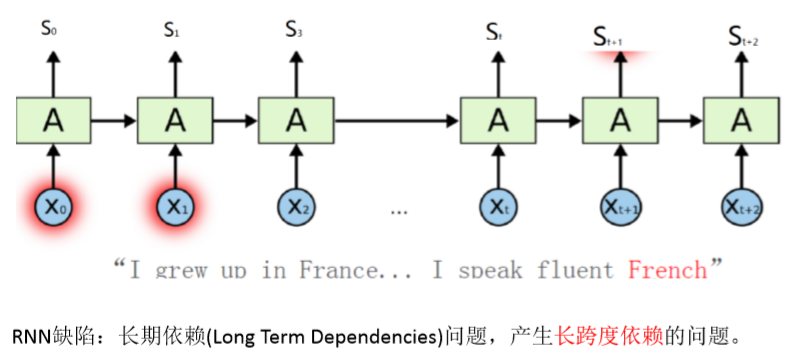

1. 句子太长的时候，想要知道后面内容很难把之前的信息保留下来(ReLU函数)很难来调整误差到最小。

# 7. 长短期记忆网络(LSTM)
1. 长短期记忆网络能够学习长期依赖关系，并可保留误差，在沿时间和层进行反向传递时，可以将误差保持在更加恒定的水平，让递归网络能够进行多个时间步的学习，从而建立远距离因果联系。它在许多问题上效果非常好，现在被广泛应用。
2. 主要是针对RNN的长跨度依赖问题

## 7.1. LSTM原理
1. 长短期记忆网络将信息存放在递归网络正常信息流之外的门控单元中，这些单元可以存储、写入或读取信息，就像计算机内存中的数据一样。但愿通过门的开关判定存储哪些信息，何时允许读取、写入或清除信息。这些门是模拟的，包含输出范围全部在0～1之间的Sigmoid函数的逐元素相乘操作。这些门依据接收到的信号开关，而且会用自身的权重集对信息进行筛选，根据强度和输入内容决定是否允许信息通过。这些权重会通过递归网络的学习过程进行调整。
2. LSTM主要引入了三种门:也就是输入门、遗忘门和输出门

结构
---

1. 左下图一是输入门，左下二三是遗忘门，左下四是输出门
2. 沿时序进行展开
3. 在遗忘门我们可以产生新的候选值，判断是否将其加入到元胞状态中去
4. 输出门是从输入门和遗忘门的信息结果进行选择来进行输出。

门限循环单元
---
1. 门限循环单元本质上就是一个没有输出门的长短期记忆网络，因此它在每个时间步都会将记忆单元中的所有内容写入整体网络,其结构如下图所示。
2. 进行优化，删去了输入门，只保留了遗忘门和输出门。
3. 门限循环单元模型只有两个门，分别是更新门和重置门，更新门是遗忘门和输入门的结合体。将元胞状态和隐状态合并，更新门用于控制前一时刻的状态信息被带入到当前状态中的程度，更新门的值越大说明前一时刻的状态信息带入越多。重置门用于控制忽略前一时刻的状态信息的程度，重置门的值越小说明忽略的越多。这个模型比长短期记忆网络更加简化，也变得越来越流行。

## 7.2. LSTM训练步骤
1. 决定从元胞状态中扔掉哪些信息。由叫做"遗忘门"的Sigmoid层控制。遗忘门会输出0～1之间的数，1表示保留该信息，0表示丢弃该信息
2. 通过输入门将有用的新信息加入到元胞状态。首先，将前一状态和当前状态的输入输入到Sigmoid函数中滤除不重要信息。另外，通过tanh函数得到一个‐1〜1之间的输出结果。这将产生一个新的候选值，后续将判断是否将其加入到元胞状态中。
3. 将上一步中Sigmoid函数和tanh函数的输出结果相乘，并加上第一步中的输出结果，从而实现保留的信息都是重要信息，此时更新状态即可忘掉那些不重要的信息
4. 最后，从当前状态中选择重要的信息作为元胞状态的输出。首先，将前一隐状态和当前输入值通过Sigmoid函数得到一个0〜1之间的结果值。然后对第三步中输出结果计算tanh函数的输出值，并与得到的结果值相乘，作为当前元胞隐状态的输出结果，同时也作为下一个隐状态的输入值

## 7.3. 例子一:基于LSTM的股票预测

### 7.3.1. 数据引入
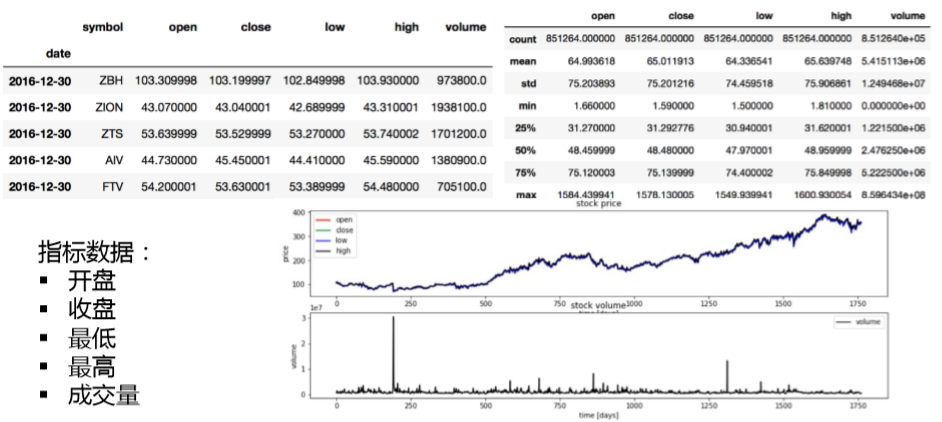

1. 输入是股票的历史数据，进行预处理。
2. 每个样本在一个时间窗中取出来n维数据，输入过去一段时间不同窗口的值，作为输入层不同时刻的输入。

### 7.3.2. 数据预处理
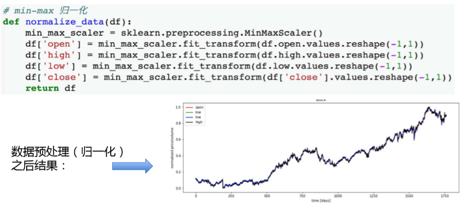

1. 对于每一个视窗，不同段时间的序列进行升降。
2. 这里是将数据进行归一化来进行处理。

### 7.3.3. 准备样本

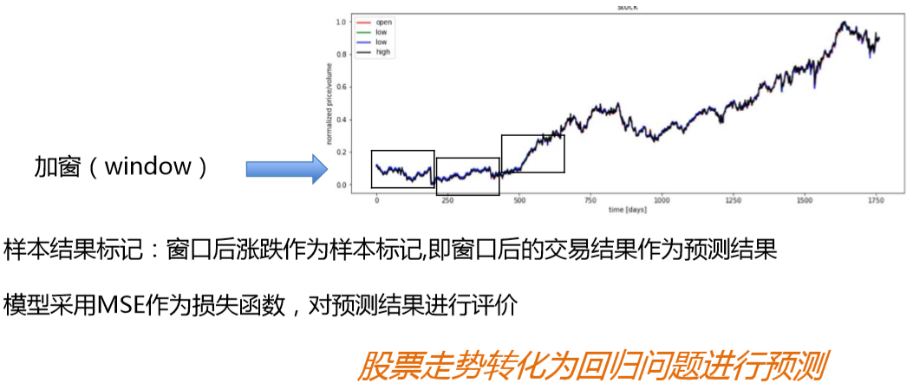

1. 进行加窗取样

### 7.3.4. 设计LSTM网络

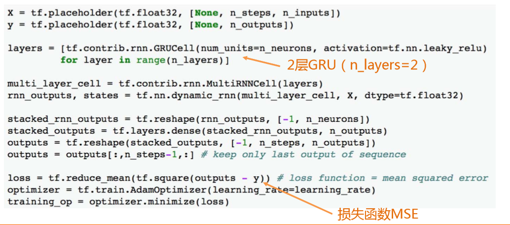

1. 我们使用2层的GRU(两层的长短期记忆网络)
2. 定义代价函数，然后我们使用均方差损失函数。
3. AdamOptimizer()是梯度下降法的一个改进版本
    + 是动态的学习率，保证更快地收敛。

### 7.3.5. 预测结果
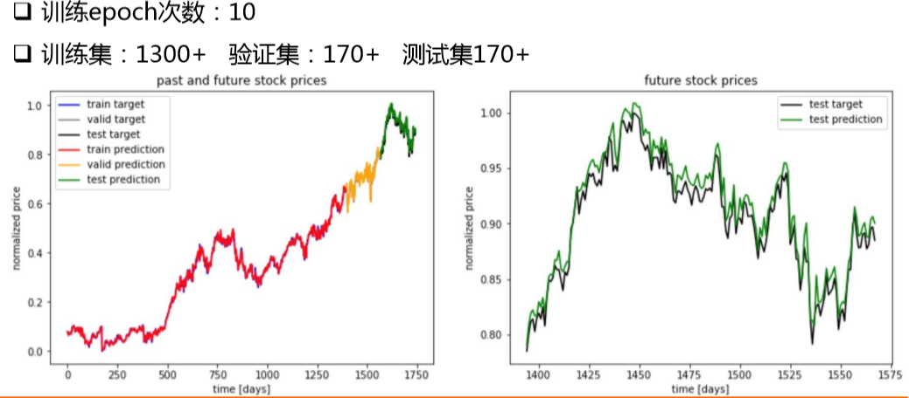

1. 我们一共训练十次。
2. 归一化预测股票价格。
3. 蓝颜色预测，黑颜色是结果

## 7.4. 例子二:基于LSTM的电商秒杀业务预测
1. 秒杀活动会在短时间有大量的访问，用来预测如果之后出现秒杀活动，系统会不会出现故障。

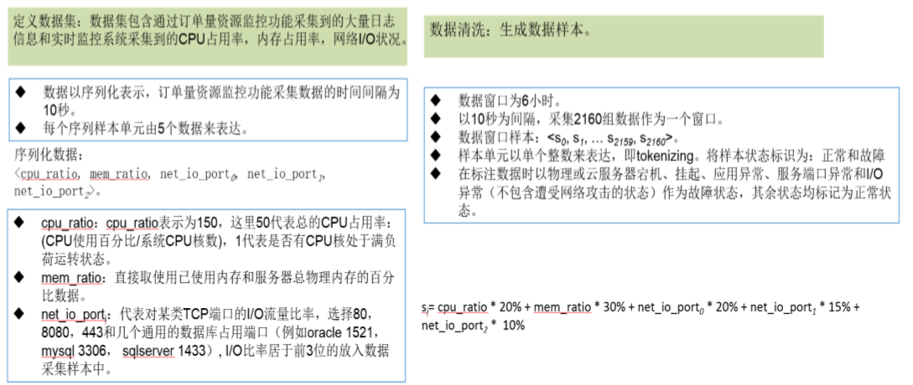

2. 每十秒钟采集一次数据

3. 两层长短期记忆网络，输出量两种状态