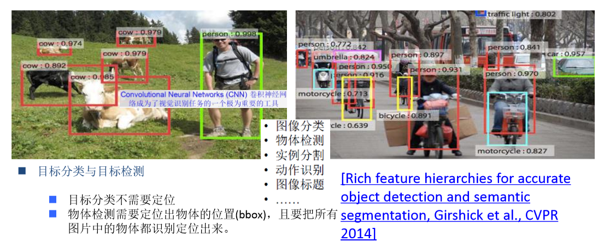
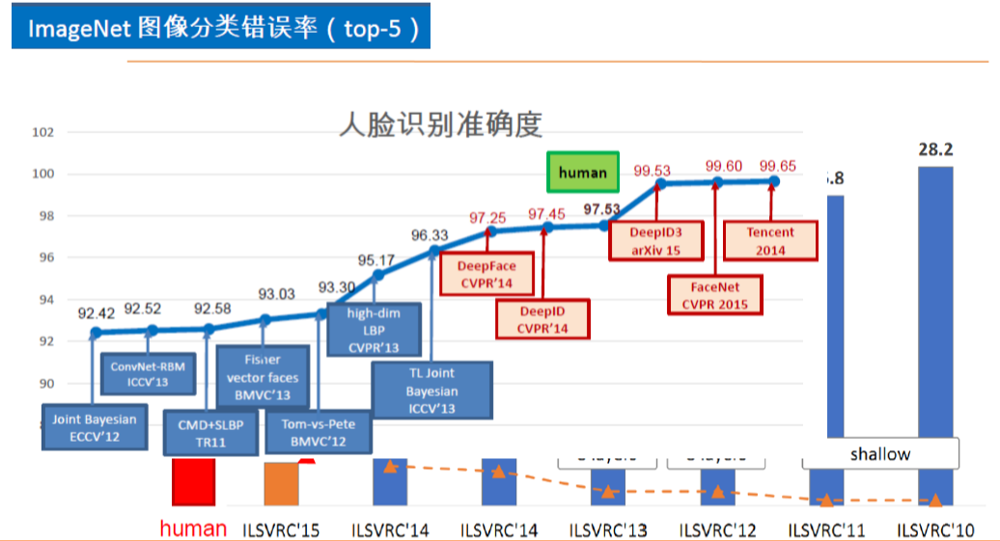
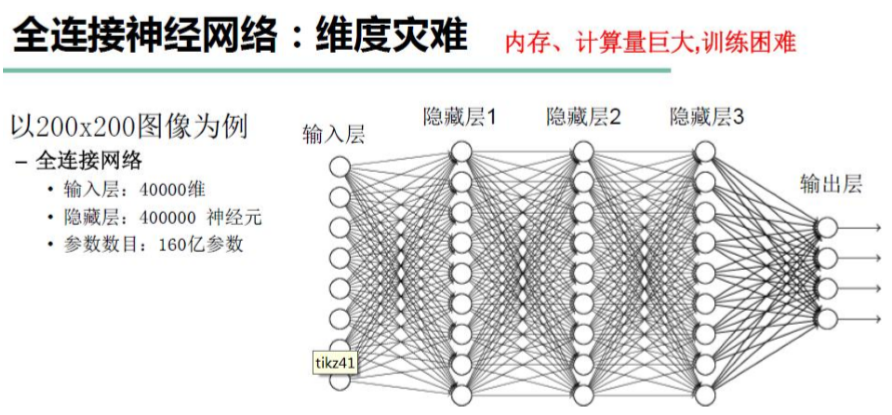
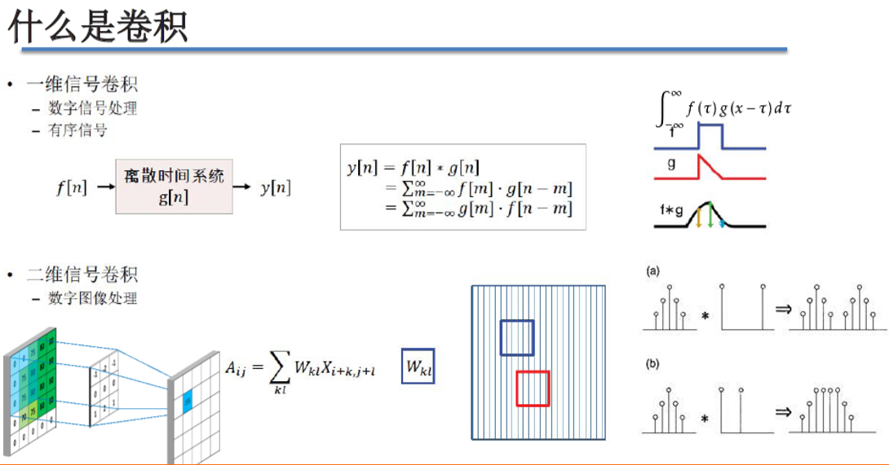
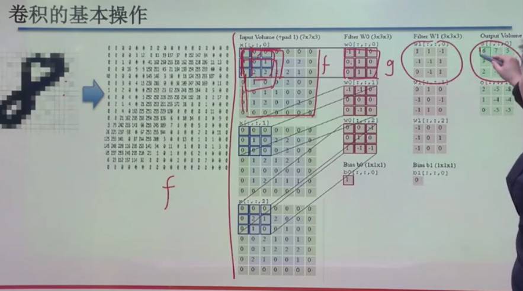
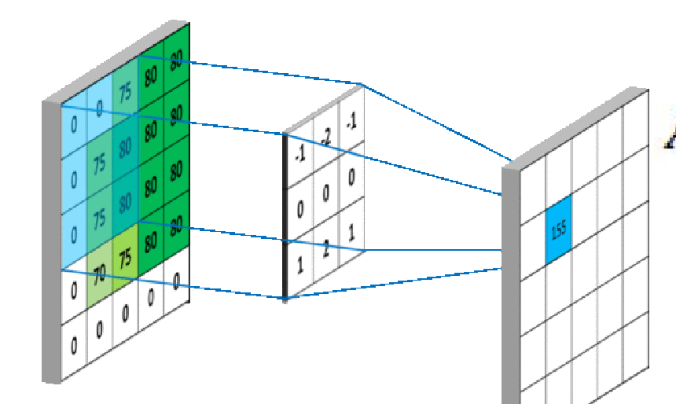
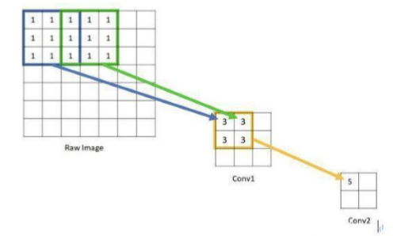

卷积神经网络
---

# 1. 卷积神经网络(Convolutional Nerual Networks)
1. 卷积神经网络经常用于图像处理

目标检测
---

1. 图像识别，图像分割是卷积神经网络使用很成熟的一部分。

ImageNet图像分类错误率
---

全连接神经网络:维度灾难
---

1. 三个隐藏层
2. 160亿参数使用梯度下降法计算会极大地增加内存和计算量的消耗。

## 1.1. 感觉野——人脑与视觉感知机制
1. 神经元所影响的刺激区域称为神经元的感受野( receptive field)，不同神经元感受野的大小和性质都不同。
2. 加拿大神经生理学家David Hunter Hubel和瑞典神经科 学家Torsten Nils Wiesel在20世纪50年代和60年代开始研究视觉机制：将图像投射到屏幕上，将测量神经元活动的电线插入猫的大脑，通过固定猫的头部来控制视网膜上的成像，测试生物细胞对线条、直角、边缘线等图形的反应。
3. 研究结构：有些细胞对某些处在一个角度上的线条、垂直线条、直角或者明显的边缘线，都有特别的反应。要引起这个细胞反应，直线的朝向只能落在一个很小的角度范围里(该细胞的感受野内)。

# 2. 卷积

1. 卷积最初用于信号处理
2. 卷积最早是原始信号f函数，对于f和g进行求和
3. 离散型卷积例子:
    + 右下角例子:左边为f，右边为g，进行卷积*操作
    + 在卷积操作后，函数性质还保留了下来
4. 连续型卷积例子
    + 右上角例子:保留了函数的一些特性，但是也丢失了函数的一些特性。
    + 卷积操作从根本上就像是一个滤波器。

## 2.1. 卷积的基本操作

1. 手写体识别，我们首先将图像进行编码(得到二维矩阵)
2. 将矩阵式编码看做函数f，每一个位置都是一个值，将图像看做一个映射。
3. 卷积可以获取一些图的本质特征而丢失了别的特征
4. Input(相当于f)filter(相当于g)
    + f相当于定义域，然后对定义域使用g操作来获得其映射的结果，对应位置向乘相加。
    + 每次移动一个操作，移动距离为步长，步长越长丢失的信息越多。
    + 对应位置相乘相加，得到最后输出的结果。(在定义域的位置内，用卷积操作获得信息)

## 2.2. 感受野
1.  感受野就是视觉感受区域的大小。在卷积神经网络中，感受野是CNN中的某一层输出结果的一个元素对应输入层的一个映射，即feature map上的一个点所对应的输入图上的区域。

# 3. 对于卷积的解释(非常棒)
1. <a herf = "https://www.cnblogs.com/alexanderkun/p/8149059.html">最容易理解的对卷积的解释</a>
2. <a href = "https://www.jianshu.com/p/fc9175065d87">学习卷积</a>