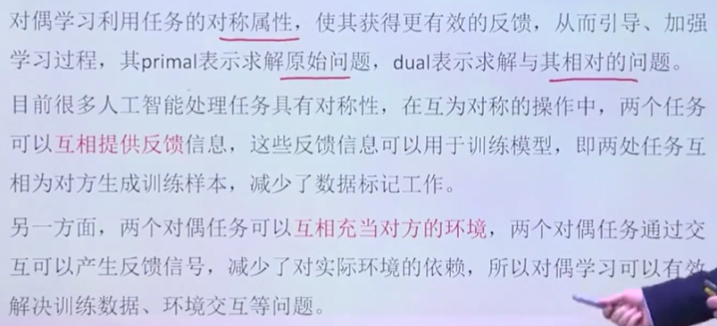
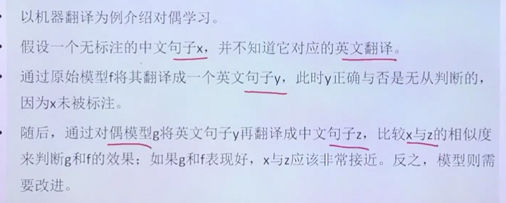
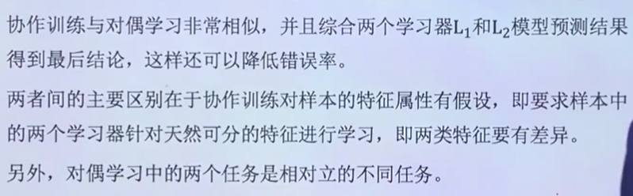
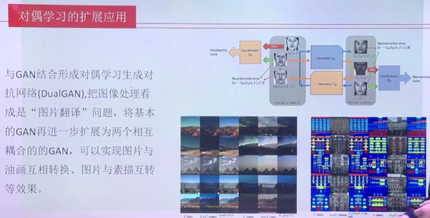

对偶学习
---

# 1. 什么是对偶学习
1. 给定一个任务，我们有对立的任务，英译汉和汉译英。
    + 同时进行训练

2. 汉译英和英译汉，之后比较汉即可，减少了对于实际环境的依赖。

# 2. 对偶学习案例

# 3. 对偶训练和协作训练

1. 协作训练对于样本是有假设，不能把样本混在一起

# 4. 对偶学习的扩展应用

1. 晴天图片生成阴天图片等
2. 原理:输入generator，然后判别器判别返回另一个generator，然后进行比较，得到重构误差。