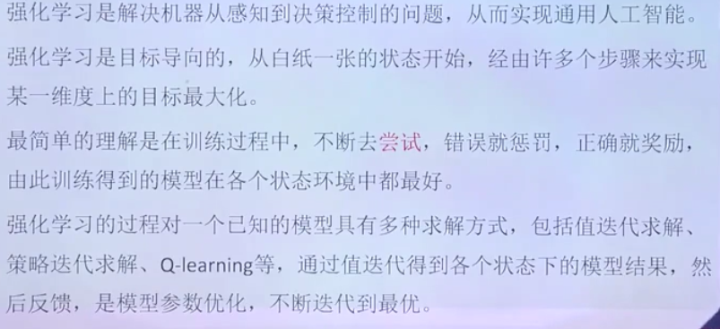
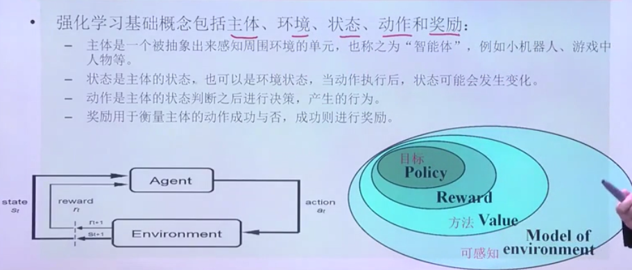
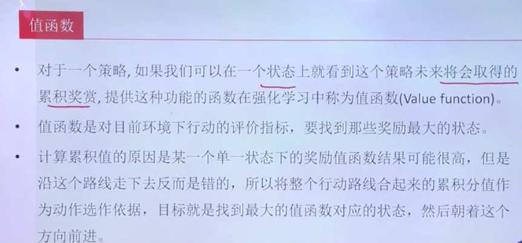
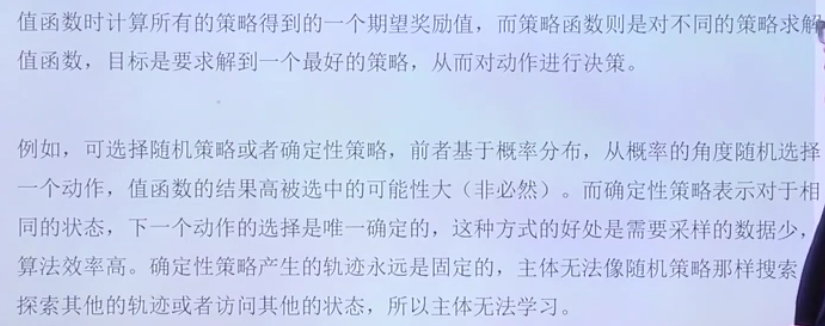
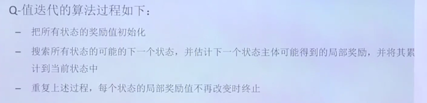
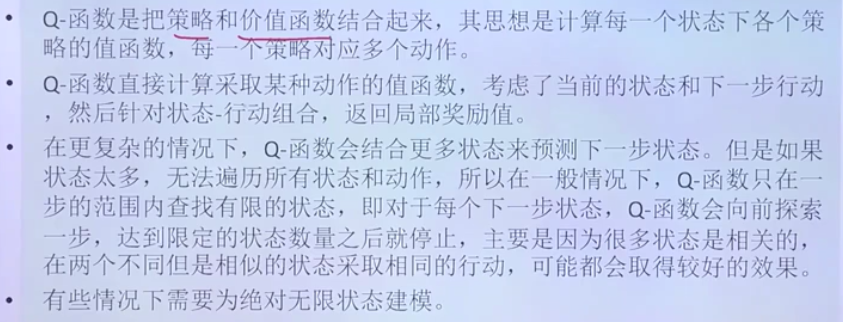
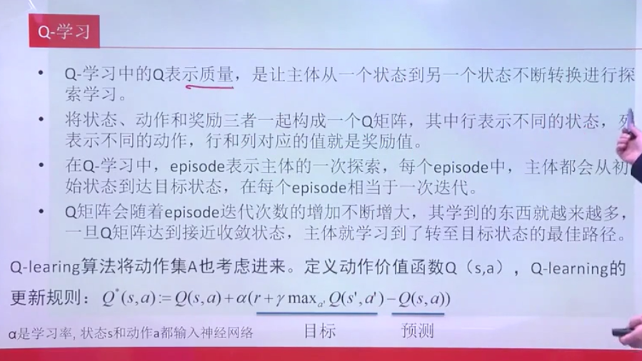
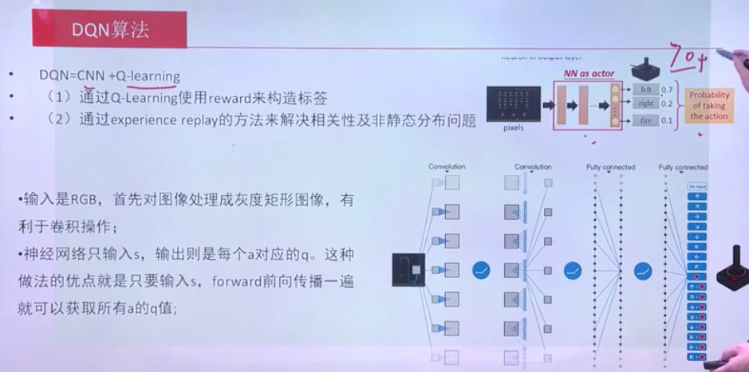
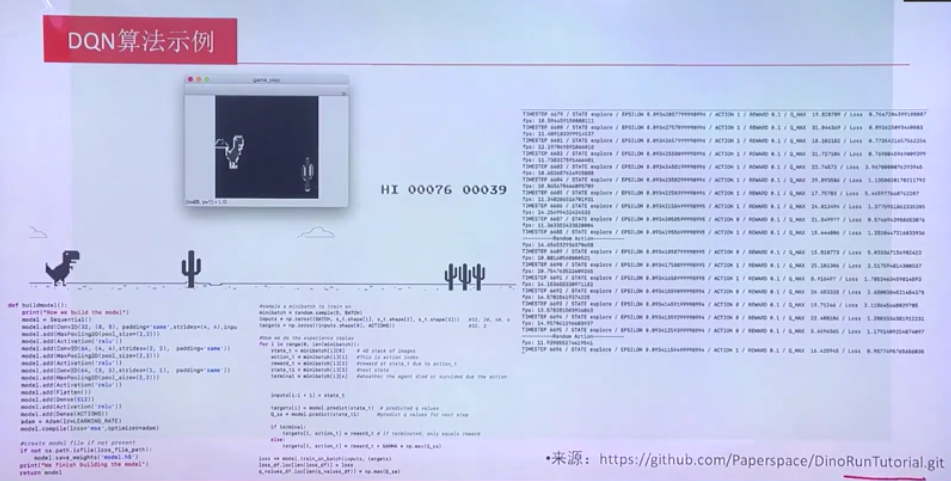

强化学习
---

# 1. 什么是强化学习

1. 不断尝试，仅仅反馈给机器这样做好不好。
2. 正反馈/负反馈:错误就惩罚，正确就奖励。

# 2. 强化学习基础

1. 主体
2. 状态:主体或者环境的状态。
3. 动作:主题的状态之后进行决策，产生的行为。
4. 奖励:需要平衡正向奖励和负向奖励的比例。

## 2.1. 值函数

1. 找到奖励最大的状态。

## 2.2. 策略函数

1. 可以选择随机策略或者确定性策略，前者基于概率分布。可以尝试两种方法的结合

# 3. Q-值迭代

1. 不断迭代来确定奖励是多少

## 3.1. Q-函数

1. 有可能是无限状态的保存

# 4. Q-学习

1. 不断进行迭代，对于每一环境下做的好坏进行评估

# 5. DQN算法

1. 进行加分减分等处理，来评估action，训练神经网络。
2. 学习到的是策略，然后根据更多的状态进行预测。

## 5.1. 算法实例

