生成式对抗网络GAN
---

# 1. 非监督学习及GAN

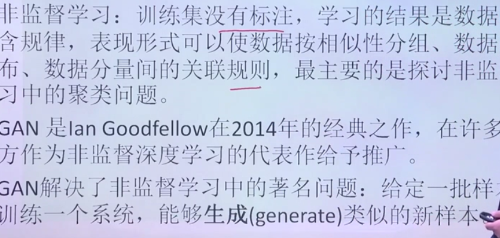

# 2. 生成模型

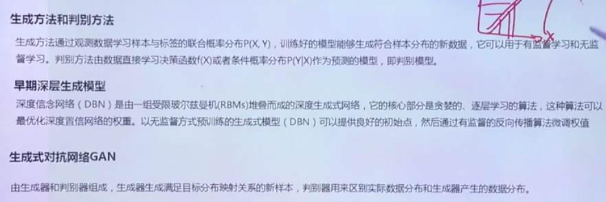

# 3. 深度信念网络(DBN)

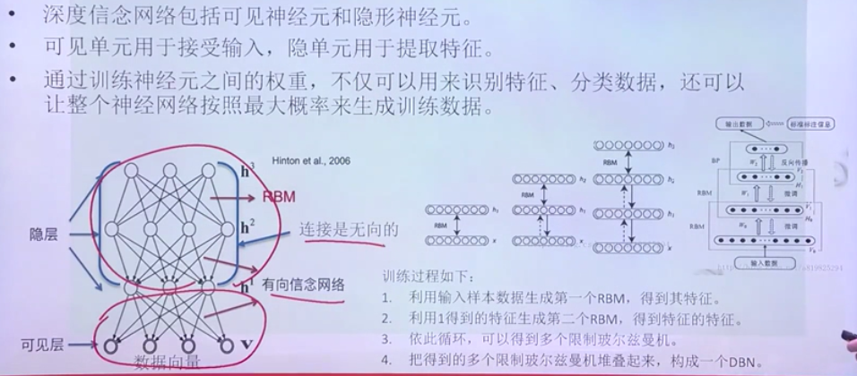

1. 一般包括一个可见层+ 隐层(RBM,无向图，是一种记忆网络)。
2. 先生成一层，逐渐向上添加层次。

## 3.1. 深度信念网络案例

1. 标签是进行比较来完成反向调整参数

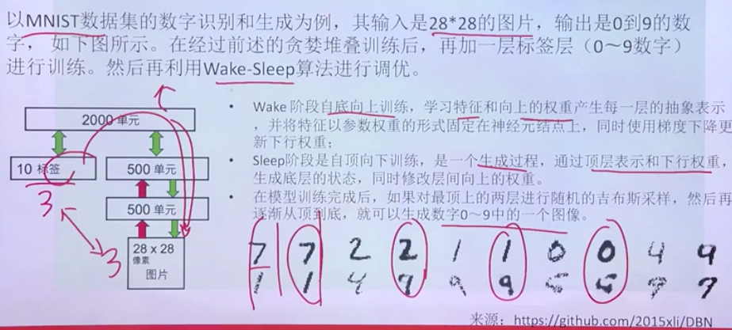

2. 网络生成完成后就已经不需要标签部分了。

# 4. GAN模型
1. 生成器+判别器:两者之间进行对抗竞争
    + 结果需要的是生成器。
2. 对抗网络:使用两个网络相互竞争，称之为对抗式(adversarial)结构

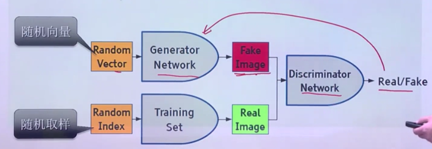

## 4.1. Auto Encoder

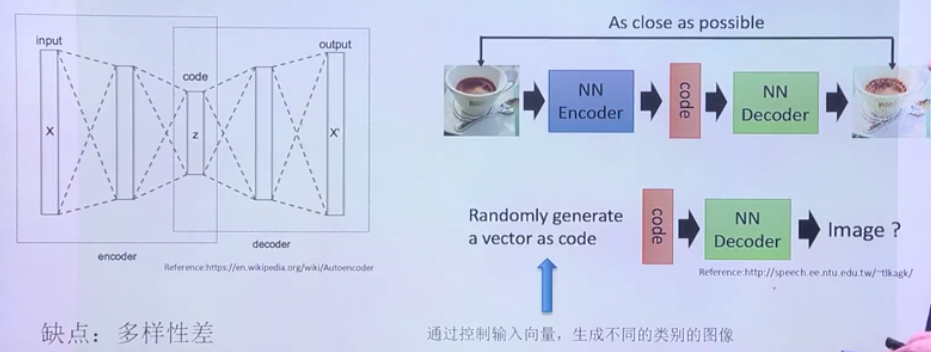

1. 先编码为向量z，再解码成原向量。
2. 如果code的维度比较小，那么生成的结果的效果会比较差，在损失函数中，我们比较生成图片和原始图片每一个像素的差异。

## 4.2. 变分自编码器(Variational Autoencoders,VAE)

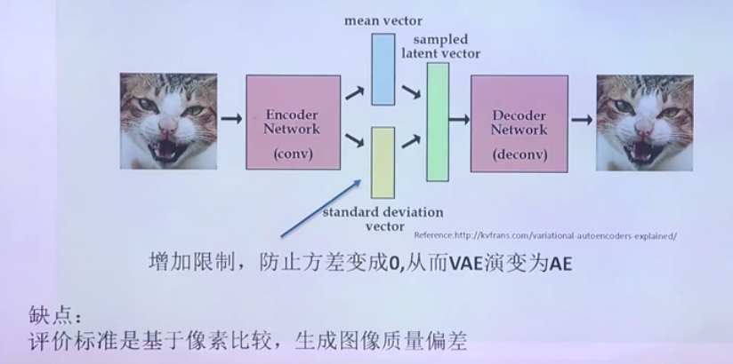

1. 添加随机码，增加限制，放置方差变为0，导致VAE变化为AE

## 4.3. GAN生成过程
1. 生成器先生成，然后判别器进行判别。
2. 判别器可以被欺骗之后，判别器升级，再次进行训练。

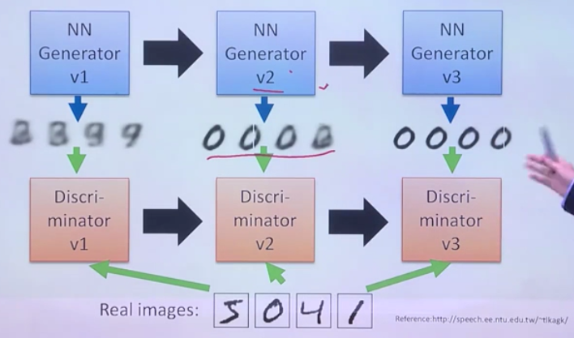

## 4.4. 如何定义损失

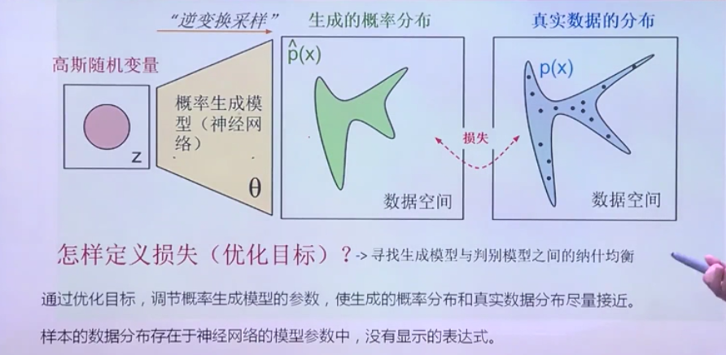

## 4.5. GAN损失函数

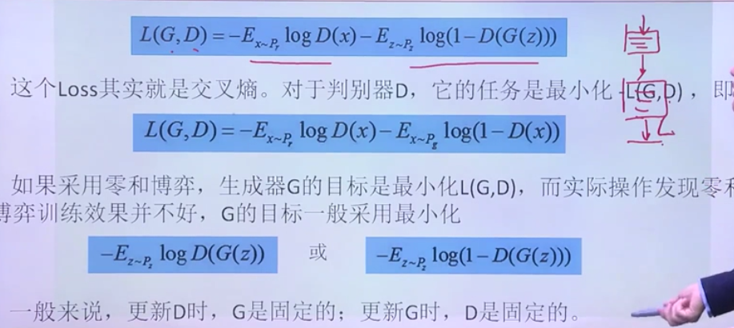

1. GAN不稳定的因素:判别器返回一个反馈，但是生成器不能生成一个能够满足判别器的结果就会卡住。

## 4.6. GAN缺点

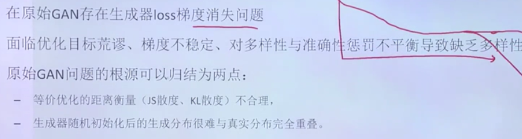

1. 如何增加GAN的优化

# 5. DCGAN(深度卷积对抗生成网络)

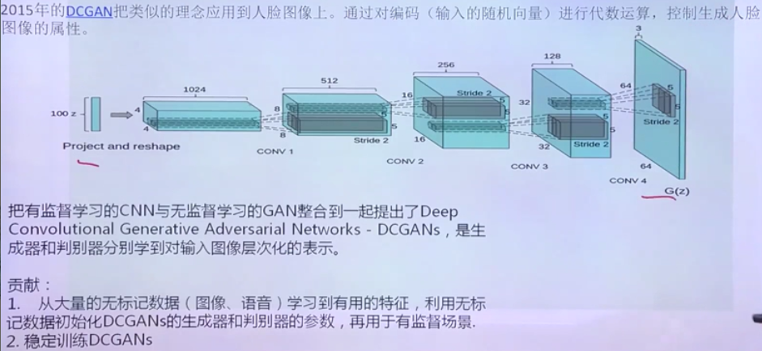

1. 海量数据，导致其具有word2Vec的一些特点。