迁移学习
---

# 1. 什么是迁移学习
1. 减少训练工作量,将已经训练好的模型应用到其他的领域中去。

2. 要保证测试数据与训练数据服从相同的概率规律

# 2. 基于样本的迁移学习

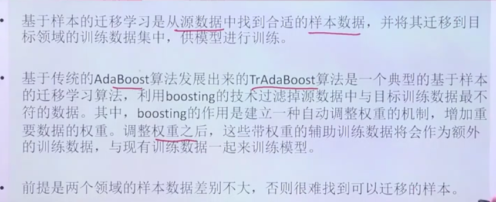

1. 如何进行数据迁移?使用AdaBoost算法将现有样本和测试样本的关系，来调整相应不同的权重。
2. 两类领域的样本数据差别不大，工作量比较大

## 2.1. AdaBoost算法

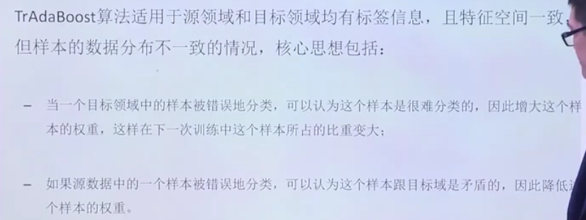

1. 比较难拿到相应领域的数据来进行迁移学习
2. AdaBoost是一个迭代算法，把弱分类器集合起来构成一个强分类器。

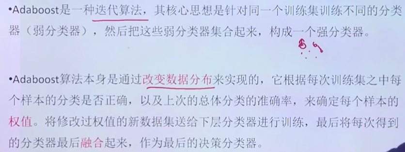

### 2.1.1. 算法步骤

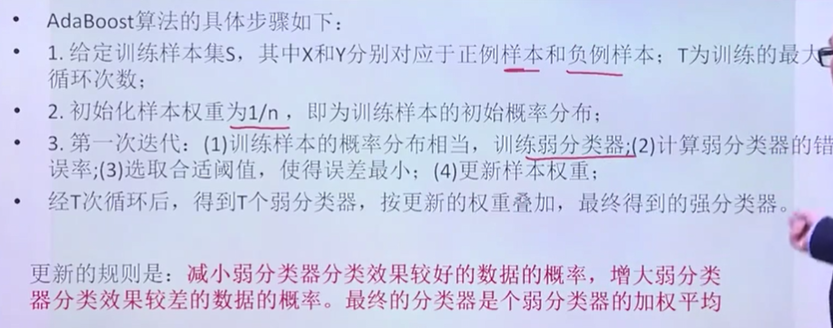

### 2.1.2. 算法总结

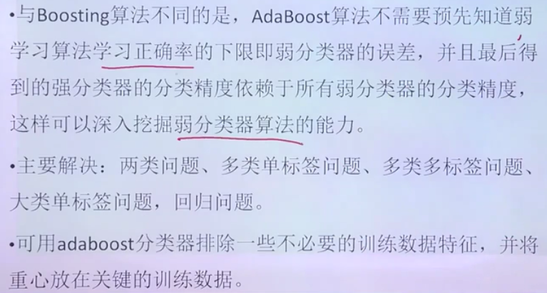

### 示例

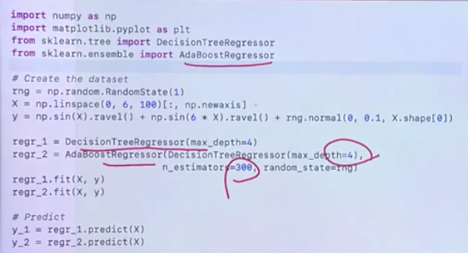

结论:与传统的回归树相比，Adaboost具有较好的回归拟合能力。

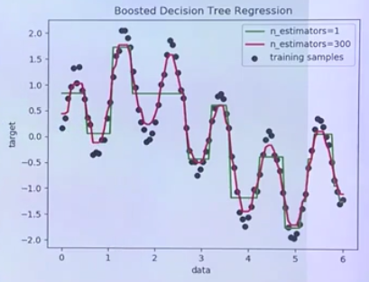

# 3. 基于特征的迁移学习
1. 基本思想:使用互聚类算法同时对两种数据集进行聚类，得到一个共同的特征表示，实现源样本数据表示在新的空间。
    + 比如添加入一个新的动物，需要重新训练耗时比较长，但是根据特征来进行聚类，形成特征表格。

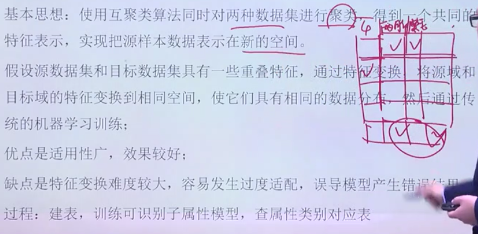

# 4. 基于模型的迁移学习

1. 利用源域模型中的共享参数，应用到目标域进行训练和预测。
2. 使用VGG的前多少层，然后添加几层神经网络进行微调即可。

# 5. 基于关系知识的迁移学习
1. 主要用在网络中的社交网络上迁移。

# 6. 迁移学习例子

## 6.1. 模型迁移

1. 样本量过小，可能导致效果不好
2. 我们可以输入VGG16模型(已经训练了大量的图片)
    + include_top：分类层是否要

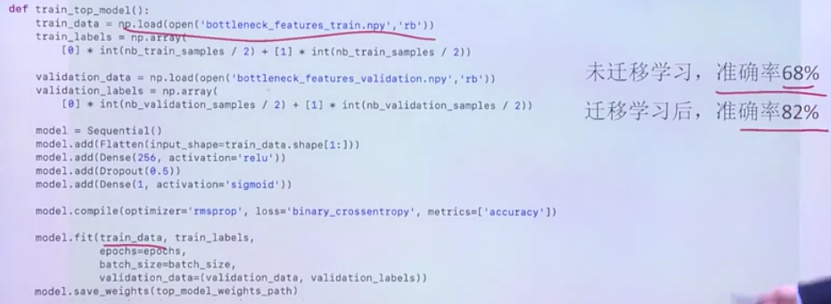

## 6.2. Layer迁移

1. 固定前15层参数

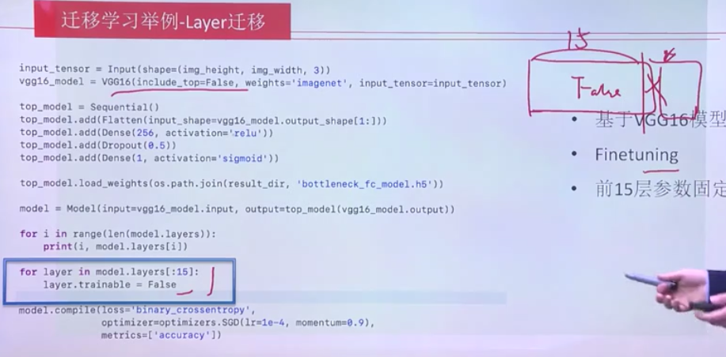

2. 不允许修改这里面的参数，之后添加上自己的神经网络部分

## 6.3. 多任务学习
1. 主要应用于文本翻译和多语言转换

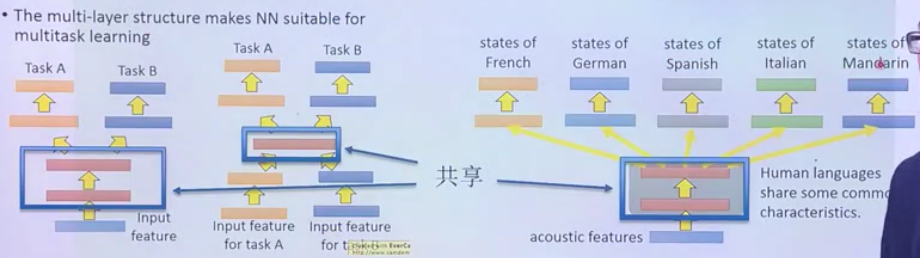