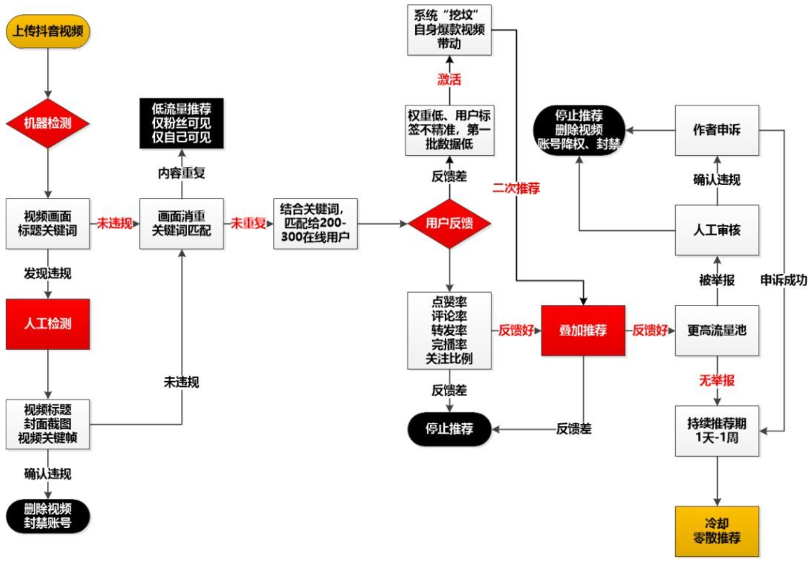
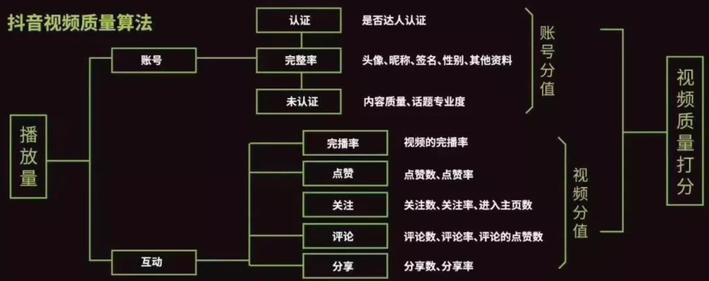
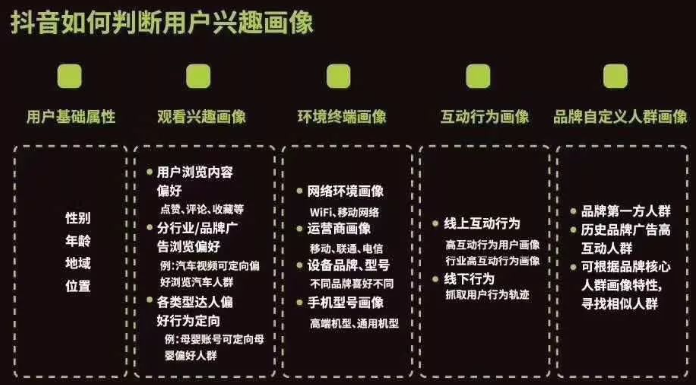

抖音推荐算法总结
---

# 1. 抖音推荐算法图(推测)

# 2. 发布后的推荐流程

## 2.1. 双重审核
1. 双重审核是抖音算法筛选视频内容的第一道门槛
2. **机器审核(检测是否违规或重复)**：一般是通过提前设置好的人工智能模型来识别你的视频画面和关键词
   1. 审核作品、文案中是否存在**违规行为**，如果意思存在，就会被飘黄、标红等提示人工注意
   2. 通过抽取视频中的画面、关键帧，与抖音大数据库中已存在的海量作品进行匹配消重，内容重复的作品进行低流量推荐，或者降权处理(仅粉丝可见、仅自己可见)
3. **人工审核(检查标题、封面和关键帧)**：针对机器筛选出的疑似违规作品，以及容易出现违规领域的作品，如果违规则会删视频、降权通告、封禁账号等处罚。
   1. 视频标题
   2. 封面截图
   3. 视频关键帧

## 2.2. 冷启动
1. 抖音的推荐算法是信息流漏斗算法(和今日头条是一致的)
2. 审核后首先冷启动流量池曝光
   1. 流量池:200-300在线用户
   2. 也可能有上千曝光

## 2.3. 数据加权
1. 根据冷启动流量池的曝光数据，结合账号的分值来分析是否进行加权，比如如下的参数

2. 加权处理后，会挑选前10%的视频，再增加10000次曝光。

## 2.4. 加大推荐
1. 对数据好的短视频进行更大的加权，并且会在第三部强化人群标签分发，让内容分发的更加精确。
2. 视频会有标签，用户也有标签，两者之间会完成标签匹配。

## 2.5. 进入精品推荐池
1. 进入精品推荐池，大规模曝光，一旦进入精品推荐后，人群标签就被弱化。

# 3. 延后“引爆”
> 很多的抖音的内容发布当前、一周甚至一个月内斗数据平平，但是突然就火了，原因如下
1. **挖坟**:抖音会重新挖掘数据库里的老内容，提供更多的曝光，而老作品能够给被引爆是因为
   1. 优质内容:内容足够好
   2. 精准用户:账号发布的内容已经足够多了，标签更加明晰
2. **爆款效应**:当你的一个作品在获得大量曝光(几百万，甚至千万级)时，会带来大朗用户查看你的个人主页，查看你之前的作品，如果你的一个作品获得了足够的关注(转评赞，这启发我们点赞的路径也是很重要的)，系统将会把这些视频重新放进推荐池。

# 4. 流量触顶
1. 高推荐曝光的时间，一般不会超过一周。账号的热度会快速下降。
2. 抖音日活是有限的。
   1. 和你的内容相关的标签基本完成推荐，其他非精准标签的推荐人群反馈效果差，所以停止推荐。
   2. 抖音不希望某一个账号快速火起来，而是通过一轮轮考验，考验你的内容再创新能力，考验你储蓄输出优质内容的能力。

# 5. 参考
1. <a href = "https://blog.csdn.net/sinat_26811377/article/details/103217551">抖音推荐算法总结</a>