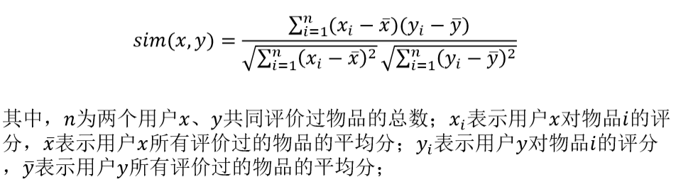
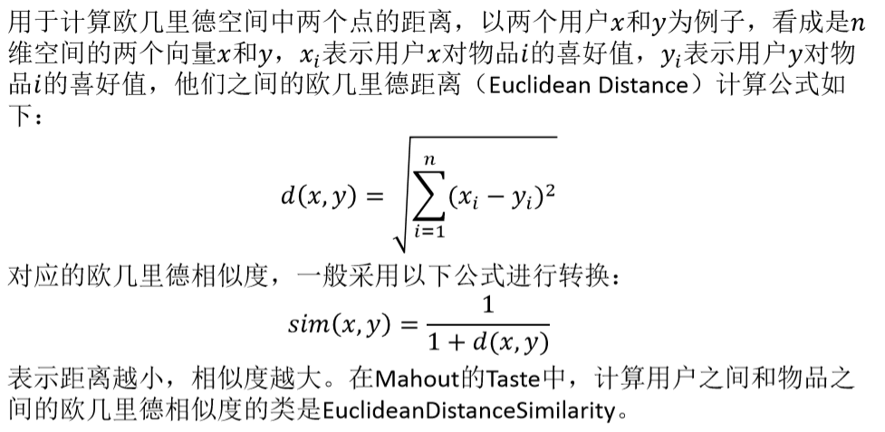
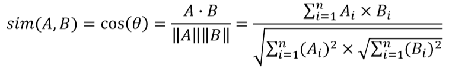
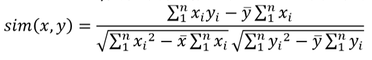

推荐系统基础
---
1. 推荐系统根据用户的浏览记录、社交网络等信息进行个性化的计算，发现用户的兴趣，并应用推荐算法最终达到"千人千面"、"个性化"推荐的效果。本章首先结合推荐系统应用场景介绍推荐系统的通用模型，重点介绍基于内容的推荐、基于协同过滤的推荐、基于关联规则的推荐、推荐系统效果评测方法、推荐系统常见问题等，并结合实际案例介绍推荐系统设计和应用。

# 1. 推荐系统应用背景
1. 推荐系统是一种帮助用户快速发现有用信息的工具，通过分析用户的历史行为，研究**用户偏好**，对用户兴趣建模，从而主动给用户推荐能够满足他们感兴趣的信息。本质上，推荐系统是解决用户额外信息获取的问题。在海量冗余信息的情况下，用户容易迷失目标，推荐系统主动筛选信息，将**基础数据与算法模型**进行结合，帮助其确定目标，最终达到智能化推荐。推荐系统优点有：
    + 可提升**用户体验**。通过个性化推荐，帮助用户快速找到感兴趣的信息。
    + 提高产品销量。推荐系统帮助用户和产品建立精准连接，提高产品营销转化率。
    + 推荐系统可以挑战传统的2/8原则，使部热门的商品能够销售给特定人群。
    + 推荐系统是一种系统**主动**的行为，**减少**用户操作，主动帮助用户找到其感兴趣的内容。
2. 常见的应用场景:
    1. 电商平台。其中的"猜你喜欢"等部分、搜索结果中推荐商品排名靠前都是用了推荐系统。
    2. 个性化电影网站。基于观看历史以及视频之间的联系分析用户兴趣，为用户做推荐。
    3. 音乐歌单。基于用户收听历史、行为以及音乐风格等进行协同过滤推荐。
    4. 社交网络。主要应用是好友推荐和资讯内容推荐。好友推荐是推荐有共同兴趣的用户成为好友，比如用户通过阅读、点赞、评论了相同的博文产生关系。便可以推荐互加好友。
    5. 新闻网站。应用推荐方便用户获取个性化资讯，减少用户浏览、检索新闻的时间，增加用户粘性。
    6. 个性化阅读。为每一个用户定制其感兴趣的个性化内容。获得用户兴趣，推送个性化的阅读内容，提供更优的阅读方式和更好的阅读体验。
    7. 个性化广告。有针对性地向特定用户展示特定广告内容。对广告受众进行用户画像，基于用户行为做协同过滤，根据用户对广告的态度或反应改进推荐算法，减少用户对广告的负面体验。

# 2. 相似度计算
1. 在推荐系统中，涉及**用户之间**相似度、**物品之间**的相似度和**用户与物品之间**的相关性的计算。其中相似度计算是基于**向量间距离**，距离越近相似度越大。例如，在用户对物品偏好的二维矩阵中，一个用户对所有物品的偏好作为一个向量，可用于计算用户之间的相似度，即两个向量间的距离；将所有用户对一个物品的偏好作为表示此物品，可以用于计算物品之间的相似度
2. 给用户和物品进行画像，来比较物品用户相似度

## 2.1. 皮尔逊相关系数
1. 皮尔逊相关系数(Pearson Correlation Coefficient)一般用于计算两个变量间的相关性，它的取值是[‐1,1]，当取值大于0时表示两个变量是正相关的；当取值小于0时表示两个变量是负相关的，取值为0表示不相关。在推荐系统中，常用于用户之间的相似度计算，计算公式如下： 

## 2.2. 欧几里德相似度

1. 距离越小，相似度越大

## 2.3. 余弦向量相似度
1. 余弦向量相似度(Cosine Similarity)是计算两个向量的夹角余弦，被广泛应 用于计算文档之间的相似度，其计算公式为如下

2. 其中，Ai和Bi分别表示两个文档的向量分量。在Mahout的Taste中，实现 Cosine相似度的类是PearsonCorrelationSimilarity，此外一个类UncenteredCosineSimilarity实现了形式化以后的cosine向量夹角：

3. 余弦相似度更多的是从方向上区分差异，而对最后的结果数值不敏感，所以无法度量每个维数值的差异，在某些情况下会导致无法区分用户的评分。例如用户对内容进行评分，按照5分制进行打分，1分最差，5分最好，A和B两用户分别对两个物品进行评分，分值分别为(1,2)和(4,5)，使用余弦相似度得出的结果是0.98，两者相似度较高，但实际上A用户不喜欢这2个内容，而B用户比较喜欢，这说明结果产生了误差，调整余弦相似度是所有维度上的数值**都减去均值**，再用余弦相似度计算，例如A和B对两个物品的评分均值都是3，那么调整后为(‐2,‐1)和(1,2)得到相似度结果为‐0.8，相似度为负值并且差异较大，这样**更加符合事实**。

## 2.4. 曼哈顿相似度
1. 曼哈顿距离在Mahout的Taste里的实现类是CityBlockSimilarity，采用了简化的计算方式，比欧式距离计算量少，性能相对高。比较适合用户的偏好数据是0或者1的情况。

## 2.5. 对数似然相似度
1. 对数似然相似度在Mahout的Taste中实现类名为LogLikelihoodSimilarity，比较适用于用户的偏好数据是0或者1的情况。

## 2.6. 斯皮尔曼相似度
1. 斯皮尔曼相似度在Mahout的Taste中实现类名为SpearmanCorrelationSimilarity，它舍弃了真实的评分值，将其转化为排序值，可以理解为是排列后用户喜好值之间的Pearson相关系统。例如，对于每个用户，重写其最不喜欢的评分值为1，次不喜欢的评分值为2，依此类推。对转换后的值求Pearson的相关系数，得到的结果就是斯皮尔曼相关系数。因为斯皮尔曼相关性计算需要花费时间对喜好值进行排序，效率并不高，所以一般用于学术研究或者小规模计算。