推荐系统的评测(评估)
---
1. 增加评测的目的是确定算法在什么情况下性能最好，一般评测维度分为用户维度、物品维度、时间维度。
    + 其中用户维度主要包括用户的人口统计学信息、活跃度以及是不是新用户等；
    + 物品维度包括物品的属性信息，流行度、平均分以及是不是新加入的物品等；时间维度包括季节、工作日还是周末、白天还是晚上等；
    + 不同纬度下的系统评测指标，能全面了解推荐系统性能。
2. 评估的不同的维度?
    1. 用户的维度
    2. 平台方的维度
    3. 推荐系统自身维度
    4. 标的物提供方的维度

<!-- TOC -->

- [1. 评测方法](#1-评测方法)
  - [1.1. 离线实验](#11-离线实验)
    - [1.1.1. 离线实验步骤](#111-离线实验步骤)
    - [1.1.2. 准确度指标](#112-准确度指标)
    - [1.1.3. 覆盖率指标](#113-覆盖率指标)
    - [1.1.4. 多样性指标](#114-多样性指标)
    - [1.1.5. 实时性指标](#115-实时性指标)
    - [1.1.6. 鲁棒性指标](#116-鲁棒性指标)
    - [1.1.7. 其他指标](#117-其他指标)
  - [1.2. 用户调查](#12-用户调查)
  - [1.3. 在线实验](#13-在线实验)
    - [1.3.1. 在线评估第一阶段](#131-在线评估第一阶段)
    - [1.3.2. 在线评估第二阶段](#132-在线评估第二阶段)
  - [1.4. 主观评估](#14-主观评估)
- [2. 评测指标](#2-评测指标)
  - [2.1. 用户的维度](#21-用户的维度)
    - [2.1.1. 满意度](#211-满意度)
    - [2.1.2. 惊喜度](#212-惊喜度)
    - [2.1.3. 新颖性](#213-新颖性)
    - [2.1.4. 预测准确度](#214-预测准确度)
    - [2.1.5. TopN推荐](#215-topn推荐)
    - [2.1.6. 信任度](#216-信任度)
    - [2.1.7. 多样性](#217-多样性)
    - [2.1.8. 体验流畅度](#218-体验流畅度)
  - [2.2. 推荐系统自身维度](#22-推荐系统自身维度)
    - [2.2.1. 准确度](#221-准确度)
    - [2.2.2. 召回率](#222-召回率)
    - [2.2.3. 实时性](#223-实时性)
    - [2.2.4. 健壮性(鲁棒性)](#224-健壮性鲁棒性)
    - [2.2.5. 基于共同访问图的攻击](#225-基于共同访问图的攻击)
    - [2.2.6. 响应及时稳定性](#226-响应及时稳定性)
    - [2.2.7. 抗高并发能力](#227-抗高并发能力)
  - [2.3. 标的物提供方的维度](#23-标的物提供方的维度)
    - [2.3.1. 覆盖率](#231-覆盖率)
    - [2.3.2. 挖掘长尾的能力](#232-挖掘长尾的能力)
  - [2.4. 平台方的维度](#24-平台方的维度)
- [3. 推荐系统评估需要关注的问题](#3-推荐系统评估需要关注的问题)
- [4. 准确度的详细计算](#4-准确度的详细计算)
  - [4.1. AVP(Average precision)](#41-avpaverage-precision)
  - [4.2. MAP(Mean average precision)](#42-mapmean-average-precision)
  - [4.3. NDCG(Normalized Discounted Cumulatice Gain)](#43-ndcgnormalized-discounted-cumulatice-gain)
    - [4.3.1. CG(Cumulative Gain)](#431-cgcumulative-gain)
    - [4.3.2. DCG(Discounted cumulative gain)](#432-dcgdiscounted-cumulative-gain)
    - [4.3.3. IDCG(Ideal DCG)](#433-idcgideal-dcg)
    - [4.3.4. NDCG(Normalize DCG)](#434-ndcgnormalize-dcg)
    - [4.3.5. MPR(Mean reciprocal rank)](#435-mprmean-reciprocal-rank)
    - [4.3.6. F-score/F-measure](#436-f-scoref-measure)
- [5. 代码参考](#5-代码参考)

<!-- /TOC -->

# 1. 评测方法
1. 获得评测指标的实验方法，通常分为**离线实验、用户调查、在线实验**。一般说来，一个新的推荐算法最终上线，需要完成上述的三个实验。首先，通过**离线实验**证明它在很多离线指标上优于现有的算法；其次，通过用户调查确定用户满意度不低于现有的算法；最后，通过在线A/B测试确定关键指标上优于现有的算法。

## 1.1. 离线实验

### 1.1.1. 离线实验步骤
1. 通过日志系统获得用户行为数据，并按照一定格式生成一个标准的数据集
2. 将数据集按照一定的规则分成训练集和测试集
3. 在训练集上训练用户兴趣模型，在训练集上进行预测
4. 通过事先定义的离线指标，评测算法在测试集上的预测结果

### 1.1.2. 准确度指标
1. 目的:事先评估出推荐算法模型的好坏(是否准确)，为选择合适的模型上限服务提供决策依据。
2. 准确度评估是学术界和业界最重要和最常用的指标。
3. 目前一般有三种不同的范式来评估准确度
    1. 将推荐算法看成预测(回归)问题，预测用户对于“标的物”的评分
    2. 将推荐算法看做分类问题，可以是二分类，也可以是多分类问题
    3. 将推荐系统算法看做是一个排序学习问题，利用排序学习(Learningto rank)的思路来做推荐。
    4. <a href = "https://mp.weixin.qq.com/s/cjo5MYa-t9tWDCjwDpkOeg">深度|推荐系统评估</a>

### 1.1.3. 覆盖率指标

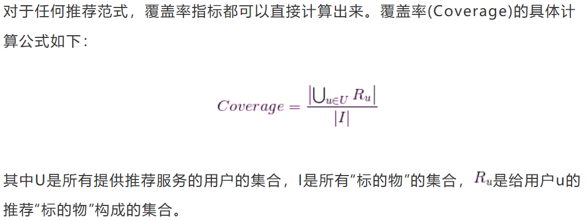

### 1.1.4. 多样性指标
1. 用户的兴趣往往是多样的，并且有些产品面对的用户也不止一个。
2. 在具体推荐系统系统工程实现中，可以通过对“标的物”(可以用机器学习聚类或者根据标签等规则来分类)

### 1.1.5. 实时性指标
1. 一般来说，推荐系统的实时性分为如下四个级别。
    1. T+1:每天更新用户推荐结果
    2. 小时级
    3. 分钟级
    4. 秒级
2. 根据不同的情况下，不同的产品形态、不同的场景对于实时级别的需求不相同。

### 1.1.6. 鲁棒性指标
1. 尽量采用鲁棒性好的算法模型
2. 做好特征工程，通过算法或者规则等策略剔除可能的脏数据
3. 在日志收集阶段，对日志进行加密、校验，避免人为攻击等垃圾数据引入。
4. 在日志格式定义及日志打点阶段，要有完整的测试case，做好冒烟回归测试，避免开发失误或者bug引入垃圾数据。

### 1.1.7. 其他指标
1. 像模型训练效率，是否可以分布式计算(可拓展性)等。

## 1.2. 用户调查
1. 用户调查需要一些真实的用户，让他们在需要测试的推荐系统上完成一些任务。在他们完成任务时，观察和记录用户的行为，并让他们回答一些问题。最后，分析他们的行为和答案，了解测试系统的性能。
2. 用户调查的优点是可以获得用户主观感受的指标，出错后容易弥补。
3. 缺点是招募测试用户代价较大，无法组织大规模的测试用户。

## 1.3. 在线实验
1. 在完成离线实验和用户调查之后，可以将系统上线做A/B测试，将它和旧算法进行比较。在线实验最常用的评测方法是A/B测试，通过一定的规则将用户随机分成几组，对不同组的用户采用不同的算法，然后通过统计不同组的评测指标，比较不同算法的好坏。A/B测试的核心思想是多个方案并行测试，每个方案只有一个变量不同，以某种规则优胜劣汰。在A/B测试中必须是单变量，A/B测试的优点是可以公平获得不同算法实际在线时的性能指标，包括商业上关注的指标。缺点是周期较长，必须进行长期的实验才能得到可靠的结果。

### 1.3.1. 在线评估第一阶段
1. 响应及时稳定性指标
2. 扛高并发能力指标

### 1.3.2. 在线评估第二阶段
1. 一般会结合AB测试技术。

## 1.4. 主观评估
1. 主观评估是很消耗时间的。
2. 让用户参与主观评估，需要一定的资金支持。

# 2. 评测指标
1. 评测指标用于评测推荐系统的性能，有些可以定量计算，有些只能定性描述。从经验上看，对于可以离线优化的指标，在给定覆盖率、多样性、新颖性等限制条件下，应尽量优化预测准确度。

## 2.1. 用户的维度

### 2.1.1. 满意度
1. 用户满意度是评测推荐系统的重要指标，无法离线计算，只能通过用户调查或者在线实验获得。
2. 调查问卷，需要考虑到用户各方面的感受，用户才能针对问题给出准确的回答。
3. 在线系统中，用户满意度通过统计用户行为得到。例如用户如果购买了推荐的商品，就表示他们在一定程度上满意，可以用购买率度量用户满意度。一般情况，可以用用户点击率、停留时间、转化率等指标度量用户的满意度。

### 2.1.2. 惊喜度
1. 推荐结果和用户的历史兴趣不相似，但却让用户满意，这就是惊喜度很高。
2. 目前惊喜度还没有公认的指标来定义，主要靠用户的反馈和后续行为来验证。

### 2.1.3. 新颖性
1. 新颖性是影响用户体验的重要指标之一。它指向用户推荐**非热门非流行**物品的能力。
2. 评测新颖度最简单的方法，是利用推荐结果的平均流行度，因为越不热门的物品，越可能让用户觉得新颖。
3. 此计算比较粗糙，需要配合用户调查准确统计新颖度。

### 2.1.4. 预测准确度
1. 预测准确度度量的是推荐系统预测用户行为的能力，是推荐系统最重要的离线评测指标。准确度的指标可以分为预测评分准确度以及TopN推荐。
2. 预测评分的准确度指的是算法预测的评分与用户实际评分的贴近程度。
3. 准确度指标一般通过平均绝对误差、均方根误差实现。
    + 平均绝对误差因计算简单、通俗易懂得到广泛应用。但有局限性，因为对平均绝对误差贡献大的往往是很难预测准确的低分商品，计算公式如下：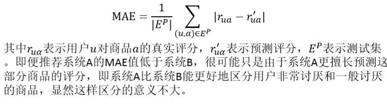
    + 均方根误差加大了对预测不准的用户物品评分的惩罚（平方项的惩罚），因而对系统的评测更加苛刻。如果评分系统是基于整数建立的（即用户给的评分都是整数），那么对预测结果取整数会降低平均绝对误差的误差。公式如下：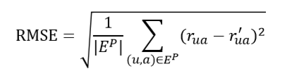

### 2.1.5. TopN推荐
1. TopN推荐是指提供推荐服务时，一般给用户的是个性化的推荐列表，这种推荐叫做TopN推荐。TopN推荐的预测准确率，一般通过准确率（precision）和召回率（recall）两个指标度量，其计算公式如下：

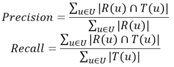

2.  R(u)是根据用户在训练集上的行为给用户做出的推荐列表，T(u)是用户在测试集上的行为列表。TopN推荐更符合实际的应用需求，例如预测用户是否会看一部电影，比预测用户看了电影之后会给它什么评分更重要。

### 2.1.6. 信任度
1. 如果用户信任推荐系统，就会增加用户和推荐系统的交互。增加系统透明度可以提高系统的信任度，提供推荐解释，让用户了解推荐系统的运行机制。或者利用社交网络，通过好友信息给用户推荐，由好友进行推荐解释。
2. 度量信任度的方式可以通过**问卷调查**，也可以通过对用户行为的不断累积进行分析
3. 例如，用户对推荐的结果进行了**阅读、购买或分享**较多，说明其对推荐系统比较认可；相反，如果用户对推荐结果的后续行为中很少有正向习惯，则从侧面说明用户对于推荐系统的结果不认可。
4. 注重机器学习的可解释性。

### 2.1.7. 多样性
1. 为了满足用户广泛的兴趣，推荐列表需要能够覆盖用户不同兴趣的领域，需要具有**多样性**。
2. 多样性描述了**推荐列表中物品两两之间的不相似性**，多样性的前提是用户的隐含兴趣是多样的，即用户当前的行为只是其兴趣的一部分，推荐系统很难将用户的所有真实兴趣提取出来，所以就要在推荐结果中加入一些与用户兴趣看起来不相符的内容，一方面减少审美疲劳，防止进入恶性循环推荐中。
3. 例如，给用户推荐内容单一，用户点击此类内容必然更多，后面推荐时更加推荐此类内容，另一方面，可以对用户潜在兴趣进行验证，收集用户的内容喜好。

### 2.1.8. 体验流畅度
1. 推荐系统是一个软件产品，用户的体验是否良好，是否卡顿，响应是否及时。

## 2.2. 推荐系统自身维度

### 2.2.1. 准确度
1. 是目前学术界和业界最常用最容易量化的评估指标。
2. 描述最终的推荐列表中有多少比例是发生过的用户——物品评分记录
```py
def Precision(train,test,N):
    hit=0
    all=0
    for user in train.keys():
        Tu=test[user]
        rank=GetRecommendation(user,N)
        for item,pui in rank:
            if item in Tu:
                hit+=1
        all+=N
    return hit/(all*1.0)
```

### 2.2.2. 召回率
1. 描述有多少比例的用户——物品评分记录包含在最终的推荐列表中。
```py
def Recall(train,test,N):
    hit=0
    all=0
    for user in train.keys():
        Tu=test[user]
        rank=GetRecommendation(user,N)
        for item,pui in rank:
            if item in Tu:
                hit+=1
        all+=len(Tu)
    return hit/(all*1.0)
# 同时计算准确率和召回率
def PrecisionRecall(test, N): 
    hit = 0 
    n_recall = 0 
    n_precision = 0 
    for user, items in test.items(): 
        rank = Recommend(user, N) 
        hit += len(rank & items) 
        n_recall += len(items) 
        n_precision += N 
    return [hit / (1.0 * n_recall), hit / (1.0 * n_precision)]
```

### 2.2.3. 实时性
1. 推荐系统的实时性包括**实时更新推荐列表满足用户新的行为变化，以及将新加入系统的物品推荐给用户**。
2. 此外，由于大部分应用推荐系统的平台中往往物品数量和用户数量均较多，对系统的实时计算带来较大压力，如果系统设计时未考虑**实时更新**推荐结果的要求，很有可能会随着数据量的不断增加，推荐时间会不断增长，要么在硬件上进行大量投入，要么对推荐算法进行优化改进。
3. 实时性更多是**对推荐系统的架构方面的评估**。

### 2.2.4. 健壮性(鲁棒性)
1. 推荐系统通过共现的相关度来描述物品对于用户偏好的表现，从而实现物品推荐，但是物品共现并不代表偏好一致，如果通过**攻击共现**访问导致共现与用户偏好之间有偏差，就达到了攻击目的。攻击分为“推攻击”与“核攻击”，前者是使目标物品的推荐频率明显高于其他物品，从而实现该物品被更多地推荐给用户；后者是使目标物品的推荐频率**明显低于其他物品**，从而实现该物品尽可能不被系统推荐。
2. 推荐系统可能遭受到的攻击类型:
    1. 随机攻击。是对特定商品评**最高分或最低分**，对其他商品随机评分或给平均分，由于评分成本较高，这种攻击方法效果一般。
    2. 蹭热销攻击。将目标商品与热销商品绑定在一起，随着热销商品推荐。(就是把自己的商品和热销的商品进行绑定消费)
    3. 反热销攻击。将目标商品与系统中不受欢迎的物品绑定在一起。在这种情况下，系统不容易推荐目标商品。
    4. 大众化攻击。首先将目标商品评为**最高分**（如果是竞品则评为最低分），其它商品则根据商品的得分**是否高于所有商品的平均分来给分**，使得攻击者给出来的分值更加大众化，不容易被发现。
    5. 探测攻击策略。首先**伪造一个用户**，系统就会给用户推荐一些商品，根据这些推荐商品的情况，探测相似用户选择商品的情况。然后依据获得的信息对他们**选择的商品**进行攻击。

### 2.2.5. 基于共同访问图的攻击
1. 基于共同访问的物品推荐系统是从用户和物品的角度出发，当发现用户喜欢物品i时，推荐系统会向用户推荐与物品i相似的N个其他物品，攻击者可以通过对物品之间相似度计算方法中人为注入攻击，如果物品间相似度计算是通过用户共同访问来实现的，那么，通过调整**目标物品与锚点物品**之间的相似度来达到攻击的目的，原理如下图所示。

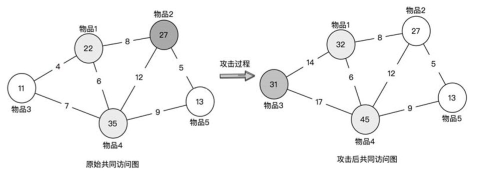

2. 攻击过程中，提升物品间的相似度是通过伪造用户实现的，把锚点物品与目标商品间的关联通过多个伪造用户行为进行增强，提高物品1、4、3的共现次数，三者间的相似度就会增加。具体步骤如下：
    1. 为物品3选择锚点物品，因为物品1和4对应的推荐列表中不包含3，但都与3相连，所以选择 1和4作为3的锚点物品。
    2. 攻击者通过各种方法不断共同访问或购买锚点物品和目标物品，提高其共现度，本例中1、4 与3的共现次数分别提升至14和17。
    3. 根据生成推荐列表的计算方法，计算1和4的推荐列表中均含有3，从而实现攻击。

### 2.2.6. 响应及时稳定性
1. 推荐服务的相应时长，推荐服务是否稳定也是非常关键的。

### 2.2.7. 抗高并发能力
1. 推荐系统是否能够承受高并发访问，在高并发用户访问下(比如双十一的淘宝推荐)，是否可以正常稳定的提供服务，也是推荐系统的重要能力。

## 2.3. 标的物提供方的维度

### 2.3.1. 覆盖率
1. 覆盖率（coverage）是描述一个推荐系统对物品长尾的发掘能力，用系统推荐的物品占总物品的比例来衡量。假设系统的用户集合为U，物品集合为U，推荐系统给每个用户推荐一个长度为N的物品列表R(u)，覆盖率公式为： 

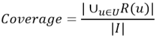

2.  其中|I|表示物品列表的数量，覆盖率是内容提供者关心的指标，覆盖率为100%的推荐系统可以将每个物品都推荐给至少一个用户，而覆盖率只有10%，意味着只有很小一部分物品会推荐出来，推荐的内容过于狭窄。除了推荐物品的占比，还可以通过研究物品在推荐列表中出现的次数分布，更好地描述推荐系统的挖掘长尾的能力。如果分布比较平，说明推荐系统的覆盖率很高；如果分布陡峭，说明分布系统的覆盖率较低。

### 2.3.2. 挖掘长尾的能力
1. 由(ChrisAnderson)提出的长尾理论

## 2.4. 平台方的维度
1. 对于平台方来说，商业目标是最重要的指标之一。
2. 由于平台方的盈利目的又需要借助用户来实现，所以用户的活跃、留存、转化、使用时长等用户使用维度的指标。
3. 重要的指标有
    1. 用户的行为相关指标
    2. 商业变现相关指标
    3. 商家("标的物"提供方)相关指标
    
# 3. 推荐系统评估需要关注的问题
1. 离线评估准确度高的模型，在线评估不一定高
2. 推荐系统寻求的是一个全局最优化的方案
3. 推荐系统是一个多目标优化问题
4. AB测试平台对推荐评估的巨大价值
5. 重视线上用户行为及商业变现方面的评估

# 4. 准确度的详细计算

## 4.1. AVP(Average precision)
1. 准确率和召回率只能衡量搜索性能的一个方面，最理想的是准确率和召回率都比较高。

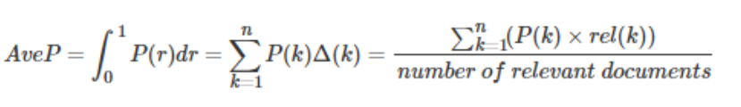

2. 其中rel(k)表示第k个文档是否相关，若相关则为1，否则为0，P(k)表示前k个文档的准确率。

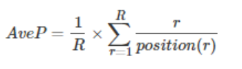

3. 其中R表示相关文档的总个数，position(r)表示，结果列表从前往后看，第r个相关文档在列表中的位置。

## 4.2. MAP(Mean average precision)
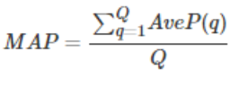

1. 单个主题的平均准确率是每篇相关文档检索出后的准确率的平均值。
2. 主集合的平均准确率(MAP)是每个主题的平均准确率的平均值。
3. MAP 是反映系统在全部相关文档上性能的单值指标。系统检索出来的相关文档越靠前(rank 越高)，MAP就应该越高。如果系统没有返回相关文档，则准确率默认为0。
4. MAP的衡量标准比较单一，q(query，搜索词)与d(doc，检索到的doc)的关系非0即1，核心是利用q对应的相关的d出现的位置来进行排序算法准确性的评估。

## 4.3. NDCG(Normalized Discounted Cumulatice Gain)
1. N：归一化，D：衰减率，C：累加，G：熵（关键）

### 4.3.1. CG(Cumulative Gain)
1. 计算前p个位置累计得到的收益

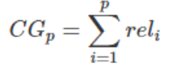
表示第i个文档的相关度等级，2表示非常相关，1表示相关，0表示无关，-1表示垃圾文件
2. rel<sub>i</sub>

### 4.3.2. DCG(Discounted cumulative gain)
1. 由于CP<sub>p</sub>的计算中对位置信息不敏感。
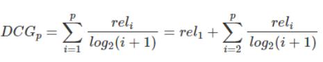
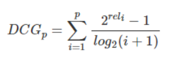

### 4.3.3. IDCG(Ideal DCG)
1. 是指理想情况下的DCG

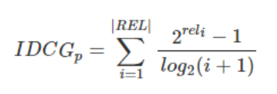

### 4.3.4. NDCG(Normalize DCG)

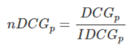

### 4.3.5. MPR(Mean reciprocal rank)

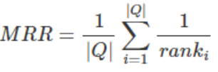

1. MPR是多个查询语句的排名倒数的均值。

### 4.3.6. F-score/F-measure
1. 同时考虑了准确率和召回率

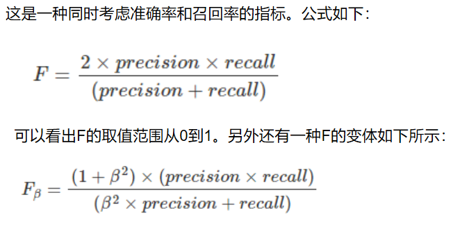

# 5. 代码参考
1. <a href = "https://www.cnblogs.com/shenxiaolin/p/9309749.html">推荐系统排序评价指标</a>