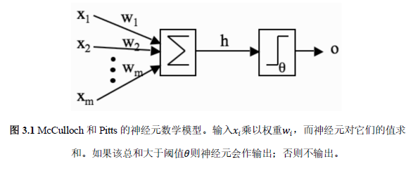

Basic-神经元与神经网络
---

# 1. 大脑和神经元

## 1.1. 神经元
1. 跨膜电位到达阈值，神经元则会**放电或激活**，并以一个固定强度和持续时间的脉冲会向下传递到**轴突**。
2. 每一个神经元连接都是在一个**突触**中。
3. 激活后，神经元在下一次激活之前需要一段时间来恢复能量(**不应期**)
4. 可塑性：改变神经元突出连接的强度，或建立新的连接。

## 1.2. 神经元模型

### 1.2.1. Hebb规则
1. Hebb规则认为突触连接强度的变化与两个神经元计划的相关性成比例，如果两个神经元始终同时激活，那么它们之间连接的强度会变大。反之，如果两个神经元从来不同时激活，那么它们之间的连接会小时。
2. **长时程增强效应**和**神经可塑性**。

### 1.2.2. McCulloch和Pitts神经元

1. 一组输入加权$w_i$：相当于突触，可以为正(兴奋性)，也可以为负(抑制性)
2. 一个加法器：将输入信号相加(与收集电荷的细胞膜等价)
3. 一个激活函数：(最初是一个阈值函数)决定细胞是否进行放电。

### 1.2.3. McCulloch和Pitts神经元模型的局限性
1. 现实情况下，输入未必是**线性**相加的
2. 现实生活中的神经元不会给出单一输出相应，而是给出一个电位序列(一个脉冲的序列，这个序列对信息进行编码)，然后以一种连续的方式给出分等级的输出。
3. 神经元一般是随机地(异步)更新，而很多模型中是使用时钟脉冲更新的。

# 2. 神经网络
1. 将一系列的神经元放置到一起，形成**神经网络**。
2. 模式识别：假设数据中存在着某一种模式，通过给神经网络一些已知的样例，我们希望它能够发现这种模式，并且正确地预测其他样例。
3. 需要回答的问题：我们应该如何改变神经元的权值和阈值，使网络能够频繁地得到正确的结果？