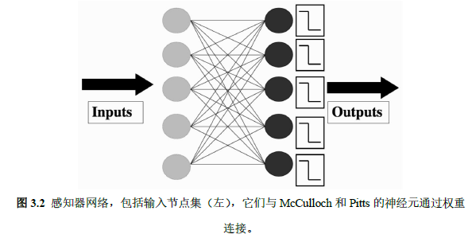
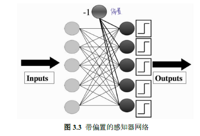
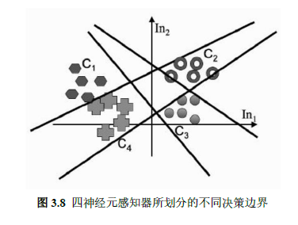

Network1-感知机
---

# 1. 简单感知机模型描述
1. 是由McCulloch和Pitts的神经元组成的集合，包含一组输入和一些把输入和神经元联结起来的权值。
   1. 输入节点：浅灰色阴影的结点，不是神经元
   2. 神经元：黑色的结点，加法部分是圆形，还有每一个的阈值部分。

2. 感知机模型中
   1. 神经元彼此独立
   2. 唯一共享就是输入
   3. 一般地，有m个输入和n个神经元
   4. $w_{ij}$表示连接输入节点i和神经元j的权值。

# 2. 感知机模型更新
1. 我们得到正确的神经元则是满意的
2. 但是任何一个错误激活或者错误未被激活的神经元都需要进行权值的调整。

## 2.1. 不包含偏置的感知机网络的权值调整
1. 我们假设结果错误的神经元为k，那么我们关心的权值为$w_{ik}, i\in[1,m]$
2. 误差函数为$y_k-t_k$，$y_k$为实际输出值，而$t_k$为目标输出值，由于本身输入神经元的元素的正负也会影响更新，因此我们得到$\triangle w_{ik} = - (y_k - t_k) * x_i$，$x_i$为输入向量。
3. 接下来我们引入学习速率$\eta$的概念，用来控制网络学习的快慢，由此我们得到如下的权值更新的最终规则

$$
w_{ij} \leftarrow w_{ij} - \eta(y_j - t_j) * x_i
$$

## 2.2. 更新终止条件(备选)
1. 预定义最大的循环次数为T
2. 计算得到所有正确的输入

## 2.3. 关于学习速率$\eta$的补充说明
1. 参数$\eta$控制着权值调整的幅度。
2. 过大的$\eta$可能会导致网络不稳定，过小的$\eta$会花费更多的时间来学习，但是这样会更加稳定，且对噪声和不精确的成本具有更好的抵抗力。
3. 始终的学习速率$0.1 < \eta < 0.4$

# 3. 包含偏置的感知机网络
1. 我们要为每一个神经元设置一个激活阈值$\theta$，以确定如果它激活，它的值至少为多少，但是不同神经元的激活阈值可能是不一致的。
2. 我们将神经元的阈值固定为0，然后给神经元增加一个**额外的输入权值**，并使得对应于该权值的输入为一定值(本书为-1)
3. 我们可以根据需要修改这个权值(在更新算法中也包含这个权值)，这个输入通常被称为**偏置**节点，一般记作$w_{0j}, j\in[1,n]$

# 4. 感知机算法
1. 该算法包含两部分：训练和再现阶段
2. 初始化
   1. 设置所有的权值$w_{ij}$为小的随机数(正或负均可)
3. 训练
   - 对T次循环
      - 对每一个输入变量
         - 利用激活函数g计算每一个神经元j的激活状态
         - $y_j = g(\sum\limits_{i=0}\limits^{m}w_{ij}x_i) = f(x) = \begin{cases} 1 & if \sum\limits_{i=0}\limits^{m} w_{ij}x_i > 0 \\ 0 & if \sum\limits_{i=0}\limits^{m} w_{ij}x_i \leq 0 \\ \end{cases}$
         - 然后利用等式来更新每一个权值
         - $w_{ij} \leftarrow w_{ij} - \eta(y_j - t_j) * x_i$
4. 再现
   1. 利用下式计算每个神经元的激活状态
   2. $y_j = g(\sum\limits_{i=0}\limits^{m}w_{ij}x_i) = f(x) = \begin{cases} 1 & if w_{ij}x_i > 0 \\ 0 & if w_{ij}x_i \leq 0 \\ \end{cases}$
5. 算法复杂度
   1. 训练阶段:O(Tmn)
   2. 再现阶段:O(mn)

# 5. 线性可分性
1. 我们期望能找到这样这一条直线(二维是直线，三维是平面，更高维是超平面)，保证直线的一侧神经元都激活，而另一边神经元都不激活，这样的直线被称为**决策边界**，或者是**判别函数**。
2. 对于边界，也就是我们能找到一个输入向量$\bold{x}_1$满足$\bold{x}_1*\bold{w}^T=0$，那么我们再找到另一个输入向量$\bold{x}_2$满足$\bold{x}_2*\bold{w}^T=0$，于是我们可以得到$(\bold{x}_1 - \bold{x}_2) * \bold{w}^T = 0$，也即是边界和权值向量$\bold{w}^T$垂直
3. 如果这条曲线存在，那么则是**线性可分**的
4. 四神经元感知机所划分的不同决策边界

## 5.1. 感知机收敛理论
1. Rosenblatt在1962年证明，给定一个线性可分的数据集，感知机将在有限次数的收敛后收敛于某个分类方。
2. 迭代次数以$\frac{1}{\gamma^2}$为界，$\gamma$是分离超平面与最接近的数据点之间的距离。
3. 我们假设输入向量的长度$||\bold{x}|| \leq 1$
4. 我们知道一些权重向量$\bold{w}^*$可以分配数据(我们假设是线性可分的)，感知机学习算法旨在找到一些与$\bold{w}^*$平行或尽可能接近的向量$\bold{w}$。
   1. 检查向量是否平行，使用$\bold{w}^**\bold{w}$，目标是$cos\theta = 1$
   2. 只要更新权重是，$\bold{w}^**\bold{w}$增加，且$||\bold{w}||$没有增加太多，那么我们认为算法会收敛的。
5. 假设在算法的第t次迭代，网络看到一个特定的输入$\bold{x}$应该有输出y，并且其计算错误，所以$y\bold{w}^{(t-1)}*\bold{x} < 0$，这意味着更新权重，这个权重更新为$\bold{w}^{(t)} = \bold{w}^{(t-1)} + \eta y\bold{x}$，令$R = \max\limits_{1\leq i \leq n}||x_i||$

$$
\bold{w}^**\bold{w} \begin{aligned}
  &=\bold{w}^* * (\bold{w}^{(t-1)} + \eta y\bold{x}) \\
  &=\bold{w}^* * \bold{w}^{(t-1)} + \eta y\bold{w}^**\bold{x}) \\
  &\geq \bold{w}^* * \bold{w}^{(t-1)} + \eta\gamma\\
  &\geq t\eta\gamma \\
\end{aligned}
$$

6. T步后的权重向量长度为

$$
||\bold{w}^{(t)}||^2 \begin{aligned}
  & = ||\bold{w}^{(t-1)} + \eta y\bold{x}||^2 \\
  & = ||\bold{w}^{(t-1)}||^2 + \eta^2y^2||x||^2 + 2\eta y||w||^{(t-1)}*x \\
  & \leq||\bold{w}^{(t-1)}||^2 + \eta^2||x||^2\\
  & \leq ||w^{(t-1)}||^2 + \eta^2R^2 \\
  & \leq t\eta^2R^2 \\
\end{aligned}
$$

7. 因此$t\eta\gamma \leq \bold{w}^* * \bold{w}^{(t)} \leq \sqrt{t}\eta R$，由此$t \leq (\frac{R}{\gamma})^2$

# 6. 感知机算法的实现
1. Python说明
   1. np.dot(matrix1, matrix2)：计算矩阵乘法
   2. np.where(condition, x, y)：满足条件则新值为x，不满足条件则新值为y。
   3. np.transpose(matrix)：对矩阵进行转置
   4. np.concatenate((inputs, -np.ones(self.nData,1)),axis=1)
   5. np.Random.rand(m+1,n+1)：得到一个初始化的样本
   6. np.inner()函数计算向量内积
   7. np.linalg.inv()函数可以方便的计算出矩阵的逆

## 6.1. OR 与 XOR函数
1. 对于XOR算法不收敛，在两个错误答案之间不断循环。
2. XOR函数的问题是可以在三维平面内被求解的，由此，我们可以知道只要将**数据映射到正确维度**的空间内，总是可以用一个线性函数将两个类别区分开的，解决这个问题有一类方法被称为核分类器，也是[支持向量机](../分类算法/Algorithm-支持向量机.md)的基础
3. 参考Ch3/pcn.py

## 6.2. 皮马印第安人数据集
1. <a href = "http//archive.ics.uci.edu/ml/">UCI机器学习数据集</a>
2. 本问题数据集名称为Pima
3. 课本84页开始