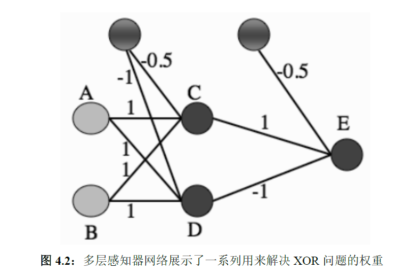

Network2-多层感知机
---

# 1. 引入
1. 我们大部分该兴趣的问题不能线性分离的
2. 解决方案
   1. 循环网络：加入一些向后的连接，以便于输出神经与输入联系起来。
   2. 在输入结点和输出结点之间添加神经元结点
3. XOR函数的实现

4. 网络中间的神经元的名字，被叫做隐藏层(或层)
5. MLP(多层感知机)，是最常用的神经网络之一。

# 2. MLP

## 2.1. 向前
1. MLP仍然是使用误差来更新权重，往往会有向前和向后两个阶段
2. 向前：算法的回忆阶段，我们需要逐层进行计算，上一层的输出(通过激活函数)作为下一层的输入，神经元层数可能大于2层。
3. 偏置：
   1. 每一个神经元包含一个偏置输入，我们通过一个额外的输入并且永久性的设为-1，并且调整到每个神经元的权重作为训练的一部分。
   2. 网络中的每个神经元(无论是隐藏层还是输出)都会有一个额外输入，并且是固定的值。

## 2.2. 向后：误差的反向传播
1. 误差通过网络向后传播，是梯度下降的一种形式。
2. 我们为每一个神经元k选择一个误差函数:$E_k = y_k - t_k$，并且希望误差尽可能的小：
   1. 那么我们就需要确定是哪一个权重导致的误差。
   2. 对感知器使用的误差函数是$\sum\limits_{k=1}\limits^NE_k = \sum\limits_{k=1}\limits^Ny_k - t_k$，N是输出节点的数量。
   3. 然而上面的误差存在正负误差抵消的问题，我们可以使用平方和误差函数$E(\bold{t}, \bold{y}) = \frac{1}{2}\sum\limits_{k=1}\limits^N(y_k-t_k)^2$
3. $\frac{1}{2}$的意义：我们要对误差函数求导，因为我们的目标是极小化误差，所以我们选择沿着误差函数的导数方向下降(负梯度方向)

## 2.3. 激活函数
1. 门槛函数

$$
f(x) = \begin{cases}
   1 & x > 0\\
   0 & x < 0\\
\end{cases}
$$

2. sigmoid函数(常用)

$$
f(x) = \frac{1}{1 + \exp^{-\beta h}}
$$

3. 双曲正切函数$f(x) = \frac{\exp^h - exp^{-h}}{exp^h + exp^{-h}}$，导数比较简单，可以将使用线性变换对饱和点进行调整。