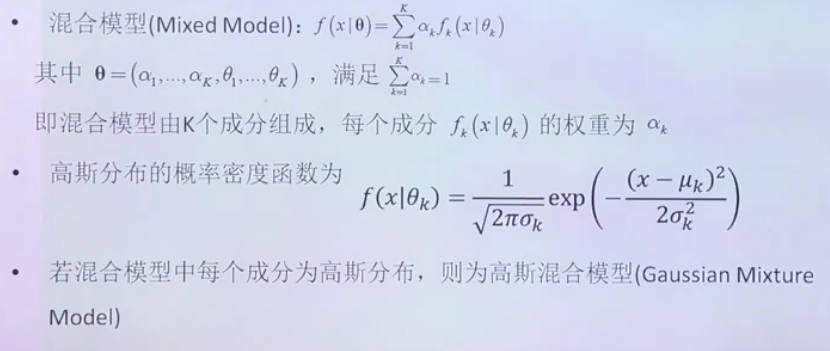
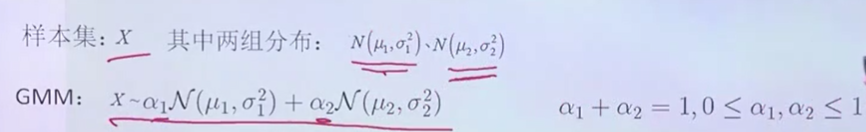
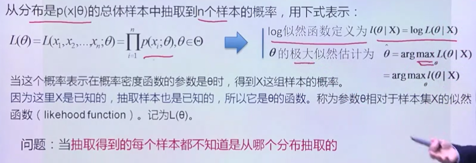
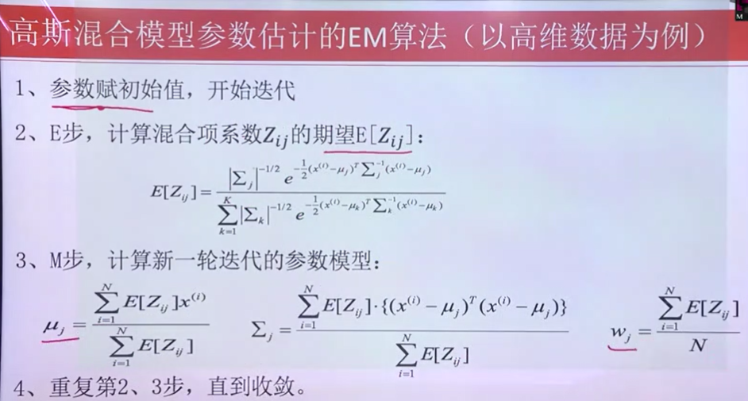
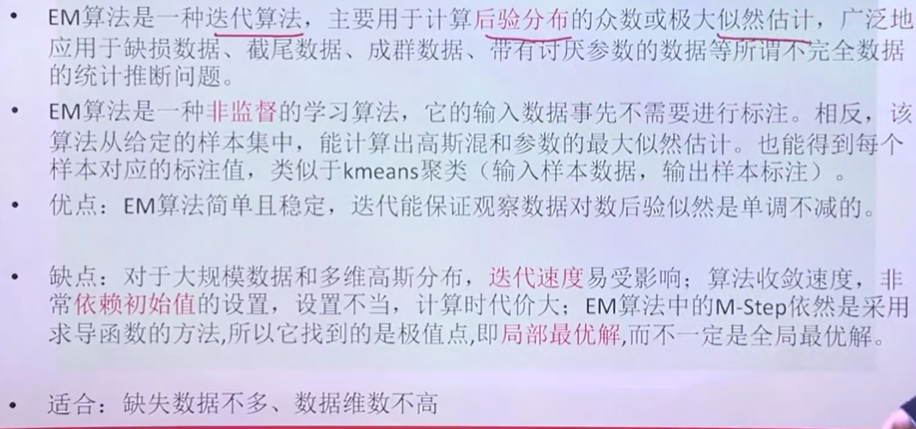

**EM算法**

# 1. 高斯混合模型

1. 两组数据有着不同的分布形态，而把他们属性混合在一起。

## 1.1. 例子

1. 我们怎么获得特征参数呢？我们就用GMM算法，来采样获得。

# 2. 最大似然函数

1. 当我们知道X的样本，我们求具体θ的函数。
2. 问题:当抽取的样本不知道从哪个样本中抽取出来，我们需要估计
    1. 样本所属的类别
    2. 样本高斯分布的特征参数
3. 而我们知道θ可以知道样本，知道样本可以知道θ。

# 3. EM算法的基本思想
1. 在开始状态下参数均未知，但假定一直A的某种信息就可以得到B的信息，反过来知道B也就知道了A。可以考虑首先赋予A某种初值，以此得到B的估计值，然后从B的当前值，重新估计A的初值，持续迭代直到收敛未止

## 3.1. 高斯混合模型参数估计的EM算法

1. 通过估计，反复迭代计算到收敛

## 3.2. 总结

1. 对不完全的数据进行补充.
2. 类似于对抗网络,如果赋值有问题,可能难以达到收敛值.
3. 依赖于初始值