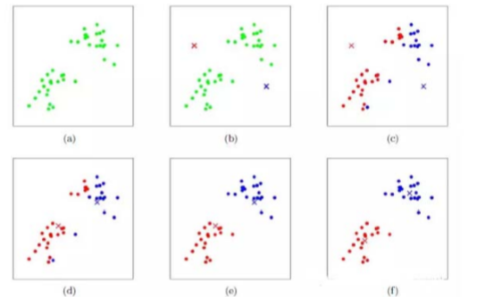
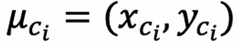
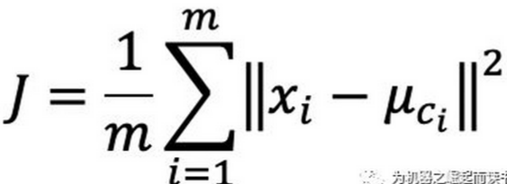
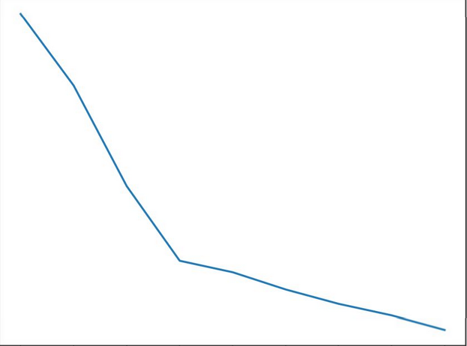
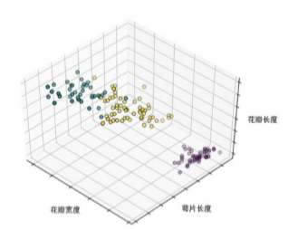
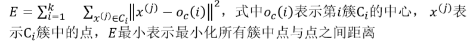
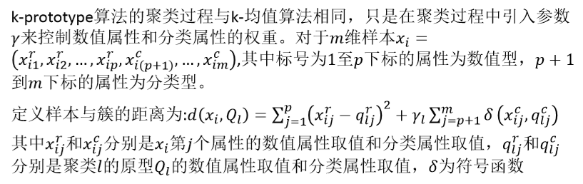

**基于划分的方法**

# 1. 基于划分的方法
1. 基于划分的方法是**简单、常用**的一种聚类方法
2. 通过将对象划分为互斥的簇进行聚类，每个对象**属于且仅属于**一个簇。
3. 划分结果旨在使簇之间的相似性低，簇内部的相似度高
4. 基于划分的方法常用算法有k均值、k‐medoids、k‐prototype等

# 2. k-均值算法
1. k‐均值聚类是基于划分的聚类算法，计算样本点与类簇质心的距离，与类簇质心相近的样本点划分为同一类簇。k‐均值通过样本间的距离来衡量它们之间的相似度，两个样本距离越远，则相似度越低，否则相似度越高
2. k‐均值算法聚类步骤如下：
    1. 首先**选取k个类簇(k需要用户进行指定)的质心**，通常是随机选取。
    2. 对剩余的每个样本点，计算它们到各个质心的欧式距离，并将其归入到相互间距离小的质心所在的簇。计算各个新簇的质心。
    3. 在所有样本点都划分完毕后，根据划分情况重新计算各个簇的质心所在位置，然后迭代计算各个样本点到各簇质心的距离，对所有样本点重新进行划分。
    4. 重复第(2)步和第(3)步, 直到迭代计算后，所有样本点的划分情况保持不变，此时说明k‐均值算法已经得到了优解，将运行结果返回
3. 只能进行**凸性**样本的划分，核心是通过迭代来获得最后的结果。
    + 非凸性的是不收敛的，可以用可视化来排除。

## 2.1. 算法过程



1. 按照各个步骤来计算。
2. 算法的输入主要是样本，有若干的属性，k-均值可以处理数值型和非数值型的属性。
3. 叉就是聚类中心，而划分也是主要来找到聚类中心，聚类中心是代表着当前一簇样本特征的值。
    + 样本离哪个聚类中心近就是哪一类的。

### 2.1.1. 部分参数属性


聚类核心的坐标
---


代价函数
---

1. ||a||表示的是a的L2范数，||x-y||可以被理解为x这个点到y这个点的距离。
2. 在参考的时候我们可以将数据点进行染色
3. 重复计算聚类中心，最后不发生变化的时候，说明算法已经收敛了。
    + 我们需要的是将不同部分的点重新计算选取新的聚类中心

## 2.2. 寻找聚类中心
1. 主要通过迭代来寻找聚类中心
    + 一开始我们可以来随机找聚类中心
    + 然后为假设聚类中心，进行划分,之后计算相应分组的中心，观察和聚类中心重合的情况。
    + 如果明显不对的时候，我们用计算出来的几何中心作为聚类中心来进行重复上述操作
2. 对于数值型的属性，如果能找到分组，我们的聚类中心和样本的中心是重合的。
    + 证明！
3. 启发式:我们知道是有最优解的
4. 可能的问题:我们计算出来的是**局部最优解**，但是不是全局最优解。

## 2.3. 思想
1. 我们是知道有最优解但是不知道最优解是什么，所以我们通过迭代来进行计算。

### 2.3.1. 解决聚类核心的选取问题:肘部法则
1. 肘部法则(ELbow Method):也就是你把K当做x轴，代价函数当做y轴，画出一条曲线。

2. 那么我们足够理智的话，我们会选择K等于4，因为在4之前，每次增大K都会显著降低代价函数，而K大于4时，再增加K代价函数下降的幅度比较小，也就是不那么划算。

## 2.4. 算法的特点
1. k‐均值算法原理简单，容易实现，且运行效率比较高
    + k值是由用用户来决定
2. k‐均值算法聚类结果容易解释，适用于高维数据的聚类
3. k‐均值算法采用**贪心**策略，导致容易局部收敛，**在大规模数据集上求解较慢**
4. k‐均值算法对**离群点和噪声点非常敏感**，少量的离群点和噪声点可能对算法求平均值产生极大影响，从而影响聚类结果
    + 可以将部分噪声点进行单独处理。
5. k‐均值算法中**初始聚类中心**的选取也对算法结果影响很大，不同的初始中心可能会导致不同的聚类结果。对此，研究人员提出k‐均值++算法，其思想是使初始的聚类中心之间的相互距离尽可能远
    + 选择不当会导致计算速度很慢。

## 2.5. 算法注意事项
1. 使k‐均值聚类时，需要注意如下问题
    + 模型的输入数据为**数值型数据**(如果是离散变量，需要作哑变量处理)。如果数据的量纲不同会导致比较大的量纲在计算的时候有优势。那么我们想要将所有的变量全部划归到[0,1]
    + 需要将原始数据作标准化处理(防止不同量纲对聚类产生影响)
        + 转化方法可以为(x - x<sub>min</sub>)/(x<sub>max</sub> - x<sub>min</sub>)
2. 对k值的选取，主要有以下几种：
    1. 与**层次聚类算法**结合，先通过层次聚类算法得出大致的聚类数目，并且获得一个初始聚类结果，然后再通过k‐均值算法改进聚类结果
    2. 基于系统演化的方法，将数据集视为伪热力学系统，在分裂和合并过程中，将系统演化到稳定平衡状态从而确定k值
    3. 可以通过从2开始，尝试不同的k值。

## 2.6. K-均值算法的Python实现
1. 利用sklearn库应用k‐均值聚类算法实现对Iris数据集进行聚类。首先引用相应的库，其中sklearn.cluster为sklearn中已经实现的聚类算法工具包，代码如下
```python
import numpy as np 
import matplotlib.pyplot as plt
from mpl_toolkits.mplot3d import Axes3D 
from sklearn.cluster import KMeans #K-均值所在库
from sklearn import datasets 
plt.rcParams['font.sans-serif']=['SimHei'] #用来正常显示中文标签 plt.rcParams
['axes.unicode_minus']=False #用来正常显示负号
```
2. 读取数据集:首先，从IRIS数据集中加载鸢尾花样本信息到X和y两个变量中，其中，X存放花瓣长宽等特征，y存放花的类别标签。构造并初始化K‐均值模型，设置类簇数量为3类，调用fit方法执行聚类，代码如下
```python
np.random.seed(5)
iris=datasets.load_iris()# 加载数据集
X=iris.data
y=iris.target
est=KMeans(n_clusters=3)# 调整k值
est.fit(X)# 进行聚类计算
labels=est.labels_
```
3. 对聚类算法进行可视化分析:接下来，对聚类的结果可视化显示，使用Axes3D将其显示在3维空间中，其中花瓣宽度、萼片长度、花瓣长度分别作为x,y,z三个维度
```python
fig = plt.figure(1, figsize=(4, 3))
ax = Axes3D(fig, rect=[0, 0, .95, 1], elev=48, azim=134)
ax.scatter(X[:, 3], X[:, 0], X[:, 2],c=labels.astype(np.float), edgecolor='k')# 散点图 
# 以下是坐标轴的设定。
ax.w_xaxis.set_ticklabels([]) 
ax.w_yaxis.set_ticklabels([]) 
ax.w_zaxis.set_ticklabels([])
ax.set_xlabel('花瓣宽度')# x名称
ax.set_ylabel('萼片长度')# y名称
ax.set_zlabel('花瓣长度')# z名称
ax.set_title("3类")
ax.dist= 12
plt.show()
```
4. 最后的结果图:



## 2.7. K-均值++算法


1. 主要是对初始聚类中心的选取进行了优化。也就是把初识样本点的距离拉远
    + 实验表明，距离越远，迭代次数相对较少。

## 2.8. K-mediods算法
1. k‐均值算法簇的聚类中心选取受到噪声点的影响很大，因为噪声点与其他样本点的距离远，在计算距离时会严重影响簇的中心。k‐medoids算法克服了k‐均值算法的这一缺点，k ‐medoids算法不通过计算簇中所有样本的**平均值**得到簇的中心，而是**通过选取原有样本中的样本点作为代表对象代表这个簇**，计算剩下的样本点与代表对象的距离，将样本点划分到与其距离近的代表对象所在的簇中
    + 非数值型用重心不合适。
    + 不用平均值，避免的一部分噪声所带来的影响。
2. 距离计算过程与k均值算法的计算过程类似，只是将距离度量中的中心替换为代表对象，绝对误差标准如下


### 2.8.1. 分组方法
1. **围绕中心点划分**(Partitioning Around Mediods, PAM)算法是k ‐medoids聚类的一种典型实现。PAM算法中簇的中心点是一个真实的样本点而不是通过距离计算出来的中心。PAM算法与k均值一样，使用贪心策略来处理聚类过程
2. k‐均值迭代计算簇的中心的过程，在PAM算法中对应计算是否替代对象o'比原来的代表对象o能够具有更好的聚类结果，替换后对所有样本点进行重新计算各自代表样本的绝对误差标准。若替换后，替换总代价小于0，即绝对误差标准减小，则说明替换后能够得到更好的聚类结果，若替换总代价大于0，则不能得到更好的聚类结果，原有代表对象不进行替换。在替换过程中，尝试所有可能的替换情况，用其他对象迭代替换代表对象，直到聚类的质量不能再被提高为止。

## 2.9. k‐prototype 算法
1. 主要是克服k-均值不能解决非数值型变量的问题。



2. 将数值型属性和非数值型属性分开来处理，然后计算他们之间的距离的计算
    + 数值型用用原来的方法
    + 对于非数值型数值，δ是符号函数，我们看里面的两部分是否一样，我们找几个非数值型数据的距离为
3. 聚类中心
    + 数值属性是原来的方法。
    + 非数值属性，非数值型数据中出现频率最高的部分就是新的聚类中心


# 3. 其他参考
<a href = "https://mp.weixin.qq.com/s/EH_82p7lE9lFftGoozNvMA">K-means聚类算法及其应用</a>
<a href = "https://mp.weixin.qq.com/s/aWTDJtafY9XHZdHdOUaqXw">使用K-均值识别异常值</a>