**基于密度和层次的聚类分析**
1. 非凸型的样本集是不适用于K-均值算法的。

# 1. 基于密度聚类
1. 基于划分聚类和基于层次聚类的方法在聚类过程中根据距离来划分类簇，因此只能够用于挖掘球状簇。
2. 为了解决这一缺陷，基于密度聚类算法利用密度思想，将样本中的**高密度**区域(即样本点分布稠密的区域)划分为簇，将簇看作是样本空间中被稀疏区域(噪声)分隔开的稠密区域。这一算法的**主要目的**是过滤样本空间中的稀疏区域，获取稠密区域作为簇。
3. 基于密度的聚类算法是根据**密度而不是距离**来计算样本相似度，所以基于密度的聚类算法能够用于挖掘任意形状的簇，并且能够有效过滤掉噪声样本对于聚类结果的影响。
    + 由于根据密度，我们自然能够比较好的过滤掉部分噪声。
4. 常见的基于密度的聚类算法有DBSCAN、OPTICS和DENCLUE等。其中，OPTICS 对DBSCAN算法进行了改进，降低了对输入参数的敏感程度。DENCLUE算法综合了基于划分、基于层次的方法。

# 2. DBSCAN算法

## 2.1. 一些概念
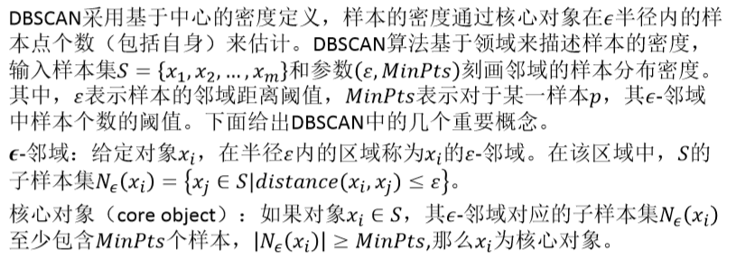

1. 采用基于中心的密度定义，采用基于领域来描述样本的密度。
2. MinPts是阈值，如果距离点P的半径ε内的点的个数大于MinPts，那么我们认为这个点是**核心对象**。

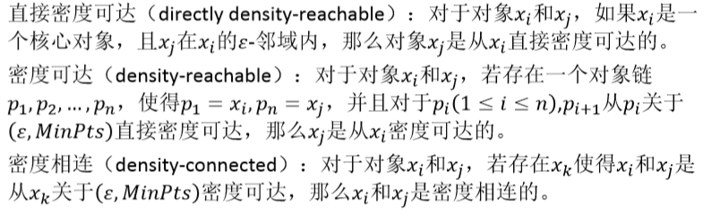
1. 直接密度可达
2. 密度可达:存在一个对象链。
3. 密度相连:存在一个x<sub>k</sub>，其邻域可以包含这两个点。

例子
---
1. 在下图中，若MinPts = 3，则a、b、c和x、y、z都是核心对象，因为在各自的ε‐邻域中，都至少包含3个对象。对象c是从对象b直接密度可达的，对象b是从对象a直接密度可达的，则对象c是从对象a密度可达的。对象y是从对象x密度可达的，对象z是从对象x密度可达的，则对象y和z是密度相连的
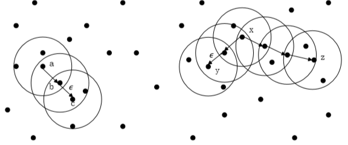

## 2.2. 算法思想
1. DBSCAN算法根据密度可达关系求出所有密度相连样本的大集合，将这些样本点作为同一个簇。DBSCAN算法**任意**选取一个核心对象作为"种子"(起点)，然后从"种子"出发寻找所有**密度可达**的其他**核心对象**，并且包含每个核心对象的ε‐邻域的非核心对象，将这些核心对象和非核心对象作为**一个簇**。当寻找完成一个簇之后，选择还没有簇标记的其他核心对象，得到一个新的簇，反复执行这个过程，直到**所有的核心对象都属于某一个簇**为止。

## 2.3. 算法特点
1. DBSCAN可以用于对任意形状的稠密数据集进行聚类，DBSCAN算法对输入顺序**不敏感**。DBSCAN能够在聚类的过程中发现数据集中的**噪声点**，且算法本身对噪声不敏感。当数据集分布为**非球型**时，使用DBSCAN算法效果较好
2. DBSCAN算法要对数据集中的每个对象进行**邻域检查**，当数据集较大时，**聚类收敛时间长**，需要较大的内存支持，I/O 消耗也很大，此时可以采用**KD树或球树**对算法进行改进，快速搜索近邻，帮助算法快速收敛。此外，当空间聚类的密度不均匀，聚类间距离相差很大时，**聚类的质量较差**。
3. DBSCAN算法的聚类结果受到**邻域参数**(ε,MinPts)的影响较大，不同的输入参数对聚类结果有很大的影响，邻域参数也需要人工输入，调参时需要对两个参数联合调参，比较复杂
4. 算法工作量大，复杂度高。

## 2.4. 算法的Python实现
1. 应用sklearn库中DBSCAN算法实现聚类。DBSCAN算法位于sklearn.cluster库中，数据源是用make_blobs方法随机生成的，数量为750条，有3个类簇。数据经过StandardScaler().fit_transform()对数据进行标准化处理，保证每个维度的方差为1，均值为0，使预测结果不会被某些维度过大的特征值而主导
```python
from sklearn.cluster import DBSCAN
from sklearn import metrics
from sklearn.datasets.samples_generator import make_blobs
from sklearn.preprocessing import StandardScaler
import matplotlib.pyplot as plt

plt.rcParams['font.sans-serif']=['SimHei']#用来正常显示中文标签
plt.rcParams['axes.unicode_minus']=False#用来正常显示负号
centers=[[1,1],[-1,-1],[1,-1]] 
X,ltrue=make_blobs(n_samples=750,centers=centers,cluster_std=0.4,random_state=0)# 设定相关参数
X=StandardScaler().fit_transform(X)
db=DBSCAN(eps=0.3,min_samples=10).fit(X)# DBSCAN调用的语句
core_samples_mask=np.zeros_like(db.labels_,dtype=bool)# 预处理
core_samples_mask[db.core_sample_indices_]=True
labels=db.labels_ n_clusters_=len(set(labels))-(1 if-1 in labels else 0)
```

效果
---
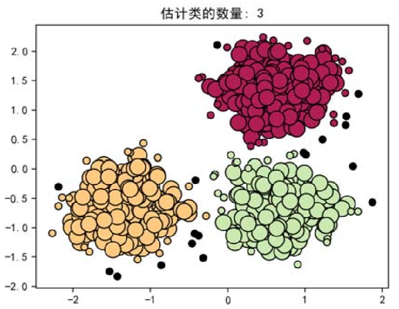

# 3. 基于层次的聚类
1. 层次聚类的应用广泛程度仅次于基于划分的聚类，**核心思想**就是通过对数据集按照层次，把数据划分到不同层的簇，从而形成一个**树形**的聚类结构。层次聚类算法可以揭示数据的分层结构，在树形结构上不同层次进行划分，可以得到不同粒度的聚类结果。按照层次聚类的过程分为自底向上的聚合聚类和自顶向下的分裂聚类。聚合聚类以AGNES、BIRCH、ROCK等算法为代表，分裂聚类以DIANA算法为代表
2. **自底向上**的聚合聚类将每个样本看作一个簇，初始状态下簇的数目等于样本的数目，然后根据算法的规则对样本进行合并，**直到满足算法的终止条件。**自顶向下的分裂聚类先将所有样本看作属于同一个簇，然后逐渐分裂成更小的簇，直到满足算法终止条件为止。目前大多数是**自底向上**的聚合聚类，自顶向下的分裂聚类比较少。

## 3.1. 层次聚类
1. 层次聚类(hierarchical clustering)方法把数据组织成若干簇，并形成一个相应的树状图进行聚类。
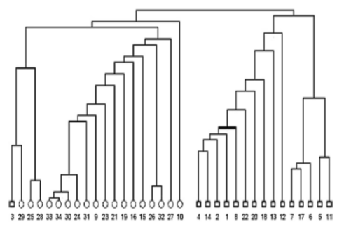

### 3.1.1. 聚合层次聚类
1. 聚合层次聚类采用自底向上的策略，首先把每个对象单独作为一类，然后根据一定的规则，例如把簇间距离小的相似簇合并成为越来越大的簇，直到所有样本凝聚成一个大的簇，针对给定应用选择好结果的聚类层次。
    + 没错生成一个虚拟样本，然后和其他样本进行计算。
2. 选取几组就由你来决定。

### 3.1.2. 分散聚类
1. 与聚合型方法相反，分裂聚类采用自顶向下的方法，先把所有的对象都看成一个簇，然后不断分解直至满足一定的条件。

### 3.1.3. 案例
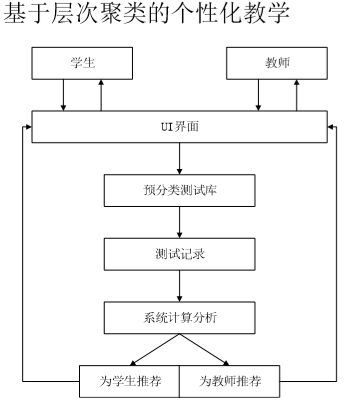
1. 首先进行数据收集，做题进行学习
    + 将所有的数据加起来，然后我们整理成一个更大的表格。
2. 之后我们学习后，进行分类来完成分组。

## 3.2. BIRCH聚类算法

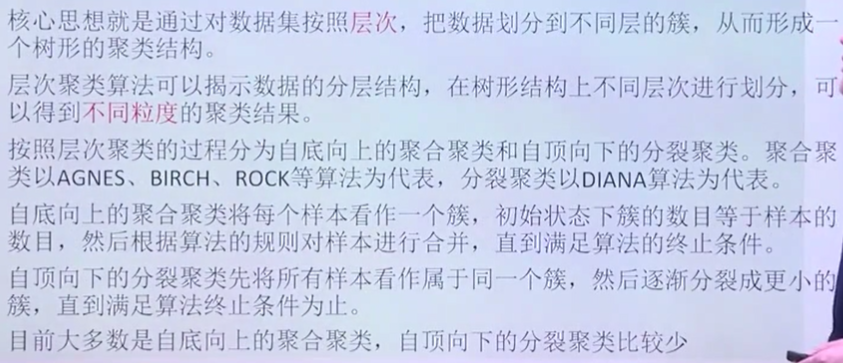

1. 从下往上进行聚类为主，而自上向下的比较小

### 3.2.1. 概念
1. k值是**可选**的，只需要**扫描一次**。

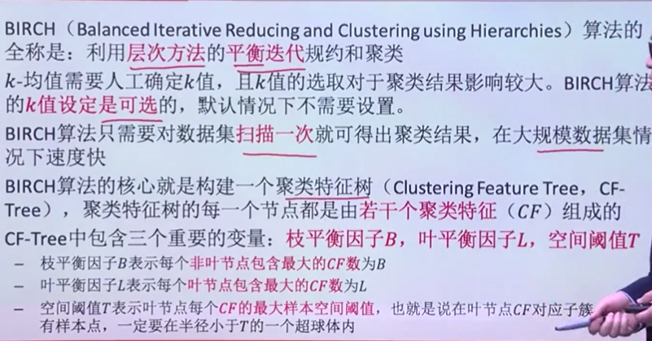

2. 枝平衡因子B:非叶节点上最大的CF数
3. 叶平衡因子L:叶节点包含最大的CF数
4. 空间阈值:CF的最大样本空间阈值。

### 3.2.2. 实例
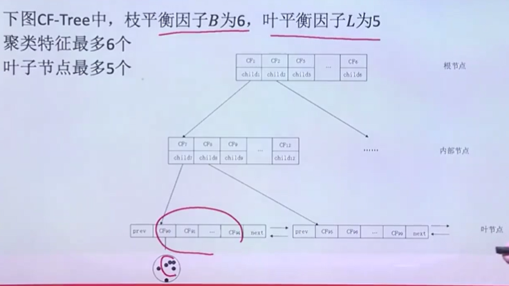
S
### 3.2.3. 如何构架CF-Tree

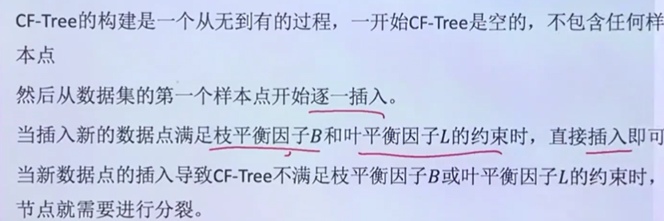

完整过程
---
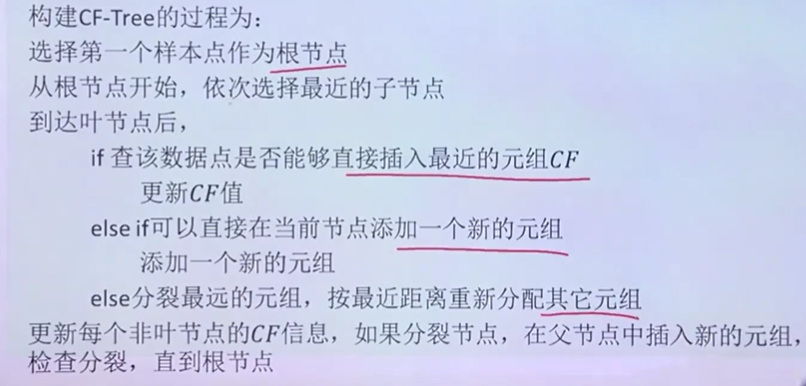

### 3.2.4. 节点分裂
1. B=3，L=2，插入违反了L但是没有违反B

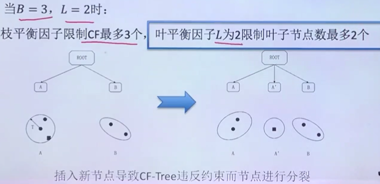

2. B=3，L=2，插入违反了L同时违反了B

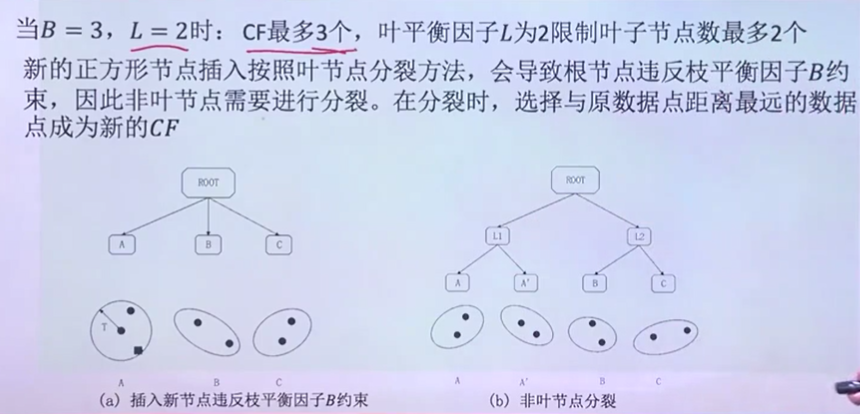

### 3.2.5. 如何进行聚类

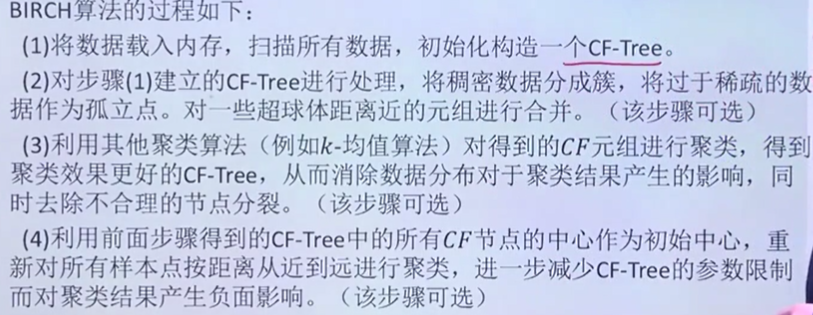

### 3.2.6. BIRCH聚类总结

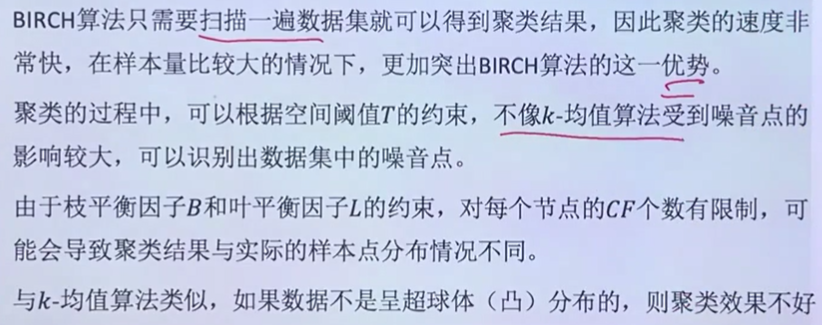

1. 非凸数据效果不好


# 4. 参考
1. <a href = "https://mp.weixin.qq.com/s/Ro4yyFTNvi769QHduTpQVg">基于层次聚类的工业数据分析研究</a>